# Data Cleaning: Noisy Data dan Outlier

Panduan lengkap untuk mendeteksi dan menangani **noisy data** dan **outlier** dalam dataset. Materi ini melengkapi apa yang sudah dipelajari di mata kuliah Teknik Sampling dan Data Wrangling, dengan fokus pada teknik yang **belum dibahas** sebelumnya.

## Daftar Isi

1. [Recap: Missing Values](#1-recap-missing-values)
2. [Noisy Data](#2-noisy-data)
3. [Deteksi Outlier](#3-deteksi-outlier)
4. [Binning dan Smoothing](#4-binning-dan-smoothing)
5. [Handling Outlier](#5-handling-outlier)
6. [Kapan Outlier Dibuang vs Dipertahankan?](#6-kapan-outlier-dibuang-vs-dipertahankan)
7. [Dampak Cleaning pada Statistik Deskriptif](#7-dampak-cleaning-pada-statistik-deskriptif)
8. [Data Cleaning sebagai Proses](#8-data-cleaning-sebagai-proses)
9. [Ringkasan dan Cheatsheet](#9-ringkasan-dan-cheatsheet)
10. [Tugas dan Latihan](#10-tugas-dan-latihan)
11. [Referensi](#11-referensi)

---

## 1. Recap: Missing Values

Pada mata kuliah **Teknik Sampling dan Data Wrangling** (Modul 5), kalian sudah mempelajari cara menangani missing values secara mendalam. Berikut ringkasan singkat sebagai pengingat.

### Jenis Missing Values

| Jenis | Penjelasan | Contoh |
|---|---|---|
| MCAR (Missing Completely at Random) | Data hilang secara acak total — tidak ada pola, murni kebetulan | Sensor mati karena listrik padam |
| MAR (Missing at Random) | Data hilang karena dipengaruhi variabel lain yang kita punya | Mahasiswa malas isi survei jika IPK rendah |
| MNAR (Missing Not at Random) | Data hilang justru karena nilai itu sendiri — ada alasan tersembunyi | Orang berpenghasilan tinggi tidak mengisi kolom gaji |

### Flowchart Penanganan

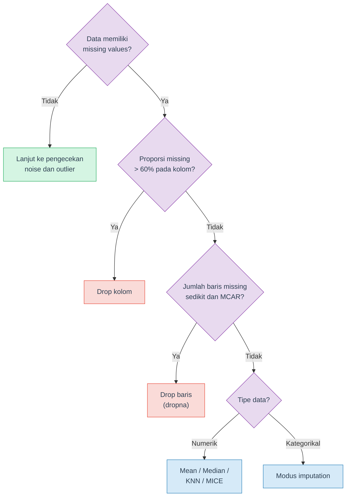

Jangan lupa cek duplikat juga: `df.duplicated().sum()` lalu `df.drop_duplicates()`.

> **Catatan**: Detail tentang missing values — deteksi dengan `missingno`, KNN Imputer, MICE/IterativeImputer, perbandingan visual antar metode imputasi — sudah dibahas lengkap di materi Teknik Sampling dan Data Wrangling (Modul 5). Materi ini tidak mengulang topik tersebut.

> **Awas: Disguised Missing Data** — Tidak semua missing values tampil sebagai `NaN`. Kadang user sengaja mengisi data palsu pada field wajib karena tidak ingin memberikan informasi pribadi — misalnya memilih tanggal lahir default "1 Januari 2000" atau mengisi pendapatan "0". Data seperti ini terlihat valid secara format, tapi sebenarnya tidak informatif. Gunakan domain knowledge dan cek distribusi untuk mendeteksinya (Han et al., 2023).

---

## 2. Noisy Data

### Apa itu Noise?

**Noise** (data kotor/berisik) adalah kesalahan atau variasi acak dalam data yang **tidak membawa informasi berguna**. Noise mengaburkan pola sebenarnya dan bisa menyesatkan analisis maupun model machine learning.

Contoh noise dalam kehidupan nyata:

- Umur tercatat **-5 tahun** (tidak mungkin)
- Gaji tercatat **Rp 999.999.999.999** padahal data karyawan biasa
- Suhu tubuh tercatat **200 derajat Celsius** karena sensor rusak
- Nama kota ditulis "Surabya" (typo dari "Surabaya")

### Noise vs Outlier vs Anomaly

Tiga istilah ini sering tertukar. Berikut perbedaannya:

| Aspek | Noise | Outlier | Anomaly |
|---|---|---|---|
| **Definisi** | Error atau variasi acak | Nilai yang jauh berbeda dari mayoritas | Pola langka yang nyata ada |
| **Penyebab** | Kesalahan input, sensor rusak | Bisa error ATAU fenomena nyata | Fenomena nyata yang jarang terjadi |
| **Informasi** | Tidak ada — harus dihilangkan | Perlu investigasi dulu | Ada — justru dicari |
| **Contoh** | Umur = -5 tahun | Gaji CEO = 50 miliar (di data karyawan) | Transaksi fraud di antara jutaan transaksi normal |
| **Aksi** | Selalu bersihkan | Tergantung konteks dan domain | Pertahankan dan analisis lebih lanjut |

> **Penting**: Tidak semua outlier adalah noise, dan tidak semua noise tampil sebagai outlier. Seorang CEO yang gajinya 100x lipat karyawan lain adalah outlier, tapi **bukan** noise — itu data valid. Sebaliknya, umur = -5 tahun adalah noise yang jelas.

<details>
<summary><b>Cek Pemahaman</b>: Dalam dataset transaksi bank, ditemukan satu transaksi senilai Rp 500 juta di antara ribuan transaksi rata-rata Rp 500 ribu. Noise, outlier, atau anomaly?</summary>

Jawabannya: **tergantung konteks**. Bisa jadi **outlier** yang valid (transfer pembelian rumah), bisa jadi **anomaly** (indikasi fraud yang perlu diinvestigasi), atau bisa juga **noise** (kesalahan input yang seharusnya Rp 500 ribu). Inilah mengapa **domain knowledge** sangat penting dalam data cleaning — statistik saja tidak cukup.

</details>

### Sumber Noise

| Sumber | Contoh | Cara Deteksi |
|---|---|---|
| Human error | Salah ketik: gaji "50000" menjadi "500000" | Cek range, distribusi |
| Sensor/alat ukur | Termometer rusak melaporkan suhu 200 derajat Celsius | Cek nilai di luar batas fisik |
| Data collection | Web scraping menangkap header tabel sebagai baris data | Inspeksi manual baris pertama/terakhir |
| Encoding/format | Tanggal "01/02/2024" — Januari atau Februari? | Cek konsistensi format |
| Merge/integration | Duplikat muncul dari join dua sumber data berbeda | `df.duplicated()` |

---

## 3. Deteksi Outlier

Ada dua pendekatan utama: **metode statistik** (kuantitatif, menghasilkan threshold angka) dan **metode visual** (kualitatif, menggunakan grafik). Sebaiknya kombinasikan keduanya.

Semua contoh di bawah menggunakan dataset yang sama:

```python
import numpy as np
import pandas as pd

data = pd.Series([15, 18, 19, 20, 21, 22, 22, 25, 42, 100])
```

### 3.1 Metode IQR (Interquartile Range)

IQR mengukur sebaran data pada **50% tengah** (antara kuartil pertama dan kuartil ketiga). Metode ini **non-parametrik** — tidak mengasumsikan distribusi tertentu — sehingga cocok untuk data yang tidak normal (skewed).

**Rumus:**

$$IQR = Q3 - Q1$$

$$\text{Batas bawah} = Q1 - 1.5 \times IQR$$

$$\text{Batas atas} = Q3 + 1.5 \times IQR$$

Data di luar kedua batas tersebut dianggap **outlier**. Jika menggunakan faktor **3.0** (bukan 1.5), data disebut **extreme outlier**.

```python
Q1 = data.quantile(0.25)
Q3 = data.quantile(0.75)
IQR = Q3 - Q1

batas_bawah = Q1 - 1.5 * IQR
batas_atas = Q3 + 1.5 * IQR

print(f"Q1 = {Q1}, Q3 = {Q3}, IQR = {IQR}")
print(f"Batas bawah = {batas_bawah}, Batas atas = {batas_atas}")

outliers = data[(data < batas_bawah) | (data > batas_atas)]
print(f"Outlier: {outliers.values}")
```

Expected output:

```
Q1 = 19.25, Q3 = 24.25, IQR = 5.0
Batas bawah = 11.75, Batas atas = 31.75
Outlier: [ 42 100]
```

IQR berhasil mendeteksi **42** dan **100** sebagai outlier karena keduanya di atas batas atas (31.75).

### 3.2 Z-Score

Z-score mengukur **berapa standar deviasi** suatu data point jauhnya dari mean.

**Rumus:**

$$z = \frac{x - \mu}{\sigma}$$

Aturan umum: data dengan $|z| > 3$ dianggap outlier.

```python
from scipy import stats

z_scores = stats.zscore(data)  # menggunakan population std (ddof=0)

print("Z-scores:")
for val, z in zip(data, z_scores):
    flag = " <-- OUTLIER" if abs(z) > 3 else ""
    print(f"  {val:>5} -> z = {z:>6.2f}{flag}")

outliers = data[np.abs(z_scores) > 3]
print(f"\nOutlier (|z| > 3): {outliers.values}")
```

Expected output:

```
Z-scores:
     15 -> z =  -0.64
     18 -> z =  -0.51
     19 -> z =  -0.47
     20 -> z =  -0.43
     21 -> z =  -0.39
     22 -> z =  -0.35
     22 -> z =  -0.35
     25 -> z =  -0.22
     42 -> z =   0.48
    100 -> z =   2.87

Outlier (|z| > 3): []
```

Perhatikan: Z-score **tidak mendeteksi satupun outlier**, padahal 100 jelas-jelas jauh dari mayoritas data. Mengapa?

Ini disebut **masking effect** — outlier itu sendiri menaikkan mean (dari ~21 ke 30.4) dan menggembungkan standar deviasi (menjadi 24.2), sehingga z-score-nya "tersamarkan". Masalah ini umum terjadi pada dataset kecil atau ketika ada beberapa outlier sekaligus.

> **Catatan**: Z-score mengasumsikan distribusi **normal** dan sensitif terhadap outlier (karena menggunakan mean dan std). Untuk data kecil atau skewed, gunakan Modified Z-score.

### 3.3 Modified Z-Score (MAD)

Modified Z-score menggunakan **median** dan **MAD** (Median Absolute Deviation) sebagai pengganti mean dan std, sehingga **jauh lebih robust** terhadap outlier.

**Rumus:**

$$MAD = \text{median}(|x_i - \text{median}(x)|)$$

$$M_i = \frac{0.6745 \times (x_i - \text{median}(x))}{MAD}$$

Konstanta 0.6745 membuat MAD setara dengan standar deviasi pada distribusi normal. Threshold: data dengan $|M_i| > 3.5$ dianggap outlier (Iglewicz & Hoaglin, 1993).

```python
median = data.median()
mad = np.median(np.abs(data - median))

modified_z = 0.6745 * (data - median) / mad

print(f"Median = {median}, MAD = {mad}")
print("\nModified Z-scores:")
for val, mz in zip(data, modified_z):
    flag = " <-- OUTLIER" if abs(mz) > 3.5 else ""
    print(f"  {val:>5} -> Mz = {mz:>6.2f}{flag}")

outliers = data[np.abs(modified_z) > 3.5]
print(f"\nOutlier (|Mz| > 3.5): {outliers.values}")
```

Expected output:

```
Median = 21.5, MAD = 3.0

Modified Z-scores:
     15 -> Mz =  -1.46
     18 -> Mz =  -0.79
     19 -> Mz =  -0.56
     20 -> Mz =  -0.34
     21 -> Mz =  -0.11
     22 -> Mz =   0.11
     22 -> Mz =   0.11
     25 -> Mz =   0.79
     42 -> Mz =   4.61 <-- OUTLIER
    100 -> Mz =  17.65 <-- OUTLIER

Outlier (|Mz| > 3.5): [ 42 100]
```

Modified Z-score berhasil mendeteksi **kedua outlier** yang dilewatkan oleh Z-score biasa. Ini karena median (21.5) dan MAD (3.0) tidak terpengaruh oleh nilai ekstrem.

### 3.4 Perbandingan Metode Deteksi

| Metode | Asumsi | Robust terhadap Outlier? | Kapan Digunakan |
|---|---|---|---|
| IQR | Tidak ada (non-parametrik) | Ya | Data skewed, tidak normal, dataset kecil |
| Z-Score | Distribusi normal | Tidak (masking effect) | Data besar, distribusi mendekati normal |
| Modified Z-Score | Tidak ada | Ya (paling robust) | Data kecil/sedang, ada dugaan outlier banyak |

> **Tips**: Jika ragu, mulai dengan **Modified Z-score** atau **IQR**. Z-score biasa hanya reliable jika datanya besar (n > 100) dan distribusinya mendekati normal.

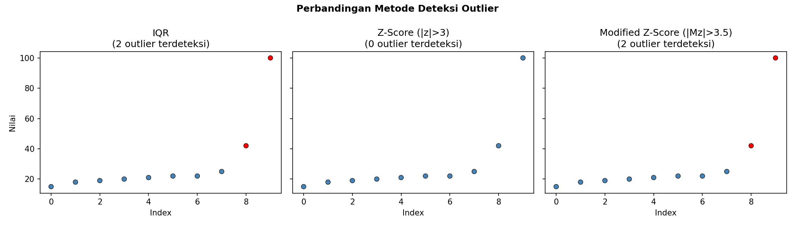

### 3.5 Metode Visual

Selain metode statistik, visualisasi membantu mengidentifikasi outlier secara intuitif.

#### Boxplot

Boxplot secara otomatis menampilkan IQR, median, whisker (1.5x IQR), dan titik-titik outlier.

```python
import matplotlib.pyplot as plt

fig, ax = plt.subplots(figsize=(8, 2))
ax.boxplot(data, vert=False, widths=0.5)
ax.set_xlabel("Nilai")
ax.set_title("Boxplot — Deteksi Outlier")
plt.tight_layout()
plt.show()
```

Pada boxplot, titik-titik di luar whisker adalah outlier. Dalam contoh di atas, nilai 42 dan 100 akan muncul sebagai titik terpisah di sebelah kanan whisker.

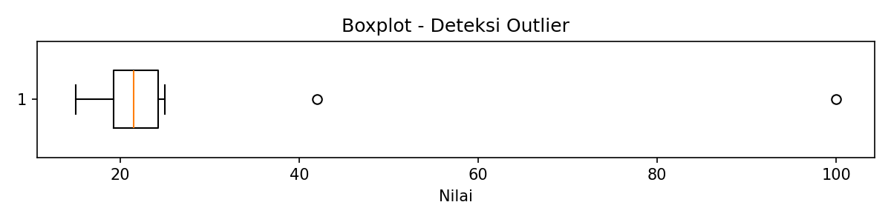

#### Histogram

Histogram menunjukkan distribusi frekuensi. Outlier terlihat sebagai bar yang terisolasi jauh dari kelompok utama.

```python
fig, ax = plt.subplots(figsize=(8, 4))
ax.hist(data, bins=10, edgecolor="black", alpha=0.7)
ax.set_xlabel("Nilai")
ax.set_ylabel("Frekuensi")
ax.set_title("Histogram — Distribusi Data")
plt.tight_layout()
plt.show()
```

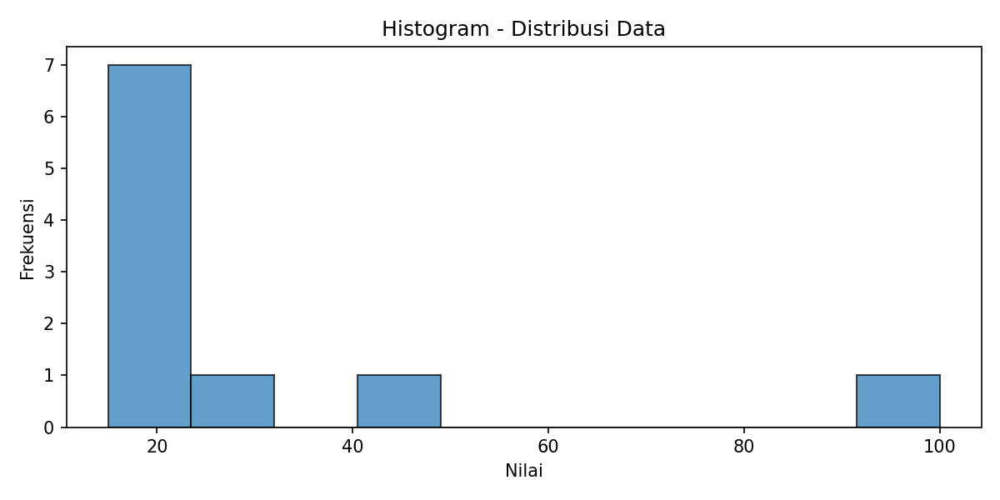

#### Scatter Plot

Scatter plot berguna untuk melihat outlier dalam konteks **dua variabel** sekaligus.

```python
# Contoh: scatter plot index vs value
fig, ax = plt.subplots(figsize=(8, 4))
ax.scatter(range(len(data)), data, edgecolors="black", linewidth=0.5)
ax.set_xlabel("Index")
ax.set_ylabel("Nilai")
ax.set_title("Scatter Plot — Identifikasi Outlier")

# Tambahkan garis batas IQR
ax.axhline(y=batas_atas, color="red", linestyle="--", label=f"Batas atas IQR ({batas_atas})")
ax.axhline(y=batas_bawah, color="red", linestyle="--", label=f"Batas bawah IQR ({batas_bawah})")
ax.legend()
plt.tight_layout()
plt.show()
```

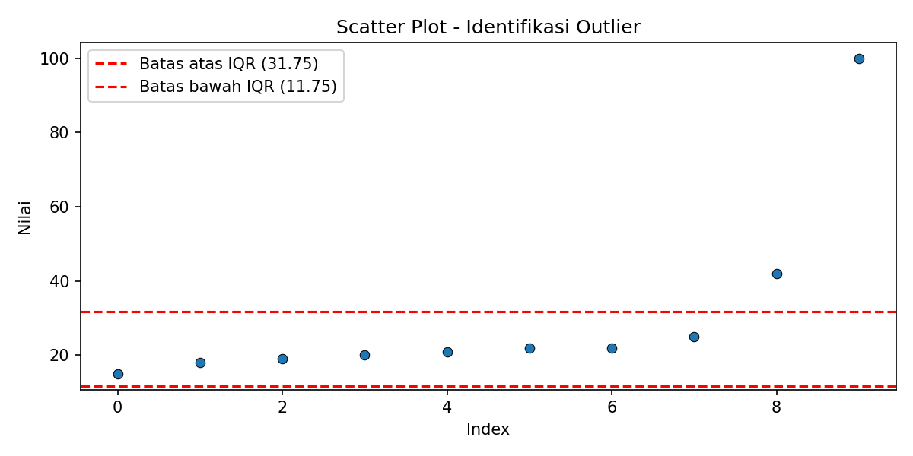

> **Tips**: Dalam praktik, gunakan **kombinasi** metode statistik dan visual. Metode statistik memberikan threshold yang objektif, sedangkan visual membantu memahami *konteks* dan *pola* outlier.

> **Metode lain**: Selain metode statistik di atas, outlier juga bisa dideteksi menggunakan **clustering** — nilai yang tidak termasuk dalam cluster manapun dianggap sebagai outlier (Han et al., 2023). Teknik ini akan dibahas lebih lanjut di materi Unsupervised Learning (Week 9-10).

<details>
<summary><b>Cek Pemahaman</b>: Mengapa Z-score bisa gagal mendeteksi outlier pada dataset kecil?</summary>

Karena Z-score menggunakan **mean** dan **standar deviasi**, yang keduanya sensitif terhadap nilai ekstrem. Outlier menaikkan mean dan menggembungkan std, sehingga z-score outlier itu sendiri menjadi lebih kecil — efek ini disebut **masking**. Modified Z-score menggunakan median dan MAD yang tidak terpengaruh oleh outlier, sehingga lebih robust.

</details>

---

## 4. Binning dan Smoothing

**Binning** adalah teknik membagi data menjadi kelompok-kelompok (bin) berdasarkan interval tertentu. Setelah data dikelompokkan, nilai-nilai dalam setiap bin bisa dihaluskan (**smoothing**) untuk mengurangi noise.

Binning dan smoothing termasuk metode **non-parametrik** yang diperkenalkan di buku Han et al. sebagai teknik dasar data cleaning.

### Flowchart Binning dan Smoothing

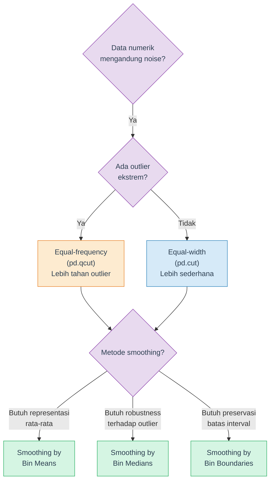

### Contoh Data

Contoh klasik dari Han et al. (2023):

```python
data = pd.Series([4, 8, 15, 21, 21, 24, 25, 28, 34])
```

### 4.1 Equal-Width Binning

Membagi range data menjadi bin dengan **lebar yang sama**.

```python
# 3 bin dengan lebar sama
bins_equal_width = pd.cut(data, bins=3)
print("Equal-width bins:")
print(bins_equal_width.value_counts().sort_index())
```

Expected output:

```
Equal-width bins:
(3.97, 14.0]     2
(14.0, 24.0]     4
(24.0, 34.0]     3
```

> **Catatan**: Equal-width binning sensitif terhadap outlier karena range ditentukan oleh min dan max. Jika ada outlier, bin-bin lain bisa menjadi sangat sempit. Perhatikan juga bahwa bin tengah (14.0, 24.0] berisi 4 data karena ada dua nilai 21 — distribusi per bin tidak selalu merata.

### 4.2 Equal-Frequency (Equal-Depth) Binning

Membagi data sehingga setiap bin memiliki **jumlah data yang (kurang-lebih) sama**.

```python
# 3 bin dengan frekuensi sama (masing-masing 3 data)
bins_equal_freq = pd.qcut(data, q=3)
print("Equal-frequency bins:")
print(bins_equal_freq.value_counts().sort_index())
```

Secara manual, dengan 9 data dan 3 bin (depth = 3):

```
Bin 1: [4, 8, 15]
Bin 2: [21, 21, 24]
Bin 3: [25, 28, 34]
```

### 4.3 Smoothing

Setelah data dibagi ke dalam bin, smoothing mengganti nilai-nilai dalam setiap bin untuk mengurangi noise. Ada tiga metode:

#### Smoothing by Bin Means

Ganti setiap nilai dalam bin dengan **mean** bin tersebut.

```
Bin 1: [4, 8, 15]  → mean = 9   → [9, 9, 9]
Bin 2: [21, 21, 24] → mean = 22  → [22, 22, 22]
Bin 3: [25, 28, 34] → mean = 29  → [29, 29, 29]
```

#### Smoothing by Bin Medians

Ganti setiap nilai dalam bin dengan **median** bin tersebut.

```
Bin 1: [4, 8, 15]  → median = 8  → [8, 8, 8]
Bin 2: [21, 21, 24] → median = 21 → [21, 21, 21]
Bin 3: [25, 28, 34] → median = 28 → [28, 28, 28]
```

#### Smoothing by Bin Boundaries

Ganti setiap nilai dengan **batas bin terdekat** (minimum atau maximum bin).

```
Bin 1: [4, 8, 15]   → boundaries: 4 dan 15
  4  → 4  (sudah di batas)
  8  → 4  (|8-4|=4 < |8-15|=7, lebih dekat ke 4)
  15 → 15 (sudah di batas)
  Hasil: [4, 4, 15]

Bin 2: [21, 21, 24]  → boundaries: 21 dan 24
  21 → 21, 21 → 21, 24 → 24
  Hasil: [21, 21, 24]

Bin 3: [25, 28, 34]  → boundaries: 25 dan 34
  25 → 25, 28 → 25 (|28-25|=3 < |28-34|=6), 34 → 34
  Hasil: [25, 25, 34]
```

### Implementasi Smoothing dengan pandas

```python
# Equal-frequency binning manual (depth = 3)
bin_size = 3
bins = [data.iloc[i:i+bin_size] for i in range(0, len(data), bin_size)]

print("=== Smoothing by Bin Means ===")
for i, b in enumerate(bins):
    smoothed = [round(b.mean())] * len(b)
    print(f"  Bin {i+1}: {b.values.tolist()} -> {smoothed}")

print("\n=== Smoothing by Bin Medians ===")
for i, b in enumerate(bins):
    smoothed = [round(b.median())] * len(b)
    print(f"  Bin {i+1}: {b.values.tolist()} -> {smoothed}")

print("\n=== Smoothing by Bin Boundaries ===")
for i, b in enumerate(bins):
    lo, hi = b.min(), b.max()
    smoothed = [lo if abs(v - lo) <= abs(v - hi) else hi for v in b]
    print(f"  Bin {i+1}: {b.values.tolist()} -> {smoothed}")
```

> **Tips**: Smoothing by bin means paling sering digunakan karena menghasilkan rata-rata yang representatif. Smoothing by boundaries mempertahankan variasi ekstrem dalam bin dan lebih jarang digunakan.

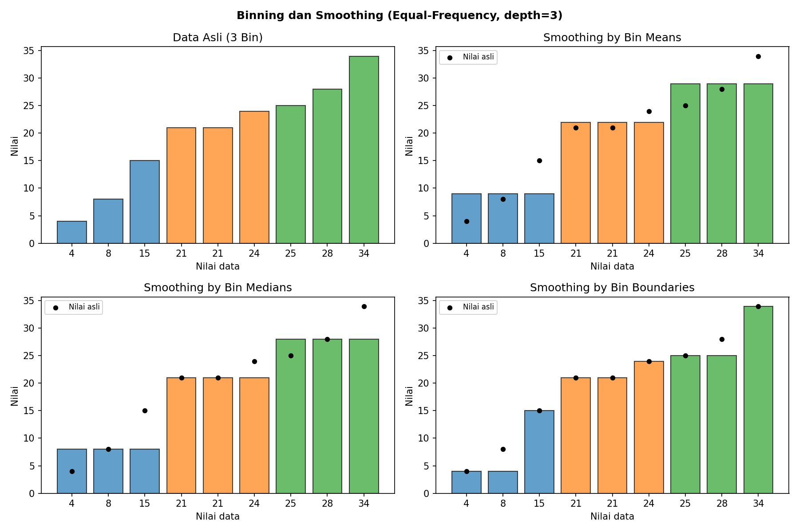

> **Metode smoothing lain**: Selain binning, **regression** juga bisa digunakan untuk smoothing — data difit ke sebuah fungsi (misalnya garis linear) sehingga noise berkurang. Linear regression memodelkan hubungan dua variabel, sedangkan multiple linear regression melibatkan lebih dari dua variabel (Han et al., 2023). Regression dibahas lebih detail di materi Supervised Learning.

<details>
<summary><b>Cek Pemahaman</b>: Apa perbedaan utama antara equal-width dan equal-frequency binning?</summary>

**Equal-width** membagi berdasarkan range (lebar interval sama), sehingga jumlah data per bin bisa tidak merata — terutama jika ada outlier. **Equal-frequency** membagi berdasarkan jumlah data (setiap bin berisi jumlah data yang sama), sehingga lebih tahan terhadap outlier tapi lebar intervalnya bervariasi.

</details>

---

## 5. Handling Outlier

Setelah outlier terdeteksi, ada beberapa cara menanganinya. Pilihan metode tergantung pada konteks data dan tujuan analisis.

### 5.1 Capping (Winsorization)

Ganti nilai outlier dengan **batas atas/bawah** yang ditentukan. Data tidak dihapus, hanya "dipotong" ke batas tertentu.

```python
# Capping menggunakan batas IQR
Q1 = data.quantile(0.25)
Q3 = data.quantile(0.75)
IQR = Q3 - Q1
batas_bawah = Q1 - 1.5 * IQR
batas_atas = Q3 + 1.5 * IQR

data_capped = data.clip(lower=batas_bawah, upper=batas_atas)
print("Sebelum:", data.values)
print("Sesudah:", data_capped.values)
```

Expected output:

```
Sebelum: [ 15  18  19  20  21  22  22  25  42 100]
Sesudah: [15.   18.   19.   20.   21.   22.   22.   25.   31.75 31.75]
```

Alternatif menggunakan `scipy`:

```python
from scipy.stats.mstats import winsorize

# Winsorize 10% dari kedua sisi
data_winsorized = winsorize(data, limits=[0.1, 0.1])
print("Winsorized:", data_winsorized)
```

### 5.2 Trimming

Hapus data yang berada di luar batas. Jumlah data berkurang, tapi distribusi menjadi lebih bersih.

```python
data_trimmed = data[(data >= batas_bawah) & (data <= batas_atas)]
print(f"Sebelum: {len(data)} data -> {data.values}")
print(f"Sesudah: {len(data_trimmed)} data -> {data_trimmed.values}")
```

Expected output:

```
Sebelum: 10 data -> [ 15  18  19  20  21  22  22  25  42 100]
Sesudah: 8 data -> [15 18 19 20 21 22 22 25]
```

> **Penting**: Trimming mengurangi ukuran dataset. Jika outlier banyak, trimming bisa menghapus terlalu banyak data dan membuat model kehilangan informasi. Gunakan dengan hati-hati.

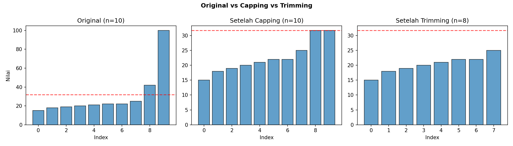

### 5.3 Transformasi

Transformasi mengubah skala data sehingga distribusi menjadi lebih simetris dan outlier tidak terlalu dominan. Data **tidak dihapus** — hanya skalanya yang berubah.

#### Log Transformation

Cocok untuk data dengan **right-skewed distribution** (ekor panjang ke kanan, misalnya data pendapatan atau harga).

```python
# np.log1p = log(1 + x), aman untuk nilai 0
data_log = np.log1p(data)
print("Original:", data.values)
print("Log(1+x):", np.round(data_log.values, 2))
```

Expected output:

```
Original: [ 15  18  19  20  21  22  22  25  42 100]
Log(1+x): [2.77 2.94 3.   3.04 3.09 3.14 3.14 3.26 3.76 4.62]
```

Perhatikan: range data yang tadinya 15-100 (selisih 85) menjadi 2.77-4.62 (selisih 1.85). Outlier 100 masih yang terbesar, tapi jaraknya dengan data lain sudah jauh berkurang.

#### Square Root Transformation

Efek lebih ringan dari log — cocok untuk data yang sedikit skewed.

```python
data_sqrt = np.sqrt(data)
print("Original:", data.values)
print("Sqrt:    ", np.round(data_sqrt.values, 2))
```

Expected output:

```
Original: [ 15  18  19  20  21  22  22  25  42 100]
Sqrt:     [3.87 4.24 4.36 4.47 4.58 4.69 4.69 5.   6.48 10.  ]
```

#### Box-Cox Transformation

Mencari transformasi **optimal** secara otomatis dengan parameter lambda. Memerlukan semua nilai **positif** (> 0).

```python
from scipy.stats import boxcox

data_positive = data[data > 0]
data_boxcox, lmbda = boxcox(data_positive)
print(f"Lambda optimal: {lmbda:.4f}")
print("Box-Cox:", np.round(data_boxcox, 2))
```

| Transformasi | Kapan Digunakan | Syarat |
|---|---|---|
| Log | Data right-skewed, range besar | Nilai >= 0 (gunakan `log1p`) |
| Square Root | Data sedikit skewed | Nilai >= 0 |
| Box-Cox | Tidak tahu transformasi terbaik | Nilai > 0 (strictly positive) |

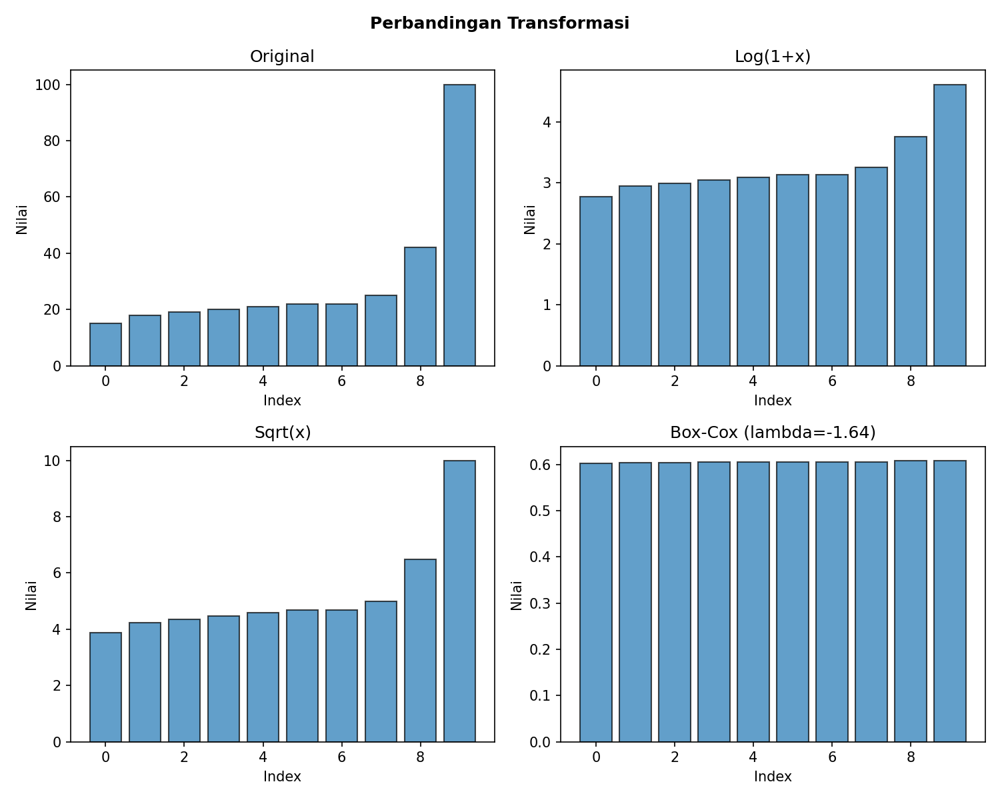

> **Catatan**: Setelah transformasi, jangan lupa bahwa interpretasi berubah — misalnya, model regresi pada data log menghasilkan koefisien dalam skala log, bukan skala asli. Untuk mengembalikan ke skala asli, gunakan `np.expm1()` (kebalikan `log1p`).

---

## 6. Kapan Outlier Dibuang vs Dipertahankan?

Ini adalah pertanyaan paling penting dalam data cleaning. Tidak ada jawaban universal — keputusan harus mempertimbangkan **domain knowledge** dan **tujuan analisis**.

### Framework Pengambilan Keputusan

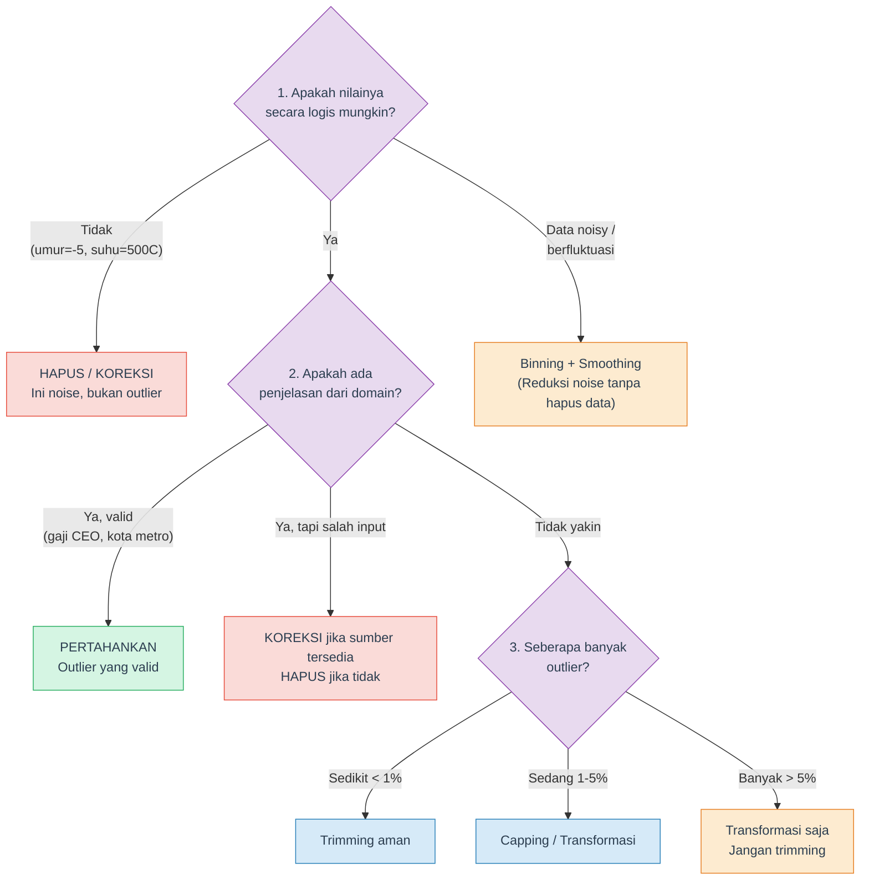

### Pertanyaan Panduan

Sebelum menghapus outlier, tanyakan:

1. **Apakah mungkin secara fisik/logis?** Umur negatif: tidak. Gaji 1 miliar: mungkin.
2. **Apakah konsisten dengan sumber data lain?** Cross-check dengan database asli jika memungkinkan.
3. **Bagaimana dampaknya jika dihapus?** Jika menghapus outlier mengubah kesimpulan secara drastis, perlu hati-hati.
4. **Apa tujuan analisisnya?** Untuk prediksi harga rumah, rumah mewah mungkin perlu dipertahankan. Untuk analisis rumah kelas menengah, bisa di-filter.

### Dimensi Kualitas Data

Saat mengevaluasi apakah suatu data perlu dibersihkan, pertimbangkan enam dimensi kualitas data (Han et al., 2023):

| Dimensi | Pertanyaan | Contoh Masalah |
|---|---|---|
| **Accuracy** | Apakah nilainya benar? | Suhu 500°C untuk cuaca kota |
| **Completeness** | Apakah semua field terisi? | Kolom email kosong 60% |
| **Consistency** | Apakah format/nilai konsisten? | Tanggal campur DD/MM dan MM/DD |
| **Timeliness** | Apakah data masih relevan? | Harga 2019 untuk analisis 2024 |
| **Believability** | Apakah data dipercaya pengguna? | Database pernah error, user tidak percaya walau sudah diperbaiki |
| **Interpretability** | Apakah data mudah dipahami? | Kode akuntansi yang tidak dimengerti tim sales |

---

## 7. Dampak Cleaning pada Statistik Deskriptif

Untuk memahami pentingnya handling outlier, perhatikan bagaimana statistik deskriptif berubah sebelum dan sesudah cleaning.

```python
data = pd.Series([15, 18, 19, 20, 21, 22, 22, 25, 42, 100])

# Sebelum cleaning
print("=== SEBELUM CLEANING ===")
print(data.describe())

# Sesudah capping (IQR)
Q1, Q3 = data.quantile(0.25), data.quantile(0.75)
IQR = Q3 - Q1
data_clean = data.clip(lower=Q1 - 1.5*IQR, upper=Q3 + 1.5*IQR)

print("\n=== SESUDAH CAPPING ===")
print(data_clean.describe())
```

### Perbandingan Before vs After

| Statistik | Sebelum | Sesudah (Capping) | Perubahan |
|---|---|---|---|
| **Mean** | 30.40 | 22.55 | Turun drastis (-26%) |
| **Std** | 25.53 | 5.53 | Turun drastis (-78%) |
| **Min** | 15.00 | 15.00 | Tetap |
| **Median** | 21.50 | 21.50 | Tetap |
| **Max** | 100.00 | 31.75 | Turun (di-cap) |

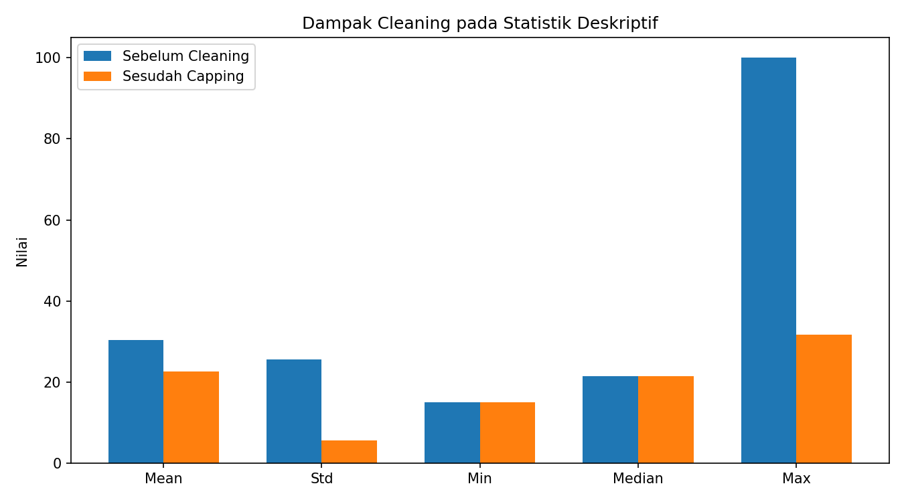

Poin penting:

- **Mean** sangat terpengaruh outlier (turun 26%), sedangkan **median** tidak berubah
- **Standar deviasi** turun 78% — artinya variasi "semu" yang disebabkan outlier sudah hilang
- Ini menunjukkan mengapa **median** lebih robust daripada mean untuk data yang mengandung outlier

> **Catatan**: Angka di atas dihitung dari dataset contoh kita ([15, 18, 19, 20, 21, 22, 22, 25, 42, 100]). Pada dataset nyata, dampaknya bisa lebih besar atau lebih kecil tergantung proporsi dan besarnya outlier.

---

## 8. Data Cleaning sebagai Proses

Data cleaning bukan langkah sekali jalan — melainkan proses **iteratif** yang terdiri dari dua tahap utama (Han et al., 2023):

1. **Discrepancy detection** — Temukan inkonsistensi, error, dan anomali dalam data. Manfaatkan **metadata** (informasi tentang data: tipe, domain, range yang valid) dan statistik deskriptif (mean, median, std, range) untuk mengidentifikasi masalah.

2. **Data transformation** — Setelah masalah ditemukan, terapkan transformasi untuk memperbaikinya (misalnya: format tanggal yang tidak konsisten, kode yang berbeda antar sumber data).

Kedua tahap ini **berulang** — transformasi bisa memunculkan masalah baru (*nested discrepancies*). Misalnya, setelah semua tanggal dikonversi ke format seragam, baru terlihat bahwa ada typo "20010" pada field tahun.

> **Pesan utama**: Cleaning data itu iteratif dan membutuhkan kesabaran. Jangan berharap satu kali pass sudah cukup. Dokumentasikan setiap langkah transformasi agar bisa di-reproduce dan di-audit.

---

## 9. Ringkasan dan Cheatsheet

### Metode Deteksi — Kapan Pakai Apa?

| Situasi | Metode yang Direkomendasikan |
|---|---|
| Data kecil (n < 100) | Modified Z-score (MAD) |
| Data besar, distribusi normal | Z-score |
| Tidak tahu distribusi | IQR |
| Eksplorasi awal | Boxplot + Histogram |
| Dua variabel | Scatter plot |

### Metode Handling — Kapan Pakai Apa?

| Situasi | Metode yang Direkomendasikan |
|---|---|
| Ingin pertahankan jumlah data | Capping / Winsorization |
| Outlier jelas noise (error) | Trimming (hapus) |
| Data right-skewed | Log transformation |
| Data sedikit skewed | Square root transformation |
| Tidak tahu transformasi terbaik | Box-Cox |
| Data berfluktuasi / noisy | Binning + Smoothing |

### Quick Reference Code

```python
import numpy as np
import pandas as pd
from scipy import stats

# === DETEKSI ===
# IQR
Q1, Q3 = df["col"].quantile(0.25), df["col"].quantile(0.75)
IQR = Q3 - Q1
mask_iqr = (df["col"] < Q1 - 1.5*IQR) | (df["col"] > Q3 + 1.5*IQR)

# Z-Score
z = stats.zscore(df["col"])
mask_z = np.abs(z) > 3

# Modified Z-Score
median = df["col"].median()
mad = np.median(np.abs(df["col"] - median))
mod_z = 0.6745 * (df["col"] - median) / mad
mask_mz = np.abs(mod_z) > 3.5

# === HANDLING ===
# Capping
df["col_capped"] = df["col"].clip(lower=Q1 - 1.5*IQR, upper=Q3 + 1.5*IQR)

# Trimming
df_trimmed = df[~mask_iqr]

# Log Transform
df["col_log"] = np.log1p(df["col"])

# Binning (equal-frequency, 5 bin)
df["col_binned"] = pd.qcut(df["col"], q=5, labels=False)
```

---

## 10. Tugas dan Latihan

### Latihan Konseptual

1. Jelaskan perbedaan antara **noise**, **outlier**, dan **anomaly**. Berikan masing-masing satu contoh dari domain e-commerce.

2. Sebuah dataset berisi tinggi badan mahasiswa (dalam cm): `[155, 160, 162, 165, 168, 170, 172, 175, 180, 350]`. Tentukan outlier menggunakan metode IQR. Apakah nilai 350 cm kemungkinan noise atau outlier? Jelaskan alasanmu.

3. Mengapa Z-score bisa gagal mendeteksi outlier pada dataset kecil? Metode apa yang lebih tepat digunakan dan mengapa?

4. Diberikan data berikut: `[5, 10, 11, 13, 15, 35, 50, 55, 72, 92]`. Lakukan equal-frequency binning (3 bin) lalu terapkan smoothing by bin means dan smoothing by bin boundaries.

5. Kapan sebaiknya kamu menggunakan **capping** dibanding **trimming** untuk menangani outlier? Sebutkan kelebihan dan kekurangan masing-masing.

### Latihan Praktik (Dataset: Pima Indians Diabetes)

Gunakan dataset `diabetes.csv` yang tersedia di folder `demo/`. Lihat notebook `Data-Cleaning-Demo.ipynb` sebagai referensi.

6. Kolom `Insulin` memiliki 374 nilai 0 (48.7% dari total data). Bandingkan hasil imputasi menggunakan **mean** vs **median** — mana yang lebih tepat untuk kolom ini? Jelaskan alasanmu berdasarkan distribusi data.

7. Terapkan ketiga metode deteksi outlier (IQR, Z-Score, Modified Z-Score) pada kolom `BMI`. Bandingkan jumlah outlier yang terdeteksi oleh masing-masing metode dan jelaskan mengapa hasilnya berbeda.

8. Lakukan **equal-frequency binning** pada kolom `Age` menjadi 4 bin. Kemudian terapkan smoothing by bin means. Tampilkan distribusi data sebelum dan sesudah smoothing menggunakan histogram.

9. Bandingkan dampak **capping** vs **log transformation** pada kolom `Insulin` terhadap statistik deskriptif (mean, std, median, skewness). Metode mana yang lebih sesuai jika data akan digunakan untuk model klasifikasi?

10. Buat pipeline data cleaning lengkap untuk dataset Pima Indians Diabetes:
    - Identifikasi dan tangani disguised missing values
    - Deteksi outlier pada minimal 3 kolom
    - Terapkan handling yang sesuai untuk setiap kolom
    - Tampilkan tabel perbandingan statistik deskriptif sebelum dan sesudah cleaning

---

## 11. Referensi

### Buku Teks

- Han, J., Kamber, M. & Pei, J. (2023). *Data Mining: Concepts and Techniques*. 4th ed. Chapter 2: Data, Measurements, and Data Preprocessing. Morgan Kaufmann.
- Tan, P.-N., Steinbach, M. & Kumar, V. (2005). *Introduction to Data Mining*. Chapter 2: Data. Wiley.

### Paper

- Iglewicz, B. & Hoaglin, D.C. (1993). *Volume 16: How to Detect and Handle Outliers*. ASQ Quality Press. (Referensi Modified Z-score)

### Dokumentasi

- [pandas — `DataFrame.clip()`](https://pandas.pydata.org/docs/reference/api/pandas.DataFrame.clip.html)
- [pandas — `pd.cut()` dan `pd.qcut()`](https://pandas.pydata.org/docs/reference/api/pandas.cut.html)
- [scipy.stats — `zscore()`](https://docs.scipy.org/doc/scipy/reference/generated/scipy.stats.zscore.html)
- [scipy.stats — `boxcox()`](https://docs.scipy.org/doc/scipy/reference/generated/scipy.stats.boxcox.html)
- [scipy.stats.mstats — `winsorize()`](https://docs.scipy.org/doc/scipy/reference/generated/scipy.stats.mstats.winsorize.html)
