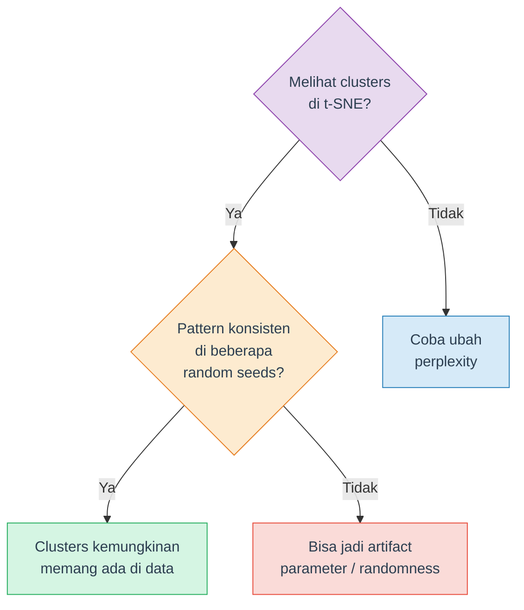

# Visualisasi Data Multivariat: t-SNE

Memahami dan menggunakan **t-SNE** (t-distributed Stochastic Neighbor Embedding) untuk visualisasi high-dimensional data ke 2D.

## Tujuan Pembelajaran

Setelah mempelajari materi ini, mahasiswa diharapkan mampu:

- Menjelaskan mengapa visualisasi multivariat diperlukan
- Memahami cara kerja t-SNE secara konseptual (Gaussian similarity, t-Student distribution, KL divergence)
- Membedakan t-SNE dan PCA serta kapan menggunakan masing-masing
- Mengatur parameter t-SNE (perplexity, learning rate, max_iter) dengan tepat
- Menginterpretasikan hasil t-SNE dengan benar dan menghindari kesalahan umum

## Daftar Isi

1. [Mengapa Visualisasi Data Multivariat?](#1-mengapa-visualisasi-data-multivariat)
2. [Apa itu t-SNE?](#2-apa-itu-t-sne)
3. [t-SNE vs PCA (Singkat)](#3-t-sne-vs-pca-singkat)
4. [Cara Kerja t-SNE](#4-cara-kerja-t-sne)
5. [Parameter t-SNE](#5-parameter-t-sne)
6. [Interpretasi t-SNE yang Benar](#6-interpretasi-t-sne-yang-benar)
7. [Limitasi t-SNE](#7-limitasi-t-sne)
8. [t-SNE dengan Python: Quick Reference](#8-t-sne-dengan-python-quick-reference)
9. [Ringkasan dan Cheatsheet](#9-ringkasan-dan-cheatsheet)
10. [Tugas dan Latihan](#10-tugas-dan-latihan)
11. [Referensi](#11-referensi)

---

## 1. Mengapa Visualisasi Data Multivariat?

Dalam data science, kita sering bekerja dengan dataset yang memiliki **banyak fitur** (variabel). Beberapa contoh:

| Dataset | Jumlah Fitur | Deskripsi |
|---|---|---|
| Iris | 4 | Ukuran kelopak dan mahkota bunga |
| Digits (MNIST kecil) | 64 | Piksel gambar angka 8x8 |
| MNIST | 784 | Piksel gambar angka 28x28 |
| Gene expression | 20.000+ | Ekspresi gen dari sampel jaringan |

Manusia hanya bisa memvisualisasikan data di **2D atau 3D**. Scatter plot biasa cuma bisa menampilkan 2-3 variabel sekaligus. Bagaimana kalau data kita punya 64 fitur? Atau 784? Kita tidak bisa bikin scatter plot 64 dimensi.

Di sinilah teknik **dimensionality reduction untuk visualisasi** diperlukan. Tujuannya: merepresentasikan high-dimensional data ke **2 dimensi** yang bisa divisualisasikan, sambil **mempertahankan struktur** aslinya semaksimal mungkin.

Dua teknik populer untuk ini:

- **PCA** (Principal Component Analysis) — linear projection, preserves global variance
- **t-SNE** — non-linear embedding, preserves local structure

Materi ini fokus pada **t-SNE**. Detail tentang PCA dibahas di materi terpisah.

> **Catatan**: Dimensionality reduction untuk visualisasi berbeda dengan untuk feature engineering (Week 4-5). Untuk visualisasi, output selalu 2D/3D dan tujuannya memahami data secara visual — bukan reduce fitur untuk model.

---

## 2. Apa itu t-SNE?

**t-SNE** (dibaca: "ti-snee") adalah algoritma dimensionality reduction non-linear yang dikembangkan oleh **Laurens van der Maaten dan Geoffrey Hinton** pada tahun 2008. Nama lengkapnya: *t-distributed Stochastic Neighbor Embedding*.

### Tujuan Utama

t-SNE dirancang khusus untuk **visualisasi** high-dimensional data ke 2D atau 3D. Algoritma ini sangat baik dalam mempertahankan **local structure** — artinya data points yang berdekatan di high-dimensional space akan tetap berdekatan di 2D.

### Kapan Menggunakan t-SNE?

- **Eksplorasi awal** — Melihat apakah ada klaster alami dalam data
- **Validasi visual** — Memverifikasi apakah label kelas memang terpisah di feature space
- **Presentasi** — Menampilkan struktur data kompleks secara intuitif
- **Debugging model** — Memeriksa apakah feature representation sudah baik

### Contoh Penggunaan di Industri

- Bioinformatika: visualisasi single-cell RNA sequencing (ratusan ribu sel, ribuan gen)
- NLP: visualisasi word embeddings (Word2Vec, GloVe)
- Computer Vision: visualisasi fitur dari layer terakhir neural network
- Cybersecurity: deteksi anomali pada network traffic

> **Penting**: t-SNE adalah alat **visualisasi**, bukan preprocessing:
>
> - Hasil t-SNE **tidak boleh** digunakan sebagai input features untuk model ML
> - Tidak punya `transform()` — hasilnya tergantung seluruh dataset saat fitting
> - Bersifat **transductive**, bukan **inductive**

<details>
<summary><b>Cek Pemahaman</b>: Mengapa t-SNE cocok untuk visualisasi tapi tidak untuk preprocessing model?</summary>

t-SNE menghasilkan embedding yang tergantung pada seluruh dataset (transductive, bukan inductive). Tidak ada cara untuk transform data baru tanpa menjalankan ulang seluruh algoritma. Selain itu, t-SNE mempertahankan local structure tapi bisa mendistorsi global distances, sehingga interpretasi geometris dari hasilnya terbatas.

</details>

---

## 3. t-SNE vs PCA (Singkat)

Sebelum mendalami t-SNE, penting memahami perbedaannya dengan PCA agar tahu kapan menggunakan masing-masing.

| Aspek | PCA | t-SNE |
|---|---|---|
| Jenis transformasi | **Linear** | **Non-linear** |
| Yang dipertahankan | Global variance (arah variasi terbesar) | Local proximity (nearest neighbors) |
| Speed | Cepat (matrix decomposition) | Lambat (iterative optimization) |
| Deterministic | Ya (hasil selalu sama) | Tidak (hasil bisa beda tiap run) |
| Scalability | Sangat baik (jutaan data) | Terbatas (~10.000-50.000 data) |
| Interpretasi komponen | Bisa (loading = feature contribution) | Tidak bisa (axis tidak bermakna) |
| Cocok untuk | Global overview, preprocessing | Cluster exploration, detailed visualization |

### Analogi

Bayangkan kamu ingin membuat peta 2D dari permukaan bumi (3D):

- **PCA** seperti proyeksi peta Mercator — preserves global shape tapi distorts ukuran (Greenland terlihat sebesar Afrika)
- **t-SNE** seperti bikin peta kota per kota — setiap kota akurat secara internal, tapi jarak antar kota bisa tidak proporsional

### Kapan Pakai yang Mana?

- Perlu **quick overview** yang interpretable? → PCA
- Perlu **lihat clusters dan local structure** dengan detail? → t-SNE
- Dalam praktik: sering pakai **keduanya** — PCA untuk overview, t-SNE untuk detail

### Perbedaan Matematis

**PCA** mencari proyeksi linear yang memaksimalkan variansi:

$$C = \frac{1}{n} X^T X \quad \text{(matriks kovarians)}$$

$$C w_k = \lambda_k w_k \quad \text{(eigendecomposition: cari eigenvector } w_k \text{ dan eigenvalue } \lambda_k\text{)}$$

$$X_{\text{projected}} = X \cdot W \quad \text{(proyeksi data ke dimensi rendah)}$$

Hasil fitting PCA = matriks $W$ (set of eigenvectors). $W$ **disimpan** → data baru tinggal dikalikan $W$ → **inductive** (punya `transform()`).

**t-SNE** mencari posisi 2D yang meminimalkan perbedaan distribusi kemiripan:

$$\min_{Y} \; KL(P \| Q) = \sum_{i \neq j} p_{ij} \log \frac{p_{ij}}{q_{ij}}$$

Hasil fitting t-SNE = positions $Y$ itu sendiri. **Tidak ada parameter** yang disimpan → data baru tidak bisa di-transform tanpa compute ulang → **transductive** (hanya `fit_transform()`).

> **Catatan**: Detail tentang PCA — teori eigenvalue, explained variance ratio, scree plot, implementasi — dibahas di materi terpisah oleh asisten dosen lain. Materi ini fokus pada t-SNE.

---

## 4. Cara Kerja t-SNE

t-SNE bekerja dalam **empat langkah utama**. Berikut penjelasan konseptual beserta rumus kuncinya.

### Step 1: Compute Similarity in High-Dimensional Space

Untuk setiap pasangan data points, t-SNE menghitung **similarity** berdasarkan jarak:

- Points yang **dekat** → similarity score ($p_{ij}$) **tinggi**
- Points yang **jauh** → similarity score ($p_{ij}$) **rendah**
- $\sigma_i$ ditentukan oleh parameter **perplexity** (Section 5)

**Rumus:**

$$p_{j|i} = \frac{\exp\left(-\|x_i - x_j\|^2 / 2\sigma_i^2\right)}{\sum_{k \neq i} \exp\left(-\|x_i - x_k\|^2 / 2\sigma_i^2\right)}$$

Lalu di-symmetrize: $p_{ij} = \frac{p_{j|i} + p_{i|j}}{2N}$

### Step 2: Initialize Positions in Low-Dimensional Space

Data points diberi posisi awal di 2D. Secara default, scikit-learn pakai hasil **PCA** sebagai inisialisasi (`init='pca'`), yang memberikan starting point lebih stabil daripada random positions.

### Step 3: Compute Similarity in Low-Dimensional Space

Untuk posisi 2D, t-SNE menggunakan **t-Student distribution** (bukan Gaussian). Kenapa? t-Student punya **heavier tails** — data points yang berjauhan mendapat lebih banyak "ruang" di 2D, mengatasi *crowding problem*.

**Rumus:**

$$q_{ij} = \frac{(1 + \|y_i - y_j\|^2)^{-1}}{\sum_{k \neq l} (1 + \|y_k - y_l\|^2)^{-1}}$$

### Step 4: Minimize KL Divergence

t-SNE mengoptimasi posisi 2D dengan meminimalkan **KL divergence** — mengukur seberapa berbeda similarity distribution di high-dimensional space ($P$) vs low-dimensional space ($Q$). Optimasi dilakukan secara iteratif menggunakan **gradient descent**.

**Rumus:**

$$KL(P \| Q) = \sum_{i \neq j} p_{ij} \log \frac{p_{ij}}{q_{ij}}$$

Semakin kecil KL divergence = semakin baik representasi 2D.

### Ringkasan Visual

```mermaid
graph LR
    A["High-dimensional data<br>(N x D)"] --> B["Compute similarity<br>p_ij (Gaussian)"]
    B --> C["Initialize 2D positions<br>(PCA / random)"]
    C --> D["Compute similarity<br>q_ij (t-Student)"]
    D --> E["Minimize<br>KL(P || Q)"]
    E -->|"Iterate"| D
    E -->|"Converged"| F["2D visualization"]

    style A fill:#e8daef,stroke:#8e44ad,color:#2c3e50
    style B fill:#d6eaf8,stroke:#2980b9,color:#2c3e50
    style C fill:#fdebd0,stroke:#e67e22,color:#2c3e50
    style D fill:#d6eaf8,stroke:#2980b9,color:#2c3e50
    style E fill:#fadbd8,stroke:#e74c3c,color:#2c3e50
    style F fill:#d5f5e3,stroke:#27ae60,color:#2c3e50
```



> **Tips**: Tidak perlu menghafal rumus-rumus di atas. Yang penting dipahami adalah **intuisinya**: t-SNE berusaha agar data points yang berdekatan di original space tetap berdekatan di 2D, dan yang berjauhan tetap berjauhan.

<details>
<summary><b>Cek Pemahaman</b>: Mengapa t-SNE menggunakan distribusi t-Student di dimensi rendah, bukan Gaussian?</summary>

t-Student distribution punya heavier tails dibanding Gaussian. Artinya, data points yang cukup berjauhan di high-dimensional space mendapat lebih banyak "ruang" di 2D, sehingga clusters terpisah lebih jelas. Tanpa ini, banyak points akan menumpuk di tengah karena volume 2D jauh lebih kecil dari high-dimensional space (crowding problem).

</details>

---

## 5. Parameter t-SNE

Parameter t-SNE sangat penting karena hasilnya **sangat sensitif** terhadap parameter choice. Berikut parameter utama di `sklearn.manifold.TSNE`:

### Tabel Parameter

| Parameter | Default | Range/Opsi | Deskripsi |
|---|---|---|---|
| `n_components` | 2 | 2 atau 3 | Jumlah dimensi output |
| `perplexity` | 30.0 | 5–50 | Keseimbangan antara struktur lokal dan global |
| `learning_rate` | `'auto'` | `'auto'` atau 10–1000 | Optimization step size (auto = N/12, min 50) |
| `max_iter` | 1000 | 250+ | Jumlah iterasi gradient descent |
| `init` | `'pca'` | `'pca'`, `'random'` | Metode inisialisasi posisi awal |
| `random_state` | None | integer | Seed untuk reproducibility |
| `metric` | `'euclidean'` | lihat dokumentasi | Distance metric |
| `method` | `'barnes_hut'` | `'barnes_hut'`, `'exact'` | Optimization algorithm |
| `n_jobs` | None | integer | Jumlah CPU core (hanya `method='exact'`) |

> **Awas: Perubahan API scikit-learn** — Pada sklearn versi lama (< 1.2), parameter iterasi bernama `n_iter` dan learning rate default-nya `200`. Sejak **sklearn 1.2+**, parameternya berubah menjadi `max_iter` dan `learning_rate='auto'`. Inisialisasi juga berubah dari `init='random'` menjadi `init='pca'`. Pastikan kode kamu menggunakan parameter yang sesuai dengan versi sklearn yang terinstall. Cek versi: `import sklearn; print(sklearn.__version__)`.

### Detail Parameter Penting

#### Perplexity

Perplexity mengontrol berapa banyak "neighbors" yang dipertimbangkan untuk setiap data point. Secara intuitif, perplexity mirip dengan jumlah effective nearest neighbors.

**Rumus:**

$$\text{Perp}(P_i) = 2^{H(P_i)} \quad \text{di mana} \quad H(P_i) = -\sum_j p_{j|i} \log_2 p_{j|i}$$

$H(P_i)$ adalah Shannon entropy dari distribusi $P_i$. Perplexity tinggi → $\sigma_i$ besar → lebih banyak neighbors diperhitungkan.

- **Perplexity rendah** (5-10): Fokus pada very local structure. Clusters kecil-kecil, bisa fragmented
- **Perplexity sedang** (15-50): Balance antara local dan global. Umumnya hasil terbaik
- **Perplexity tinggi** (50+): Lebih mempertimbangkan global structure. Clusters lebih "spread out"

Rule of thumb: perplexity harus **lebih kecil dari jumlah data**. Untuk dataset kecil (N < 100), gunakan perplexity 5-15.


#### Learning Rate

Mengontrol step size optimasi di setiap iterasi.

- Terlalu kecil: slow convergence, bisa stuck di local minimum
- Terlalu besar: unstable, points "meledak" menyebar tidak beraturan
- Rekomendasi: pakai `'auto'` (default sklearn 1.2+), yang menghitung `max(N / 12, 50)`

#### Max Iter (Jumlah Iterasi)

- Default 1000 sudah cukup untuk most cases
- Untuk large datasets, mungkin perlu naikkan ke 2000-5000
- Cek convergence lewat atribut `kl_divergence_` setelah fitting

#### Init (Inisialisasi)

- `'pca'` (default): Stable, deterministic, hasil lebih konsisten antar run
- `'random'`: Random, perlu lebih banyak iterasi, hasil bervariasi

### Wajib: StandardScaler Sebelum t-SNE

t-SNE menghitung Euclidean distance antar data points. Kalau features punya **skala berbeda** (misalnya usia 20-80 vs pendapatan 1.000.000-100.000.000), feature dengan skala besar akan mendominasi distance calculation.

Solusi: **selalu** standardize data sebelum t-SNE.

```python
from sklearn.preprocessing import StandardScaler

scaler = StandardScaler()
X_scaled = scaler.fit_transform(X)

# Baru jalankan t-SNE pada data yang sudah di-scale
tsne = TSNE(random_state=42)
X_tsne = tsne.fit_transform(X_scaled)
```

> **Penting**: Step StandardScaler ini **wajib** dan sering terlewat. Tanpa scaling, hasil t-SNE bisa misleading karena features dengan range besar mendominasi.

<details>
<summary><b>Cek Pemahaman</b>: Apa yang terjadi jika perplexity diset terlalu tinggi (misalnya 200) pada dataset dengan 150 data?</summary>

Perplexity harus lebih kecil dari jumlah data. Kalau perplexity = 200 pada 150 data, sklearn akan error/warning. Secara konseptual, perplexity 200 berarti setiap point mempertimbangkan 200 neighbors — tapi hanya ada 149 points lain. Ini tidak bermakna dan akan menghasilkan visualisasi yang buruk.

</details>

---

## 6. Interpretasi t-SNE yang Benar

Ini adalah bagian **terpenting** dari materi t-SNE. Banyak praktisi membuat interpretation mistakes yang serius.

### Axis X dan Y pada t-SNE Plot

Pertanyaan paling umum saat pertama kali melihat t-SNE plot: **"Axis X dan Y itu apa?"**

Jawabannya: **tidak ada artinya**. Berbeda dengan PCA di mana PC1 = direction of maximum variance dan bisa di-interpret lewat loadings, axis di t-SNE:

- **Bukan represent fitur tertentu** — axis X bukan fitur ke-1, axis Y bukan fitur ke-2
- **Unitless** — skala angkanya (misal -40 sampai 40) tidak punya meaning
- **Arbitrary orientation** — plot bisa di-rotate, di-flip, atau di-scale tanpa mengubah informasi apapun

Kenapa? Karena t-SNE hanya mengoptimasi **relative positions** antar data points — bukan posisi absolutnya. Yang dijaga oleh t-SNE: **jarak relatif antar titik**, bukan koordinatnya.

> **Maka**: Yang boleh kamu interpretasikan dari t-SNE plot hanya **"titik-titik ini dekat satu sama lain"** (similar) dan **"titik-titik ini jauh"** (dissimilar secara lokal). Bukan posisi, bukan skala, bukan axis.

Karena itu, saat membuat t-SNE plot, cukup beri label axis `t-SNE 1` dan `t-SNE 2` — bukan nama fitur.

Berikut 3 common mistakes lain dan cara menghindarinya.

### Mistake 1: Cluster Size is Meaningful

**SALAH**: "Cluster A lebih besar dari cluster B, berarti cluster A lebih spread out."

**BENAR**: Ukuran (area) cluster di t-SNE **tidak** merepresentasikan actual spread dari data. t-SNE cenderung equalize cluster density — cluster yang sangat compact di high-dimensional space bisa terlihat sama besarnya dengan cluster yang sebenarnya spread out.

### Mistake 2: Inter-Cluster Distance is Meaningful

**SALAH**: "Cluster A dan B berdekatan, berarti kedua kelompok itu similar."

**BENAR**: Jarak antar clusters di t-SNE **tidak** bisa diinterpretasikan langsung. Dua clusters yang berdekatan belum tentu lebih similar dibanding clusters yang berjauhan. t-SNE hanya menjamin structure **di dalam** cluster, bukan antar clusters.

### Mistake 3: One Run is Enough

**SALAH**: Jalankan t-SNE sekali lalu langsung conclude.

**BENAR**: t-SNE adalah **stochastic** algorithm — hasilnya bisa berbeda setiap kali dijalankan (kecuali `random_state` di-fix). Selalu jalankan t-SNE dengan **beberapa random seeds** dan pastikan pattern yang terlihat **konsisten** sebelum bikin kesimpulan.


### Panduan Interpretasi



### Ringkasan: DO dan DON'T

| DO | DON'T |
|---|---|
| Jalankan dengan beberapa `random_state` | Percaya satu run saja |
| Interpretasikan **keberadaan** clusters | Interpretasikan **ukuran** clusters |
| Coba beberapa nilai `perplexity` | Langsung pakai default tanpa eksplorasi |
| Pakai StandardScaler sebelum t-SNE | Jalankan t-SNE tanpa scaling |
| Cocokkan visual patterns dengan label/metadata | Interpretasikan jarak antar clusters |
| Set `random_state` untuk reproducibility | Biarkan random (sulit reproduce) |

> **Tips**: Artikel Distill.pub *"How to Use t-SNE Effectively"* (Wattenberg et al., 2016) adalah referensi terbaik untuk memahami interpretasi t-SNE. Sangat direkomendasikan untuk dibaca: [distill.pub/2016/misread-tsne](https://distill.pub/2016/misread-tsne/)

---

## 7. Limitasi t-SNE

Meskipun sangat populer, t-SNE punya beberapa keterbatasan penting:

### 1. Computational Complexity

- **Exact t-SNE**: $O(N^2)$ — tidak praktis untuk large datasets
- **Barnes-Hut t-SNE** (default sklearn): $O(N \log N)$ — lebih cepat tapi tetap lambat untuk > 50.000 data
- Untuk datasets besar (> 100.000), pertimbangkan **UMAP** sebagai faster alternative

### 2. Doesn't Preserve Global Structure

t-SNE fokus pada local structure (neighbor proximity). Konsekuensinya:
- Jarak antar clusters tidak bermakna
- Posisi relatif antar clusters bisa berubah tiap run
- Tidak cocok untuk menyimpulkan hierarchical relationships antar kelompok

### 3. Parameter Sensitive

Hasil t-SNE bisa berubah drastis dengan parameter yang berbeda:
- Perplexity yang salah bisa bikin clusters pecah atau merge
- Learning rate yang salah bisa bikin points menumpuk di satu titik
- Iterasi terlalu sedikit → visualisasi belum converge

### 4. Stochastic (Non-Deterministic)

Tanpa `random_state` yang di-fix, setiap run menghasilkan visualisasi berbeda:
- Presentasi sulit di-reproduce
- Perbandingan antar run memerlukan seed yang sama

### 5. Visualization Only

- Tidak punya `transform()` untuk data baru (transductive, bukan inductive)
- Tidak cocok sebagai preprocessing untuk ML models
- Sumbu hasil (t-SNE 1, t-SNE 2) **tidak punya interpretasi** — berbeda dengan PC1, PC2 pada PCA yang bisa traced back ke original features

### Alternatif: UMAP

**UMAP** (Uniform Manifold Approximation and Projection) adalah modern alternative yang:
- Lebih cepat dari t-SNE
- Lebih baik dalam preserving global structure
- Support `transform()` untuk data baru

UMAP tidak dibahas di materi ini, tapi perlu diketahui sebagai opsi lain.

> **Catatan**: Limitations bukan berarti tidak berguna. t-SNE tetap jadi *de facto standard* untuk visualisasi high-dimensional data di bidang bioinformatics, NLP, dan deep learning. Kuncinya: **pahami limitasinya, interpretasikan dengan hati-hati**.

---

## 8. t-SNE dengan Python: Quick Reference

Berikut minimal example penggunaan t-SNE dengan scikit-learn:

```python
import numpy as np
import matplotlib.pyplot as plt
from sklearn.manifold import TSNE
from sklearn.preprocessing import StandardScaler
from sklearn.datasets import load_iris

# 1. Load data
iris = load_iris()
X, y = iris.data, iris.target

# 2. Standarisasi (WAJIB)
X_scaled = StandardScaler().fit_transform(X)

# 3. Jalankan t-SNE
tsne = TSNE(n_components=2, perplexity=30, random_state=42)
X_tsne = tsne.fit_transform(X_scaled)

# 4. Visualisasi
fig, ax = plt.subplots(figsize=(8, 6))
for i, name in enumerate(iris.target_names):
    mask = y == i
    ax.scatter(X_tsne[mask, 0], X_tsne[mask, 1], alpha=0.7, label=name, s=30)
ax.legend(loc="best")
ax.set_xlabel("t-SNE 1")
ax.set_ylabel("t-SNE 2")
ax.set_title("t-SNE pada Dataset Iris")
plt.tight_layout()
plt.show()

# 5. Cek konvergensi
print(f"KL Divergence: {tsne.kl_divergence_:.4f}")
print(f"Iterasi berjalan: {tsne.n_iter_}")
```


### Penjelasan Kode

| Baris | Penjelasan |
|---|---|
| `StandardScaler().fit_transform(X)` | Standardize features ke mean=0, std=1 |
| `TSNE(n_components=2, ...)` | Reduksi ke 2 dimensi |
| `perplexity=30` | Effective number of neighbors (default, cocok untuk most cases) |
| `random_state=42` | Seed untuk reproducibility |
| `fit_transform(X_scaled)` | Compute t-SNE embedding |
| `kl_divergence_` | Final KL divergence (semakin kecil = semakin baik) |
| `n_iter_` | Number of iterations yang dijalankan |

> **Tips**: Selalu pakai `random_state` agar hasil bisa di-reproduce. Tanpa ini, setiap kali jalankan kode yang sama, hasilnya akan berbeda.

---

## 9. Ringkasan dan Cheatsheet

### Cheatsheet Parameter

| Situasi | `perplexity` | `max_iter` | `learning_rate` | `init` |
|---|---|---|---|---|
| Dataset kecil (< 200) | 5–15 | 1000 | `'auto'` | `'pca'` |
| Dataset sedang (200–5000) | 15–50 | 1000 | `'auto'` | `'pca'` |
| Dataset besar (> 5000) | 30–50 | 1000–2000 | `'auto'` | `'pca'` |
| Klaster terlalu kecil/pecah | Naikkan | — | — | — |
| Klaster terlalu besar/menyatu | Turunkan | — | — | — |
| Hasil belum converge | — | Naikkan | — | — |

### Do's dan Don'ts

**Sebelum t-SNE:**
- Selalu `StandardScaler` dulu
- Pahami data kamu: berapa banyak samples, features, dan classes

**Saat menjalankan t-SNE:**
- Set `random_state` untuk reproducibility
- Coba minimal 3 nilai `perplexity` yang berbeda
- Coba minimal 3 nilai `random_state` yang berbeda

**Saat menginterpretasi:**
- Fokus pada **keberadaan** clusters, bukan size atau distance-nya
- Pastikan pattern konsisten di beberapa runs
- Cocokkan visual dengan label/metadata yang kamu punya
- Jangan bikin causal conclusions dari visualisasi t-SNE

### Kapan Pakai t-SNE?

| Situasi | Gunakan t-SNE? | Alasan |
|---|---|---|
| Cluster exploration di data 50D | Ya | Ideal untuk lihat local structure |
| Preprocessing sebelum Random Forest | Tidak | t-SNE bukan untuk feature engineering |
| Visualisasi word embeddings | Ya | Classic t-SNE use case |
| Comparing distributions antar 2 dataset | Hati-hati | Inter-cluster distance tidak bermakna |
| Dataset 1 juta baris | Tidak | Terlalu lambat, pakai UMAP |
| Presentasi hasil analisis ke stakeholder | Ya | Visualisasi intuitif dan menarik |

---

## 10. Tugas dan Latihan

### Latihan Konseptual

1. **Perbedaan fundamental**: Jelaskan dengan kata-kata kamu sendiri mengapa t-SNE menggunakan distribusi t-Student (bukan Gaussian) di dimensi rendah. Apa masalah yang dipecahkan?

2. **Interpretasi**: Kamu menjalankan t-SNE pada dataset dan melihat 3 klaster. Klaster A berukuran sangat besar, klaster B kecil, dan klaster C sedang. Apakah kamu bisa menyimpulkan bahwa data di klaster A lebih tersebar dibanding klaster B? Jelaskan.

3. **Parameter**: Kamu memiliki dataset dengan 100 sampel dan 50 fitur. Berapa range perplexity yang sesuai? Mengapa perplexity = 80 tidak cocok untuk dataset ini?

4. **Stokastik**: Temanmu menjalankan t-SNE dua kali pada data yang sama (tanpa `random_state`) dan mendapat bentuk klaster yang berbeda. Dia menyimpulkan bahwa t-SNE tidak bisa dipercaya. Apakah kesimpulan ini benar? Jelaskan dan berikan saran perbaikan.

5. **Scaling**: Sebuah dataset memiliki 3 fitur: usia (20-80), pendapatan (1.000.000-100.000.000), dan jumlah anak (0-5). Apa yang terjadi jika kamu menjalankan t-SNE **tanpa** StandardScaler? Fitur mana yang akan mendominasi?

### Latihan Praktik

6. **Eksplorasi Wine Dataset**: Load dataset Wine dari sklearn (`load_wine()`). Lakukan langkah-langkah berikut:
   - Standarisasi data dengan `StandardScaler`
   - Jalankan t-SNE dengan 3 nilai perplexity berbeda (5, 30, 50) dan `random_state=42`
   - Buat subplot 1x3, warnai berdasarkan kelas (3 jenis wine)
   - Tulis observasi: pada perplexity berapa klaster paling terpisah?

7. **Efek StandardScaler**: Menggunakan dataset Iris, bandingkan hasil t-SNE **dengan** dan **tanpa** StandardScaler (`perplexity=30`, `random_state=42`). Buat subplot 1x2. Tulis minimal 3 perbedaan yang kamu amati.

8. **Reproduksibilitas**: Jalankan t-SNE pada dataset Digits dengan 5 `random_state` yang berbeda (0, 42, 123, 456, 789) dan `perplexity=30`. Buat subplot 1x5. Apakah klaster untuk digit 0 dan digit 1 selalu terpisah? Buat kesimpulan tentang robustness hasil t-SNE pada dataset ini.

### Tugas Praktikum (Dikumpulkan)

Tugas berikut dikerjakan dalam **satu notebook (.ipynb)** dan dikumpulkan sesuai deadline yang ditentukan.

#### Tugas 1: Pipeline t-SNE Lengkap pada Breast Cancer Dataset

Gunakan dataset Breast Cancer dari sklearn (`load_breast_cancer()`). Dataset ini memiliki 569 sampel, 30 fitur numerik, dan 2 kelas (malignant vs benign).

**Yang harus dikerjakan:**

a. **Eksplorasi awal** — Tampilkan shape, nama fitur, distribusi kelas, dan statistik deskriptif (mean, std, min, max) dari 5 fitur pertama. Apakah range antar fitur berbeda jauh?

b. **Preprocessing** — Lakukan StandardScaler. Tampilkan mean dan std sebelum dan sesudah scaling untuk membuktikan bahwa scaling berhasil.

c. **t-SNE dasar** — Jalankan t-SNE dengan `perplexity=30` dan `random_state=42`. Buat scatter plot yang diwarnai berdasarkan kelas (malignant = merah, benign = biru). Berikan judul, label sumbu, dan legend.

d. **Eksplorasi perplexity** — Jalankan t-SNE dengan perplexity = 5, 10, 30, 50 (semua `random_state=42`). Buat subplot 2x2. Tulis observasi: pada perplexity berapa kedua kelas paling terpisah?

e. **Cek robustness** — Jalankan t-SNE dengan perplexity terbaik dari poin (d) menggunakan 4 random state berbeda (0, 42, 99, 256). Buat subplot 2x2. Apakah pola pemisahan konsisten?

f. **Kesimpulan** — Tulis 3-5 kalimat yang menjawab: apakah fitur-fitur pada dataset ini cukup baik untuk membedakan tumor malignant dan benign berdasarkan visualisasi t-SNE? Apakah ada titik data yang overlap? Apa implikasinya?

**Deliverables:** Notebook (.ipynb) dengan semua kode berjalan dan output terlihat. Setiap langkah harus memiliki **markdown cell** yang menjelaskan apa yang dilakukan dan observasi kamu.

#### Tugas 2: Analisis Kesalahan Interpretasi

Perhatikan kode berikut:

```python
from sklearn.datasets import load_wine
from sklearn.manifold import TSNE
import matplotlib.pyplot as plt

wine = load_wine()
# Langsung t-SNE tanpa scaling
tsne = TSNE(n_components=2, perplexity=100)
X_tsne = tsne.fit_transform(wine.data)

plt.scatter(X_tsne[:, 0], X_tsne[:, 1])
plt.title("Wine Dataset - t-SNE")
plt.show()

print("Kesimpulan: data wine tidak memiliki klaster yang jelas.")
```

**Yang harus dikerjakan:**

a. Identifikasi **semua kesalahan** dalam kode di atas (minimal 5 kesalahan/bad practice). Untuk setiap kesalahan, jelaskan mengapa itu salah dan apa dampaknya.

b. Tulis ulang kode yang benar dan jalankan. Bandingkan hasilnya dengan kode yang salah. Apakah kesimpulan "tidak ada klaster" masih valid?

c. Dari pengalaman ini, buat daftar **checklist 5 langkah** yang harus selalu diikuti sebelum menginterpretasikan hasil t-SNE.

---

## 11. Referensi

### Buku Teks

- Han, J., Kamber, M. & Pei, J. *Data Mining: Concepts and Techniques*. 4th ed., Morgan Kaufmann, 2023. — Chapter 3: Data Reduction
- Tan, P.-N., Steinbach, M. & Kumar, V. *Introduction to Data Mining*. Wiley, 2005. — Chapter 2: Data

### Paper

- van der Maaten, L. & Hinton, G. "Visualizing Data using t-SNE." *Journal of Machine Learning Research*, 9, pp. 2579–2605, 2008. — Paper asli t-SNE
- van der Maaten, L. "Accelerating t-SNE using Tree-Based Algorithms." *Journal of Machine Learning Research*, 15, pp. 3221–3245, 2014. — Barnes-Hut approximation

### Artikel

- Wattenberg, M., Viegas, F. & Johnson, I. "How to Use t-SNE Effectively." *Distill*, 2016. [distill.pub/2016/misread-tsne](https://distill.pub/2016/misread-tsne/) — Panduan interaktif interpretasi t-SNE (wajib baca)

### Dokumentasi

- scikit-learn: [TSNE API Reference](https://scikit-learn.org/stable/modules/generated/sklearn.manifold.TSNE.html)
- scikit-learn: [Perplexity Example](https://scikit-learn.org/stable/auto_examples/manifold/plot_t_sne_perplexity.html)
