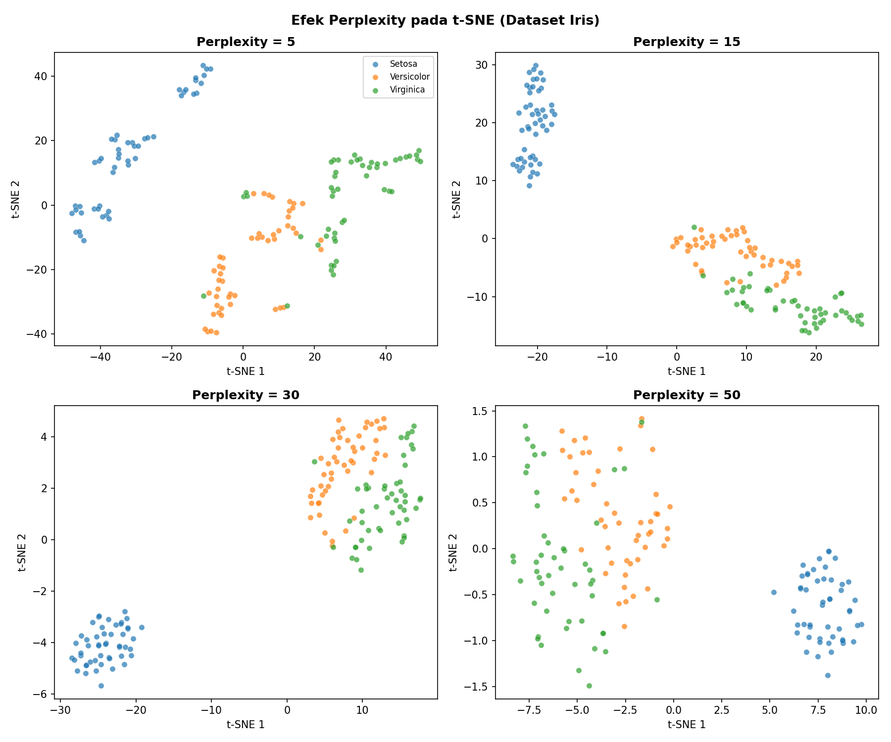
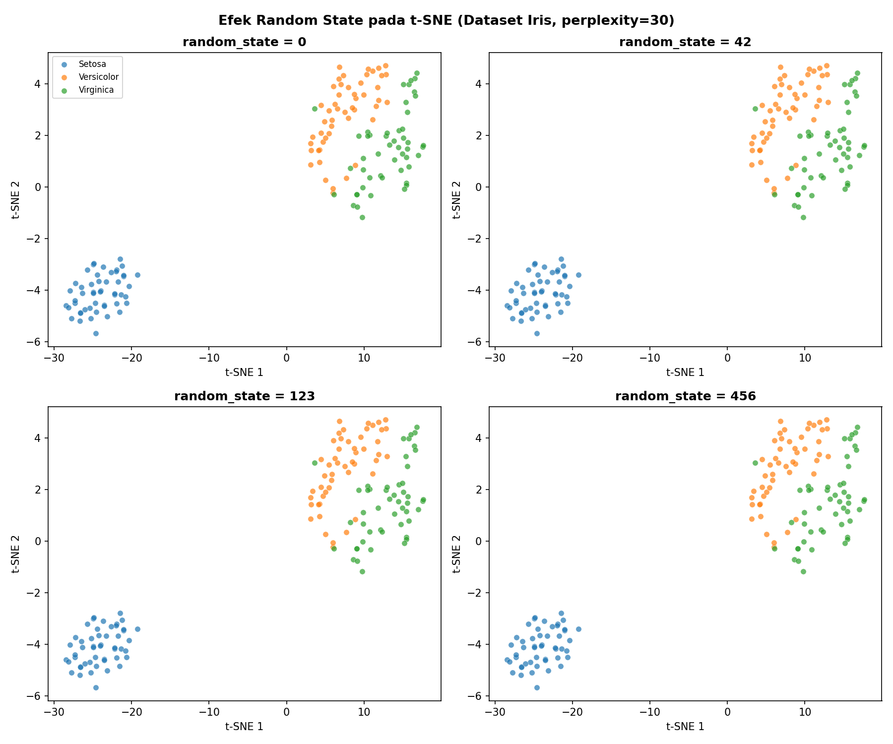
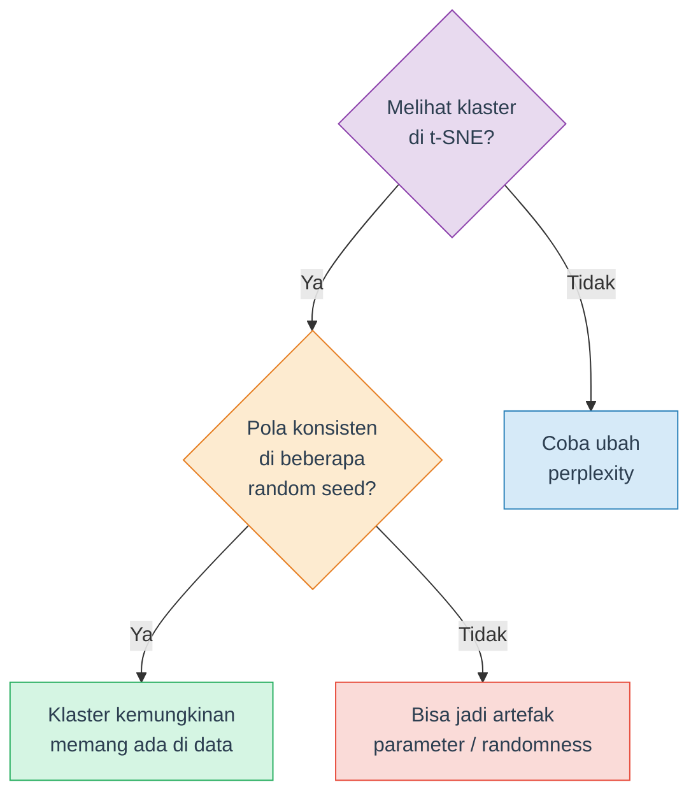
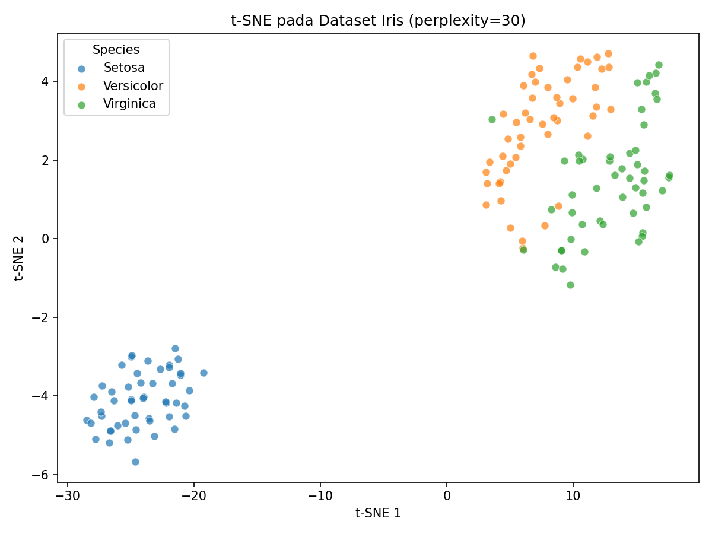

# Visualisasi Data Multivariat: t-SNE

Panduan lengkap untuk memahami dan menggunakan **t-SNE** (t-distributed Stochastic Neighbor Embedding) sebagai teknik visualisasi data berdimensi tinggi. Materi ini mencakup teori, parameter tuning, interpretasi yang benar, dan praktik langsung menggunakan scikit-learn.

## Daftar Isi

1. [Mengapa Visualisasi Data Multivariat?](#1-mengapa-visualisasi-data-multivariat)
2. [Apa itu t-SNE?](#2-apa-itu-t-sne)
3. [t-SNE vs PCA (Singkat)](#3-t-sne-vs-pca-singkat)
4. [Cara Kerja t-SNE](#4-cara-kerja-t-sne)
5. [Parameter t-SNE](#5-parameter-t-sne)
6. [Interpretasi t-SNE yang Benar](#6-interpretasi-t-sne-yang-benar)
7. [Limitasi t-SNE](#7-limitasi-t-sne)
8. [t-SNE dengan Python: Quick Reference](#8-t-sne-dengan-python-quick-reference)
9. [Ringkasan dan Cheatsheet](#9-ringkasan-dan-cheatsheet)
10. [Tugas dan Latihan](#10-tugas-dan-latihan)
11. [Referensi](#11-referensi)

---

## 1. Mengapa Visualisasi Data Multivariat?

Dalam data science, kita sering bekerja dengan dataset yang memiliki **banyak fitur** (variabel). Beberapa contoh:

| Dataset | Jumlah Fitur | Deskripsi |
|---|---|---|
| Iris | 4 | Ukuran kelopak dan mahkota bunga |
| Digits (MNIST kecil) | 64 | Piksel gambar angka 8x8 |
| MNIST | 784 | Piksel gambar angka 28x28 |
| Gene expression | 20.000+ | Ekspresi gen dari sampel jaringan |

Manusia hanya bisa memvisualisasikan data dalam **2D atau 3D**. Scatter plot biasa hanya bisa menampilkan 2-3 variabel sekaligus. Bagaimana jika data kita memiliki 64 fitur? Atau 784? Kita tidak bisa membuat scatter plot 64 dimensi.

Di sinilah teknik **dimensionality reduction untuk visualisasi** diperlukan. Tujuannya: merepresentasikan data berdimensi tinggi ke dalam **2 dimensi** sehingga bisa divisualisasikan, sambil **mempertahankan struktur** data aslinya semaksimal mungkin.

Dua teknik populer untuk ini:

- **PCA** (Principal Component Analysis) — proyeksi linear, menjaga variansi global
- **t-SNE** — embedding non-linear, menjaga kedekatan lokal antar titik data

Materi ini fokus pada **t-SNE**. Detail tentang PCA dibahas di materi terpisah.

> **Catatan**: Dimensionality reduction untuk visualisasi berbeda dengan dimensionality reduction untuk feature engineering (Week 4-5). Pada visualisasi, output selalu 2D/3D dan tujuannya memahami data secara visual — bukan mengurangi fitur untuk model.

---

## 2. Apa itu t-SNE?

**t-SNE** (dibaca: "ti-snee") adalah algoritma dimensionality reduction non-linear yang dikembangkan oleh **Laurens van der Maaten dan Geoffrey Hinton** pada tahun 2008. Nama lengkapnya: *t-distributed Stochastic Neighbor Embedding*.

### Tujuan Utama

t-SNE dirancang khusus untuk **visualisasi** data berdimensi tinggi ke 2D atau 3D. Algoritma ini sangat baik dalam mempertahankan **struktur lokal** — artinya titik-titik data yang berdekatan di ruang dimensi tinggi akan tetap berdekatan di hasil visualisasi 2D.

### Kapan Menggunakan t-SNE?

- **Eksplorasi awal** — Melihat apakah ada klaster alami dalam data
- **Validasi visual** — Memverifikasi apakah label kelas memang terpisah di feature space
- **Presentasi** — Menampilkan struktur data kompleks secara intuitif
- **Debugging model** — Memeriksa apakah representasi fitur sudah baik

### Contoh Penggunaan di Industri

- Bioinformatika: visualisasi single-cell RNA sequencing (ratusan ribu sel, ribuan gen)
- NLP: visualisasi word embeddings (Word2Vec, GloVe)
- Computer Vision: visualisasi fitur dari layer terakhir neural network
- Cybersecurity: deteksi anomali pada network traffic

> **Penting**: t-SNE adalah alat **visualisasi**, bukan preprocessing. Hasil t-SNE (2 komponen) **tidak boleh** digunakan sebagai fitur input untuk model machine learning. Kenapa? Karena t-SNE tidak memiliki fungsi `transform()` untuk data baru — hasilnya tergantung pada seluruh dataset dan parameter saat fitting.

<details>
<summary><b>Cek Pemahaman</b>: Mengapa t-SNE cocok untuk visualisasi tapi tidak untuk preprocessing model?</summary>

t-SNE menghasilkan embedding yang tergantung pada seluruh dataset (transductive, bukan inductive). Tidak ada cara untuk men-transform data baru tanpa menjalankan ulang seluruh algoritma. Selain itu, t-SNE mempertahankan struktur lokal tapi bisa mendistorsi jarak global, sehingga interpretasi geometris dari hasilnya terbatas.

</details>

---

## 3. t-SNE vs PCA (Singkat)

Sebelum mendalami t-SNE, penting memahami perbedaannya dengan PCA agar tahu kapan menggunakan masing-masing.

| Aspek | PCA | t-SNE |
|---|---|---|
| Jenis transformasi | **Linear** | **Non-linear** |
| Yang dipertahankan | Variansi global (arah variasi terbesar) | Kedekatan lokal (tetangga terdekat) |
| Kecepatan | Cepat (dekomposisi matriks) | Lambat (optimisasi iteratif) |
| Deterministik | Ya (hasil selalu sama) | Tidak (hasil bisa bervariasi tiap run) |
| Scalability | Sangat baik (jutaan data) | Terbatas (~10.000-50.000 data) |
| Interpretasi komponen | Bisa (loading = kontribusi fitur) | Tidak bisa (sumbu tidak bermakna) |
| Cocok untuk | Overview global, preprocessing | Eksplorasi klaster, visualisasi detail |

### Analogi

Bayangkan kamu ingin membuat peta 2D dari permukaan bumi (3D):

- **PCA** seperti proyeksi peta Mercator — mempertahankan bentuk global tapi mendistorsi ukuran (Greenland terlihat sebesar Afrika)
- **t-SNE** seperti membuat peta kota per kota — setiap kota akurat secara internal, tapi jarak antar kota bisa tidak proporsional

### Kapan Pakai yang Mana?

- Ingin **overview cepat** dan interpretable? Gunakan PCA
- Ingin **melihat klaster dan struktur lokal** dengan detail? Gunakan t-SNE
- Dalam praktik: sering digunakan **keduanya** — PCA untuk overview, t-SNE untuk detail

> **Catatan**: Detail tentang PCA — teori eigenvalue, explained variance ratio, scree plot, implementasi — dibahas di materi terpisah oleh asisten dosen lain. Materi ini fokus pada t-SNE.

---

## 4. Cara Kerja t-SNE

t-SNE bekerja dalam **empat langkah utama**. Berikut penjelasan konseptual beserta rumus kuncinya.

### Langkah 1: Hitung Kemiripan di Dimensi Tinggi

Untuk setiap pasangan titik data $x_i$ dan $x_j$, t-SNE menghitung **conditional probability** $p_{j|i}$ yang merepresentasikan seberapa mirip $x_j$ dengan $x_i$:

$$p_{j|i} = \frac{\exp\left(-\|x_i - x_j\|^2 / 2\sigma_i^2\right)}{\sum_{k \neq i} \exp\left(-\|x_i - x_k\|^2 / 2\sigma_i^2\right)}$$

- Jika $x_j$ dekat dengan $x_i$, maka $p_{j|i}$ tinggi
- Jika $x_j$ jauh dari $x_i$, maka $p_{j|i}$ rendah
- $\sigma_i$ ditentukan oleh parameter **perplexity** (dijelaskan di Section 5)

Kemudian kemiripan dijadikan simetris:

$$p_{ij} = \frac{p_{j|i} + p_{i|j}}{2N}$$

### Langkah 2: Inisialisasi Posisi di Dimensi Rendah

Titik-titik data diberi posisi awal di 2D. Secara default, scikit-learn menggunakan hasil **PCA** sebagai inisialisasi (`init='pca'`), yang memberikan starting point yang lebih stabil dibanding posisi acak.

### Langkah 3: Hitung Kemiripan di Dimensi Rendah

Untuk posisi 2D $y_i$ dan $y_j$, t-SNE menggunakan **distribusi t-Student** (bukan Gaussian) untuk menghitung kemiripan:

$$q_{ij} = \frac{(1 + \|y_i - y_j\|^2)^{-1}}{\sum_{k \neq l} (1 + \|y_k - y_l\|^2)^{-1}}$$

Mengapa t-Student dan bukan Gaussian? Distribusi t-Student memiliki **ekor lebih tebal** (*heavier tails*) yang memungkinkan titik-titik yang berjauhan di dimensi tinggi untuk **lebih terpisah** di 2D. Ini mengatasi *crowding problem* — fenomena di mana terlalu banyak titik berdesakan di tengah jika menggunakan Gaussian.

### Langkah 4: Minimisasi KL Divergence

t-SNE mengoptimisasi posisi 2D ($y_i$) dengan meminimisasi **Kullback-Leibler divergence** antara distribusi dimensi tinggi ($P$) dan dimensi rendah ($Q$):

$$KL(P \| Q) = \sum_{i \neq j} p_{ij} \log \frac{p_{ij}}{q_{ij}}$$

Optimisasi dilakukan menggunakan **gradient descent**. Semakin kecil nilai KL divergence, semakin baik representasi 2D mempertahankan struktur kemiripan dari dimensi tinggi.

### Ringkasan Visual

```mermaid
graph LR
    A["Data dimensi tinggi<br>(N x D)"] --> B["Hitung kemiripan<br>p_ij (Gaussian)"]
    B --> C["Inisialisasi posisi 2D<br>(PCA / random)"]
    C --> D["Hitung kemiripan<br>q_ij (t-Student)"]
    D --> E["Minimisasi<br>KL(P || Q)"]
    E -->|"Iterasi"| D
    E -->|"Konvergen"| F["Hasil visualisasi<br>2D"]

    style A fill:#e8daef,stroke:#8e44ad,color:#2c3e50
    style B fill:#d6eaf8,stroke:#2980b9,color:#2c3e50
    style C fill:#fdebd0,stroke:#e67e22,color:#2c3e50
    style D fill:#d6eaf8,stroke:#2980b9,color:#2c3e50
    style E fill:#fadbd8,stroke:#e74c3c,color:#2c3e50
    style F fill:#d5f5e3,stroke:#27ae60,color:#2c3e50
```



> **Tips**: Kamu tidak perlu menghafal rumus-rumus di atas. Yang penting dipahami adalah **intuisi**: t-SNE berusaha agar titik-titik yang berdekatan di ruang asli tetap berdekatan di 2D, dan yang berjauhan tetap berjauhan.

<details>
<summary><b>Cek Pemahaman</b>: Mengapa t-SNE menggunakan distribusi t-Student di dimensi rendah, bukan Gaussian?</summary>

Distribusi t-Student memiliki ekor yang lebih tebal (heavier tails) dibanding Gaussian. Ini berarti titik-titik yang cukup berjauhan di dimensi tinggi mendapat "ruang" lebih lebar di 2D, sehingga klaster terpisah lebih jelas. Tanpa ini, banyak titik akan menumpuk di tengah karena volume ruang 2D jauh lebih kecil dari dimensi tinggi (crowding problem).

</details>

---

## 5. Parameter t-SNE

Memahami parameter t-SNE sangat penting karena hasilnya **sangat sensitif** terhadap pemilihan parameter. Berikut parameter utama pada `sklearn.manifold.TSNE`:

### Tabel Parameter

| Parameter | Default | Range/Opsi | Deskripsi |
|---|---|---|---|
| `n_components` | 2 | 2 atau 3 | Jumlah dimensi output |
| `perplexity` | 30.0 | 5–50 | Keseimbangan antara struktur lokal dan global |
| `learning_rate` | `'auto'` | `'auto'` atau 10–1000 | Kecepatan optimisasi (auto = N/12, min 50) |
| `max_iter` | 1000 | 250+ | Jumlah iterasi gradient descent |
| `init` | `'pca'` | `'pca'`, `'random'` | Metode inisialisasi posisi awal |
| `random_state` | None | integer | Seed untuk reproduksibilitas |
| `metric` | `'euclidean'` | lihat dokumentasi | Metrik jarak |
| `method` | `'barnes_hut'` | `'barnes_hut'`, `'exact'` | Algoritma optimisasi |
| `n_jobs` | None | integer | Jumlah CPU core (hanya `method='exact'`) |

> **Awas: Perubahan API scikit-learn** — Pada sklearn versi lama (< 1.2), parameter iterasi bernama `n_iter` dan learning rate default-nya `200`. Sejak **sklearn 1.2+**, parameternya berubah menjadi `max_iter` dan `learning_rate='auto'`. Inisialisasi juga berubah dari `init='random'` menjadi `init='pca'`. Pastikan kode kamu menggunakan parameter yang sesuai dengan versi sklearn yang terinstall. Cek versi: `import sklearn; print(sklearn.__version__)`.

### Detail Parameter Penting

#### Perplexity

Perplexity mengontrol seberapa banyak "tetangga" yang dipertimbangkan untuk setiap titik data. Secara intuitif, perplexity mirip dengan jumlah tetangga terdekat yang efektif.

- **Perplexity rendah** (5-10): Fokus pada struktur sangat lokal. Klaster kecil-kecil, bisa fragmentasi
- **Perplexity sedang** (15-50): Keseimbangan lokal-global. Umumnya hasil terbaik
- **Perplexity tinggi** (50+): Lebih mempertimbangkan struktur global. Klaster lebih "menyebar"

Rule of thumb: perplexity harus **lebih kecil dari jumlah data**. Untuk dataset kecil (N < 100), gunakan perplexity 5-15.



#### Learning Rate

Mengontrol seberapa besar langkah optimisasi di setiap iterasi.

- Terlalu kecil: konvergensi lambat, bisa terjebak di local minimum
- Terlalu besar: hasil tidak stabil, titik-titik "meledak" menyebar tidak beraturan
- Rekomendasi: gunakan `'auto'` (default sklearn 1.2+), yang menghitung `max(N / 12, 50)`

#### Max Iter (Jumlah Iterasi)

- Default 1000 sudah cukup untuk kebanyakan kasus
- Untuk dataset besar, mungkin perlu dinaikkan ke 2000-5000
- Cek konvergensi melalui atribut `kl_divergence_` setelah fitting

#### Init (Inisialisasi)

- `'pca'` (default): Stabil, deterministik, hasil lebih konsisten antar run
- `'random'`: Acak, perlu lebih banyak iterasi, hasil bervariasi

### Wajib: StandardScaler Sebelum t-SNE

t-SNE menghitung jarak Euclidean antar titik data. Jika fitur memiliki **skala berbeda** (misalnya usia 20-80 vs pendapatan 1.000.000-100.000.000), fitur dengan skala besar akan mendominasi perhitungan jarak.

Solusi: **selalu** standarisasi data sebelum t-SNE.

```python
from sklearn.preprocessing import StandardScaler

scaler = StandardScaler()
X_scaled = scaler.fit_transform(X)

# Baru jalankan t-SNE pada data yang sudah di-scale
tsne = TSNE(random_state=42)
X_tsne = tsne.fit_transform(X_scaled)
```

> **Penting**: Langkah StandardScaler ini **wajib** dan sering terlewat. Tanpa scaling, hasil t-SNE bisa menyesatkan karena fitur dengan range besar mendominasi.

<details>
<summary><b>Cek Pemahaman</b>: Apa yang terjadi jika perplexity diset terlalu tinggi (misalnya 200) pada dataset dengan 150 data?</summary>

Perplexity harus lebih kecil dari jumlah data. Jika perplexity = 200 pada 150 data, sklearn akan menghasilkan error atau warning. Secara konseptual, perplexity 200 berarti setiap titik mempertimbangkan 200 tetangga — tapi hanya ada 149 titik lain. Ini tidak bermakna dan akan menghasilkan visualisasi yang buruk.

</details>

---

## 6. Interpretasi t-SNE yang Benar

Ini adalah bagian **terpenting** dari materi t-SNE. Banyak praktisi membuat kesalahan interpretasi yang serius. Berikut tiga kesalahan paling umum dan cara menghindarinya.

### Kesalahan 1: Ukuran Klaster Bermakna

**SALAH**: "Klaster A lebih besar dari klaster B, berarti klaster A lebih tersebar."

**BENAR**: Ukuran (area) klaster di t-SNE **tidak** merepresentasikan sebaran data yang sebenarnya. t-SNE cenderung menyamakan kepadatan klaster — klaster yang sangat rapat di dimensi tinggi bisa terlihat sama besarnya dengan klaster yang sebenarnya tersebar.

### Kesalahan 2: Jarak Antar Klaster Bermakna

**SALAH**: "Klaster A dan B berdekatan, berarti kedua kelompok itu mirip."

**BENAR**: Jarak antar klaster di t-SNE **tidak** bisa diinterpretasikan secara langsung. Dua klaster yang berdekatan belum tentu lebih mirip dibanding klaster yang berjauhan. t-SNE hanya menjamin struktur **di dalam** klaster, bukan antar klaster.

### Kesalahan 3: Satu Visualisasi Sudah Cukup

**SALAH**: Menjalankan t-SNE sekali dan langsung menyimpulkan.

**BENAR**: t-SNE adalah algoritma **stokastik** — hasilnya bisa berbeda setiap kali dijalankan (kecuali `random_state` di-fix). Selalu jalankan t-SNE dengan **beberapa random seed** dan pastikan pola yang terlihat **konsisten** sebelum membuat kesimpulan.



### Panduan Interpretasi



### Ringkasan: DO dan DON'T

| DO | DON'T |
|---|---|
| Jalankan dengan beberapa `random_state` | Percaya satu run saja |
| Interpretasikan **keberadaan** klaster | Interpretasikan **ukuran** klaster |
| Coba beberapa nilai `perplexity` | Langsung pakai default tanpa eksplorasi |
| Gunakan StandardScaler sebelum t-SNE | Jalankan t-SNE pada data tanpa scaling |
| Cocokkan pola visual dengan label/metadata | Interpretasikan jarak antar klaster |
| Set `random_state` untuk reproduksibilitas | Biarkan random (sulit direproduksi) |

> **Tips**: Artikel Distill.pub *"How to Use t-SNE Effectively"* (Wattenberg et al., 2016) adalah referensi terbaik untuk memahami interpretasi t-SNE. Sangat direkomendasikan untuk dibaca: [distill.pub/2016/misread-tsne](https://distill.pub/2016/misread-tsne/)

---

## 7. Limitasi t-SNE

Meskipun sangat populer, t-SNE memiliki beberapa keterbatasan penting:

### 1. Kompleksitas Komputasi

- **Exact t-SNE**: $O(N^2)$ — tidak praktis untuk dataset besar
- **Barnes-Hut t-SNE** (default sklearn): $O(N \log N)$ — lebih cepat tapi tetap lambat untuk > 50.000 data
- Untuk dataset besar (> 100.000), pertimbangkan **UMAP** sebagai alternatif yang lebih cepat

### 2. Tidak Mempertahankan Struktur Global

t-SNE fokus pada struktur lokal (kedekatan tetangga). Konsekuensinya:
- Jarak antar klaster tidak bermakna
- Posisi relatif antar klaster bisa berubah tiap run
- Tidak cocok untuk menyimpulkan hubungan hierarkis antar kelompok

### 3. Sensitif terhadap Parameter

Hasil t-SNE bisa berubah drastis dengan parameter berbeda:
- Perplexity yang salah bisa membuat klaster pecah atau menyatu
- Learning rate yang salah bisa membuat titik menumpuk di satu titik
- Iterasi terlalu sedikit bisa menghasilkan visualisasi yang belum konvergen

### 4. Stochastic (Tidak Deterministik)

Tanpa `random_state` yang di-fix, setiap run menghasilkan visualisasi berbeda. Ini membuat:
- Presentasi sulit direproduksi
- Perbandingan antar run memerlukan seed yang sama

### 5. Hanya untuk Visualisasi

- Tidak memiliki `transform()` untuk data baru (transductive, bukan inductive)
- Tidak cocok sebagai preprocessing untuk model machine learning
- Sumbu hasil (t-SNE 1, t-SNE 2) **tidak memiliki interpretasi** — berbeda dengan PC1, PC2 pada PCA yang bisa ditelusuri ke fitur asli

### Alternatif: UMAP

**UMAP** (Uniform Manifold Approximation and Projection) adalah alternatif modern yang:
- Lebih cepat dari t-SNE
- Lebih baik mempertahankan struktur global
- Mendukung `transform()` untuk data baru

UMAP tidak dibahas dalam materi ini, tapi perlu diketahui sebagai opsi lain.

> **Catatan**: Keterbatasan bukan berarti tidak berguna. t-SNE tetap menjadi *de facto standard* untuk visualisasi data berdimensi tinggi dalam bidang bioinformatika, NLP, dan deep learning. Kuncinya: **pahami limitasinya, interpretasikan dengan hati-hati**.

---

## 8. t-SNE dengan Python: Quick Reference

Berikut contoh minimal penggunaan t-SNE dengan scikit-learn:

```python
import numpy as np
import matplotlib.pyplot as plt
from sklearn.manifold import TSNE
from sklearn.preprocessing import StandardScaler
from sklearn.datasets import load_iris

# 1. Load data
iris = load_iris()
X, y = iris.data, iris.target

# 2. Standarisasi (WAJIB)
X_scaled = StandardScaler().fit_transform(X)

# 3. Jalankan t-SNE
tsne = TSNE(n_components=2, perplexity=30, random_state=42)
X_tsne = tsne.fit_transform(X_scaled)

# 4. Visualisasi
fig, ax = plt.subplots(figsize=(8, 6))
for i, name in enumerate(iris.target_names):
    mask = y == i
    ax.scatter(X_tsne[mask, 0], X_tsne[mask, 1], alpha=0.7, label=name, s=30)
ax.legend(loc="best")
ax.set_xlabel("t-SNE 1")
ax.set_ylabel("t-SNE 2")
ax.set_title("t-SNE pada Dataset Iris")
plt.tight_layout()
plt.show()

# 5. Cek konvergensi
print(f"KL Divergence: {tsne.kl_divergence_:.4f}")
print(f"Iterasi berjalan: {tsne.n_iter_}")
```



### Penjelasan Kode

| Baris | Penjelasan |
|---|---|
| `StandardScaler().fit_transform(X)` | Standarisasi fitur ke mean=0, std=1 |
| `TSNE(n_components=2, ...)` | Reduksi ke 2 dimensi |
| `perplexity=30` | Jumlah tetangga efektif (default, cocok untuk kebanyakan kasus) |
| `random_state=42` | Seed untuk reproduksibilitas |
| `fit_transform(X_scaled)` | Hitung embedding t-SNE |
| `kl_divergence_` | Nilai KL divergence akhir (semakin kecil = semakin baik) |
| `n_iter_` | Jumlah iterasi yang dijalankan |

> **Tips**: Selalu gunakan `random_state` agar hasil bisa direproduksi. Tanpa ini, setiap kali menjalankan kode yang sama, hasilnya akan berbeda.

---

## 9. Ringkasan dan Cheatsheet

### Cheatsheet Parameter

| Situasi | `perplexity` | `max_iter` | `learning_rate` | `init` |
|---|---|---|---|---|
| Dataset kecil (< 200) | 5–15 | 1000 | `'auto'` | `'pca'` |
| Dataset sedang (200–5000) | 15–50 | 1000 | `'auto'` | `'pca'` |
| Dataset besar (> 5000) | 30–50 | 1000–2000 | `'auto'` | `'pca'` |
| Klaster terlalu kecil/pecah | Naikkan | — | — | — |
| Klaster terlalu besar/menyatu | Turunkan | — | — | — |
| Hasil belum konvergen | — | Naikkan | — | — |

### Do's dan Don'ts

**Sebelum t-SNE:**
- Selalu `StandardScaler` terlebih dahulu
- Pahami data kamu: berapa banyak sampel, fitur, dan kelas yang ada

**Saat menjalankan t-SNE:**
- Set `random_state` untuk reproduksibilitas
- Coba minimal 3 nilai `perplexity` yang berbeda
- Coba minimal 3 nilai `random_state` yang berbeda

**Saat menginterpretasi:**
- Fokus pada **keberadaan** klaster, bukan ukuran atau jaraknya
- Pastikan pola konsisten di beberapa run
- Cocokkan visual dengan label/metadata yang kamu punya
- Jangan buat kesimpulan kausal dari visualisasi t-SNE

### Kapan Pakai t-SNE?

| Situasi | Gunakan t-SNE? | Alasan |
|---|---|---|
| Eksplorasi klaster di data 50D | Ya | Ideal untuk melihat struktur lokal |
| Preprocessing sebelum Random Forest | Tidak | t-SNE bukan untuk feature engineering |
| Visualisasi word embeddings | Ya | Use case klasik t-SNE |
| Perbandingan distribusi antar 2 dataset | Hati-hati | Jarak antar klaster tidak bermakna |
| Dataset 1 juta baris | Tidak | Terlalu lambat, gunakan UMAP |
| Presentasi hasil analisis ke stakeholder | Ya | Visualisasi intuitif dan menarik |

---

## 10. Tugas dan Latihan

### Latihan Konseptual

1. **Perbedaan fundamental**: Jelaskan dengan kata-kata kamu sendiri mengapa t-SNE menggunakan distribusi t-Student (bukan Gaussian) di dimensi rendah. Apa masalah yang dipecahkan?

2. **Interpretasi**: Kamu menjalankan t-SNE pada dataset dan melihat 3 klaster. Klaster A berukuran sangat besar, klaster B kecil, dan klaster C sedang. Apakah kamu bisa menyimpulkan bahwa data di klaster A lebih tersebar dibanding klaster B? Jelaskan.

3. **Parameter**: Kamu memiliki dataset dengan 100 sampel dan 50 fitur. Berapa range perplexity yang sesuai? Mengapa perplexity = 80 tidak cocok untuk dataset ini?

4. **Stokastik**: Temanmu menjalankan t-SNE dua kali pada data yang sama (tanpa `random_state`) dan mendapat bentuk klaster yang berbeda. Dia menyimpulkan bahwa t-SNE tidak bisa dipercaya. Apakah kesimpulan ini benar? Jelaskan dan berikan saran perbaikan.

5. **Scaling**: Sebuah dataset memiliki 3 fitur: usia (20-80), pendapatan (1.000.000-100.000.000), dan jumlah anak (0-5). Apa yang terjadi jika kamu menjalankan t-SNE **tanpa** StandardScaler? Fitur mana yang akan mendominasi?

### Latihan Praktik

6. **Eksplorasi Wine Dataset**: Load dataset Wine dari sklearn (`load_wine()`). Lakukan langkah-langkah berikut:
   - Standarisasi data dengan `StandardScaler`
   - Jalankan t-SNE dengan 3 nilai perplexity berbeda (5, 30, 50) dan `random_state=42`
   - Buat subplot 1x3, warnai berdasarkan kelas (3 jenis wine)
   - Tulis observasi: pada perplexity berapa klaster paling terpisah?

7. **Efek StandardScaler**: Menggunakan dataset Iris, bandingkan hasil t-SNE **dengan** dan **tanpa** StandardScaler (`perplexity=30`, `random_state=42`). Buat subplot 1x2. Tulis minimal 3 perbedaan yang kamu amati.

8. **Reproduksibilitas**: Jalankan t-SNE pada dataset Digits dengan 5 `random_state` yang berbeda (0, 42, 123, 456, 789) dan `perplexity=30`. Buat subplot 1x5. Apakah klaster untuk digit 0 dan digit 1 selalu terpisah? Buat kesimpulan tentang robustness hasil t-SNE pada dataset ini.

### Tugas Praktikum (Dikumpulkan)

Tugas berikut dikerjakan dalam **satu notebook (.ipynb)** dan dikumpulkan sesuai deadline yang ditentukan.

#### Tugas 1: Pipeline t-SNE Lengkap pada Breast Cancer Dataset

Gunakan dataset Breast Cancer dari sklearn (`load_breast_cancer()`). Dataset ini memiliki 569 sampel, 30 fitur numerik, dan 2 kelas (malignant vs benign).

**Yang harus dikerjakan:**

a. **Eksplorasi awal** — Tampilkan shape, nama fitur, distribusi kelas, dan statistik deskriptif (mean, std, min, max) dari 5 fitur pertama. Apakah range antar fitur berbeda jauh?

b. **Preprocessing** — Lakukan StandardScaler. Tampilkan mean dan std sebelum dan sesudah scaling untuk membuktikan bahwa scaling berhasil.

c. **t-SNE dasar** — Jalankan t-SNE dengan `perplexity=30` dan `random_state=42`. Buat scatter plot yang diwarnai berdasarkan kelas (malignant = merah, benign = biru). Berikan judul, label sumbu, dan legend.

d. **Eksplorasi perplexity** — Jalankan t-SNE dengan perplexity = 5, 10, 30, 50 (semua `random_state=42`). Buat subplot 2x2. Tulis observasi: pada perplexity berapa kedua kelas paling terpisah?

e. **Cek robustness** — Jalankan t-SNE dengan perplexity terbaik dari poin (d) menggunakan 4 random state berbeda (0, 42, 99, 256). Buat subplot 2x2. Apakah pola pemisahan konsisten?

f. **Kesimpulan** — Tulis 3-5 kalimat yang menjawab: apakah fitur-fitur pada dataset ini cukup baik untuk membedakan tumor malignant dan benign berdasarkan visualisasi t-SNE? Apakah ada titik data yang overlap? Apa implikasinya?

**Deliverables:** Notebook (.ipynb) dengan semua kode berjalan dan output terlihat. Setiap langkah harus memiliki **markdown cell** yang menjelaskan apa yang dilakukan dan observasi kamu.

#### Tugas 2: Analisis Kesalahan Interpretasi

Perhatikan kode berikut:

```python
from sklearn.datasets import load_wine
from sklearn.manifold import TSNE
import matplotlib.pyplot as plt

wine = load_wine()
# Langsung t-SNE tanpa scaling
tsne = TSNE(n_components=2, perplexity=100)
X_tsne = tsne.fit_transform(wine.data)

plt.scatter(X_tsne[:, 0], X_tsne[:, 1])
plt.title("Wine Dataset - t-SNE")
plt.show()

print("Kesimpulan: data wine tidak memiliki klaster yang jelas.")
```

**Yang harus dikerjakan:**

a. Identifikasi **semua kesalahan** dalam kode di atas (minimal 5 kesalahan/bad practice). Untuk setiap kesalahan, jelaskan mengapa itu salah dan apa dampaknya.

b. Tulis ulang kode yang benar dan jalankan. Bandingkan hasilnya dengan kode yang salah. Apakah kesimpulan "tidak ada klaster" masih valid?

c. Dari pengalaman ini, buat daftar **checklist 5 langkah** yang harus selalu diikuti sebelum menginterpretasikan hasil t-SNE.

---

## 11. Referensi

### Buku Teks

- Han, J., Kamber, M. & Pei, J. *Data Mining: Concepts and Techniques*. 4th ed., Morgan Kaufmann, 2023. — Chapter 3: Data Reduction
- Tan, P.-N., Steinbach, M. & Kumar, V. *Introduction to Data Mining*. Wiley, 2005. — Chapter 2: Data

### Paper

- van der Maaten, L. & Hinton, G. "Visualizing Data using t-SNE." *Journal of Machine Learning Research*, 9, pp. 2579–2605, 2008. — Paper asli t-SNE
- van der Maaten, L. "Accelerating t-SNE using Tree-Based Algorithms." *Journal of Machine Learning Research*, 15, pp. 3221–3245, 2014. — Barnes-Hut approximation

### Artikel

- Wattenberg, M., Viegas, F. & Johnson, I. "How to Use t-SNE Effectively." *Distill*, 2016. [distill.pub/2016/misread-tsne](https://distill.pub/2016/misread-tsne/) — Panduan interaktif interpretasi t-SNE (wajib baca)

### Dokumentasi

- scikit-learn: [TSNE API Reference](https://scikit-learn.org/stable/modules/generated/sklearn.manifold.TSNE.html)
- scikit-learn: [Perplexity Example](https://scikit-learn.org/stable/auto_examples/manifold/plot_t_sne_perplexity.html)
