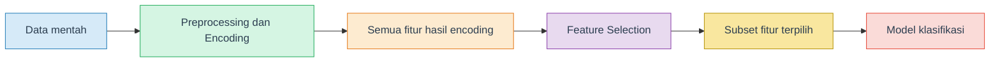
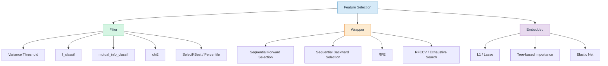
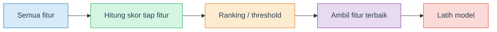
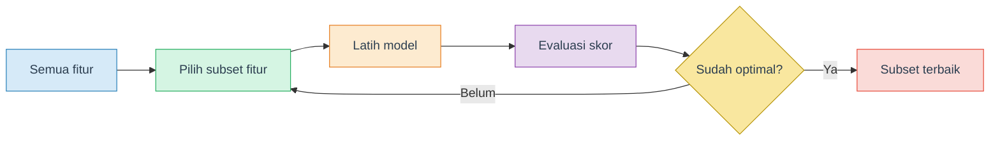
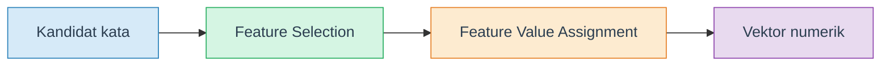

# Feature Selection for Classification

Materi **feature selection** untuk problem klasifikasi dengan fokus pada **filter methods** dan **wrapper methods**.

## Tujuan Pembelajaran

Setelah mempelajari materi ini, mahasiswa diharapkan mampu:

- Menjelaskan mengapa feature selection penting untuk klasifikasi
- Membedakan **filter methods**, **wrapper methods**, dan **embedded methods**
- Memilih metode filter yang sesuai berdasarkan karakteristik fitur dan target
- Memahami cara kerja sequential selection dan recursive elimination
- Menjelaskan hubungan antara encoding dan feature selection pada data kategorikal maupun data teks
- Mengevaluasi trade-off antara performa model, biaya komputasi, dan interpretability

## Daftar Isi

1. [Mengapa Feature Selection Penting?](#1-mengapa-feature-selection-penting)
2. [Feature Selection vs Feature Extraction](#2-feature-selection-vs-feature-extraction)
3. [Tiga Keluarga Metode](#3-tiga-keluarga-metode)
4. [Filter Methods](#4-filter-methods)
5. [Wrapper Methods](#5-wrapper-methods)
6. [Feature Selection setelah Encoding](#6-feature-selection-setelah-encoding)
7. [Memilih Metode yang Tepat](#7-memilih-metode-yang-tepat)
8. [Ringkasan dan Cheatsheet](#8-ringkasan-dan-cheatsheet)
9. [Tugas dan Latihan](#9-tugas-dan-latihan)
10. [Referensi](#10-referensi)

---

## 1. Mengapa Feature Selection Penting?

Dalam machine learning, **feature selection** adalah proses memilih subset fitur input yang paling relevan untuk membangun model.

Kalau jumlah fitur terlalu banyak, beberapa masalah umum akan muncul:

- training lebih lambat
- model lebih mudah overfitting
- interpretasi model makin sulit
- fitur hasil encoding bisa sangat banyak dan tidak semuanya berguna

### Dampak Positif Feature Selection

| Dampak | Penjelasan |
|---|---|
| **Faster training** | Lebih sedikit fitur = lebih sedikit parameter / komputasi |
| **Reduced overfitting** | Fitur yang tidak relevan tidak ikut "mengganggu" model |
| **Better interpretability** | Lebih mudah menjelaskan fitur mana yang benar-benar penting |
| **Cleaner pipeline** | Setelah encoding, dimensi data bisa dikontrol |

### Ilustrasi Alur



---

## 2. Feature Selection vs Feature Extraction

Kedua istilah ini sering tertukar.

| Aspek | Feature Selection | Feature Extraction |
|---|---|---|
| **Apa yang dilakukan?** | Memilih subset dari fitur lama | Membentuk fitur baru dari kombinasi fitur lama |
| **Contoh** | Pilih 10 fitur terbaik dari 100 fitur | PCA membentuk komponen utama baru |
| **Interpretability** | Umumnya lebih mudah | Sering lebih sulit |
| **Contoh umum** | SelectKBest, RFE, SFS | PCA, ICA, autoencoder |

> **Catatan**: Pada repositori ini, fokus Week 3 adalah **feature selection**. PCA memang sering muncul di diskusi feature reduction, tetapi tidak dibahas di modul ini.

---

## 3. Tiga Keluarga Metode

Secara umum, ada tiga keluarga metode:

- **Filter methods**
- **Wrapper methods**
- **Embedded methods**

### Gambaran Besar



### Perbandingan Singkat

| Keluarga | Ide utama | Kelebihan | Kekurangan |
|---|---|---|---|
| **Filter** | Menilai fitur tanpa melatih model utama | Cepat, sederhana, scalable | Bisa mengabaikan interaksi antar fitur |
| **Wrapper** | Menguji subset fitur dengan model | Lebih task-aware | Mahal secara komputasi |
| **Embedded** | Seleksi fitur terjadi saat training | Efisien dan kuat | Bergantung pada model tertentu |

Modul ini fokus pada **Filter** dan **Wrapper**.

---

## 4. Filter Methods

Filter methods memilih fitur berdasarkan skor statistik atau properti tertentu, **tanpa membungkus model prediksi utama**.

### Cara Kerja Umum



### Kelebihan Filter Methods

- cepat
- mudah dijelaskan
- cocok untuk baseline
- cocok untuk data dengan jumlah fitur besar

### Keterbatasan

- umumnya menilai fitur **satu per satu**
- bisa melewatkan kombinasi fitur yang sebenarnya kuat saat dipakai bersama

### 4.1 Variance Threshold

**Ide:** fitur dengan variasi sangat rendah biasanya kurang informatif.

**Tipe fitur yang cocok:**

- paling natural untuk **fitur numerik**
- sangat berguna juga untuk **fitur kategorikal yang sudah di-encoding** menjadi dummy / one-hot
- tidak dipakai langsung pada fitur kategorikal mentah berbentuk string

Cocok untuk:

- data hasil one-hot encoding
- fitur yang hampir selalu sama nilainya

Kelemahan:

- tidak melihat target
- fitur bisa punya variance rendah tapi tetap penting dalam konteks tertentu

Contoh singkat:

```python
from sklearn.feature_selection import VarianceThreshold
selector = VarianceThreshold(threshold=0.01)
X_new = selector.fit_transform(X)
```

### 4.2 ANOVA F-test (`f_classif`)

**Ide:** mengukur seberapa kuat hubungan tiap fitur dengan target klasifikasi.

**Tipe fitur yang cocok:**

- paling cocok untuk **fitur numerik**
- bisa dipakai pada **dummy variables / one-hot encoding** karena hasil akhirnya numerik
- tidak dipakai langsung pada fitur kategorikal mentah berbentuk string

Karakteristik:

- bekerja sebagai uji univariat
- umum dipakai untuk klasifikasi
- lebih cocok untuk hubungan yang cenderung linear / separasi mean antarkelas

Contoh:

```python
from sklearn.feature_selection import SelectKBest, f_classif
selector = SelectKBest(score_func=f_classif, k=10)
X_new = selector.fit_transform(X, y)
```

### 4.3 Mutual Information (`mutual_info_classif`)

**Ide:** mengukur ketergantungan statistik antara fitur dan target.

**Tipe fitur yang cocok:**

- bisa dipakai untuk **fitur numerik**
- bisa juga dipakai untuk **fitur kategorikal yang sudah di-encoding**
- lebih fleksibel dibanding `f_classif` karena tidak terbatas pada relasi linear sederhana

Kelebihan:

- bisa menangkap hubungan non-linear
- berguna ketika relasi fitur-target tidak cukup baik dijelaskan oleh uji linear

Kelemahan:

- estimasinya butuh data lebih banyak
- hasil bisa lebih sensitif pada jumlah sampel dan parameter estimasi

Contoh:

```python
from sklearn.feature_selection import SelectKBest, mutual_info_classif
selector = SelectKBest(score_func=mutual_info_classif, k=10)
X_new = selector.fit_transform(X, y)
```

### 4.4 Chi-Square (`chi2`)

**Ide:** mengukur asosiasi antara fitur non-negatif dan target kategorikal.

**Tipe fitur yang cocok:**

- sangat cocok untuk **fitur kategorikal yang sudah di-one-hot encode**
- sangat umum untuk **fitur text** seperti Bag-of-Words dan TF-IDF non-negatif
- bisa dipakai pada **fitur numerik** hanya jika nilainya non-negative
- tidak dipakai langsung pada fitur kategorikal mentah berbentuk string

Sangat populer untuk:

- data frekuensi
- Bag-of-Words
- TF-IDF non-negatif
- hasil one-hot encoding

**Syarat penting:** fitur harus **non-negative**.

Kalau ada fitur numerik negatif, lakukan scaling dulu agar aman untuk `chi2`.

Contoh:

```python
from sklearn.feature_selection import SelectKBest, chi2
selector = SelectKBest(score_func=chi2, k=10)
X_new = selector.fit_transform(X_non_negative, y)
```

### 4.5 SelectKBest

`SelectKBest` bukan skor, tetapi **selector** untuk memilih **k** fitur terbaik berdasarkan suatu scoring function.

**Tipe fitur yang cocok:**

- mengikuti **score function** yang dipakai
- kalau score-nya `f_classif`, maka lebih cocok untuk fitur numerik / hasil encoding
- kalau score-nya `chi2`, maka fitur harus non-negative
- kalau score-nya `mutual_info_classif`, bisa lebih fleksibel

Pasangan yang umum:

- `SelectKBest(f_classif, k=...)`
- `SelectKBest(mutual_info_classif, k=...)`
- `SelectKBest(chi2, k=...)`

### 4.6 SelectPercentile

Mirip dengan `SelectKBest`, tetapi memilih persentase fitur terbaik.

**Tipe fitur yang cocok:**

- sama seperti `SelectKBest`, tergantung score function yang digunakan
- sangat praktis untuk data dengan banyak fitur hasil encoding

Cocok ketika:

- jumlah fitur hasil encoding cukup besar
- kita ingin threshold relatif, bukan jumlah absolut

Contoh:

```python
from sklearn.feature_selection import SelectPercentile, f_classif
selector = SelectPercentile(score_func=f_classif, percentile=20)
X_new = selector.fit_transform(X, y)
```

### 4.7 Metode Filter Lain

Dokumentasi scikit-learn juga menyediakan metode lain:

| Metode | Ide singkat |
|---|---|
| `GenericUnivariateSelect` | Selector univariat yang lebih fleksibel |
| `SelectFpr` | Seleksi berdasarkan false positive rate |
| `SelectFdr` | Seleksi berdasarkan false discovery rate |
| `SelectFwe` | Seleksi berdasarkan family-wise error rate |

Untuk semua metode di atas, **tipe fitur yang cocok tetap bergantung pada score function** yang dipakai di dalamnya.

Metode-metode ini bagus untuk pengayaan, tetapi untuk praktikum dasar biasanya `VarianceThreshold`, `SelectKBest`, dan `SelectPercentile` sudah cukup kuat.

### Ringkasan Filter Methods

| Metode | Butuh target? | Kapan cocok dipakai? |
|---|---|---|
| VarianceThreshold | Tidak | Buang fitur near-zero variance |
| f_classif | Ya | Klasifikasi dengan relasi cukup sederhana |
| mutual_info_classif | Ya | Ada kemungkinan relasi non-linear |
| chi2 | Ya | Fitur non-negatif, terutama frekuensi / dummy / text |
| SelectKBest | Ya/Tergantung score | Memilih k fitur terbaik |
| SelectPercentile | Ya/Tergantung score | Memilih top persentase fitur |

---

## 5. Wrapper Methods

Wrapper methods mengevaluasi subset fitur dengan benar-benar **melatih model**. Jadi, kualitas fitur dinilai berdasarkan performa model, bukan hanya skor statistik lokal.

### Cara Kerja Umum



### Kelebihan Wrapper Methods

- mempertimbangkan interaksi antar fitur
- lebih dekat ke objective model nyata
- sering memberi subset yang lebih relevan untuk task tertentu

### Keterbatasan

- lebih lambat
- biaya komputasi lebih besar
- jika tidak hati-hati, lebih mudah overfit pada data kecil

### 5.1 Sequential Forward Selection (SFS)

Mulai dari **nol fitur**, lalu tambah satu fitur terbaik di setiap iterasi.

**Tipe fitur yang cocok:**

- bisa dipakai untuk **fitur numerik**
- bisa dipakai untuk **fitur kategorikal yang sudah di-encoding**
- tidak dipakai langsung pada fitur kategorikal mentah berbentuk string, karena estimator klasifikasi biasanya tetap membutuhkan input numerik

Intuisi:

- langkah awal: pilih satu fitur terbaik
- iterasi berikutnya: pilih fitur tambahan yang paling meningkatkan skor model

Contoh:

```python
from sklearn.feature_selection import SequentialFeatureSelector
from sklearn.linear_model import LogisticRegression

model = LogisticRegression(max_iter=1000)
sfs = SequentialFeatureSelector(model, n_features_to_select=10, direction='forward')
X_new = sfs.fit_transform(X, y)
```

### 5.2 Sequential Backward Selection (SBS)

Mulai dari **semua fitur**, lalu buang satu fitur terburuk di setiap iterasi.

**Tipe fitur yang cocok:**

- sama seperti SFS: cocok untuk **fitur numerik** dan **fitur hasil encoding**
- lebih realistis jika jumlah fitur awal tidak terlalu besar

Intuisi:

- cocok jika jumlah fitur awal tidak terlalu besar
- sering lebih efisien jika target jumlah fitur akhir masih cukup banyak

Contoh:

```python
sbs = SequentialFeatureSelector(model, n_features_to_select=10, direction='backward')
X_new = sbs.fit_transform(X, y)
```

### 5.3 Recursive Feature Elimination (RFE)

RFE melatih model, melihat importance / coefficient, lalu membuang fitur paling lemah secara bertahap.

**Tipe fitur yang cocok:**

- cocok untuk **fitur numerik**
- cocok juga untuk **fitur kategorikal yang sudah di-encoding**
- sangat tergantung pada estimator yang dipakai; estimator tersebut harus bisa bekerja pada representasi numerik

Kelebihan:

- populer
- mudah dijelaskan
- sangat cocok bila estimator punya `coef_` atau `feature_importances_`

Contoh:

```python
from sklearn.feature_selection import RFE
rfe = RFE(model, n_features_to_select=10)
X_new = rfe.fit_transform(X, y)
```

### 5.4 RFECV

`RFECV` adalah versi RFE yang mencari jumlah fitur terbaik dengan cross-validation.

**Tipe fitur yang cocok:**

- sama seperti RFE: numerik dan fitur hasil encoding

Kelebihan:

- tidak perlu menebak jumlah fitur terbaik sejak awal

Kekurangan:

- lebih mahal komputasinya

### 5.5 Exhaustive Feature Selection

Ide utamanya adalah mencoba **semua kombinasi subset fitur** dalam rentang tertentu.

**Tipe fitur yang cocok:**

- secara teknis bisa dipakai pada **fitur numerik** maupun **fitur hasil encoding**
- tetapi secara praktis lebih cocok pada data dengan jumlah fitur kecil, biasanya numerik atau encoding yang sudah dipersempit terlebih dahulu

Kelebihan:

- paling brute-force
- sangat bagus untuk demo konsep pada data kecil

Kekurangan:

- sangat mahal secara komputasi
- tidak cocok untuk data hasil one-hot encoding yang dimensinya besar

> **Untuk praktikum minggu ini**: exhaustive search cukup disebut sebagai pengayaan. Fokus utama tetap pada SFS, SBS, dan RFE.

### Ringkasan Wrapper Methods

| Metode | Ide | Tipe fitur yang cocok | Komputasi |
|---|---|---|---|
| SFS | Tambah fitur satu per satu | Numerik + fitur hasil encoding | Sedang |
| SBS | Buang fitur satu per satu | Numerik + fitur hasil encoding | Sedang |
| RFE | Eliminasi fitur lemah bertahap | Numerik + fitur hasil encoding | Sedang |
| RFECV | RFE + pencarian jumlah fitur optimal | Numerik + fitur hasil encoding | Tinggi |
| Exhaustive Search | Coba semua kombinasi | Numerik + fitur hasil encoding (fitur sedikit) | Sangat tinggi |

---

## 6. Feature Selection setelah Encoding

### 6.1 Encoding pada Data Kategorikal

Pada data tabular, kolom kategorikal harus diubah ke bentuk numerik sebelum masuk ke model. Cara yang paling umum:

- one-hot encoding
- dummy variables

Contoh:

| pekerjaan | Hasil one-hot |
|---|---|
| manajer | `[1, 0, 0, 0]` |
| teknisi | `[0, 1, 0, 0]` |
| mahasiswa | `[0, 0, 1, 0]` |

Masalahnya: satu kolom kategorikal bisa berubah menjadi banyak kolom baru. Inilah alasan feature selection penting setelah encoding.

### 6.2 Encoding pada Data Teks

Materi dosen juga menekankan bahwa **text harus di-encode ke numerik** sebelum diproses model.

Contoh representasi teks:

- One-Hot Encoding
- Bag-of-Words
- TF-IDF
- embeddings

### Ilustrasi Pipeline Text Encoding



Pada text classification, `chi2` dan mutual information sering dipakai setelah dokumen diubah menjadi:

- Bag-of-Words
- Count matrix
- TF-IDF matrix

> **Intinya sama**: baik data tabular maupun text, encoding bisa menghasilkan ruang fitur yang besar. Feature selection membantu menyaring fitur yang lebih relevan.

---

## 7. Memilih Metode yang Tepat

Tidak ada satu metode yang selalu terbaik.

### Rule of Thumb

| Kondisi | Saran |
|---|---|
| Banyak fitur hasil encoding | Mulai dari `VarianceThreshold` + filter univariat |
| Ingin baseline cepat | `SelectKBest` atau `SelectPercentile` |
| Curiga ada hubungan non-linear | Coba `mutual_info_classif` |
| Data frekuensi / text / dummy non-negative | Coba `chi2` |
| Banyak fitur kategorikal mentah | Encode dulu, baru lakukan feature selection |
| Ingin subset yang lebih sesuai model | Coba SFS / SBS / RFE |
| Fitur banyak sekali | Hindari exhaustive search |

### Strategi Praktis

1. Mulai dari preprocessing yang benar
2. Bangun baseline dengan semua fitur
3. Terapkan filter methods sebagai baseline cepat
4. Terapkan wrapper methods untuk pembandingan yang lebih task-aware
5. Bandingkan:
   - jumlah fitur akhir
   - skor model
   - biaya komputasi
   - kemudahan interpretasi

---

## 8. Ringkasan dan Cheatsheet

### Cheatsheet Singkat

| Metode | Jenis | Butuh target | Catatan |
|---|---|---|---|
| VarianceThreshold | Filter | Tidak | Buang fitur near-zero variance |
| f_classif | Filter score | Ya | Relasi sederhana / ANOVA |
| mutual_info_classif | Filter score | Ya | Menangkap dependensi non-linear |
| chi2 | Filter score | Ya | Fitur harus non-negative |
| SelectKBest | Filter selector | Ya/Tergantung score | Pilih top-k fitur |
| SelectPercentile | Filter selector | Ya/Tergantung score | Pilih top persentase fitur |
| SFS | Wrapper | Ya | Tambah fitur satu per satu |
| SBS | Wrapper | Ya | Buang fitur satu per satu |
| RFE | Wrapper | Ya | Eliminasi fitur lemah bertahap |
| RFECV | Wrapper | Ya | RFE + CV |

### Satu Kalimat per Metode

- **VarianceThreshold**: buang fitur yang hampir tidak berubah
- **f_classif**: cari fitur dengan perbedaan antarkelas yang kuat
- **mutual_info_classif**: cari fitur yang paling informatif terhadap target
- **chi2**: bagus untuk fitur frekuensi / one-hot / text
- **SFS**: bangun subset fitur dari nol
- **SBS**: pangkas subset fitur dari semua fitur awal
- **RFE**: hapus fitur paling lemah secara bertahap

---

## 9. Tugas dan Latihan

1. Pada dataset klasifikasi tabular, mengapa `customer_number` tidak cocok dipakai langsung sebagai fitur prediktif?
2. Apa perbedaan utama antara `f_classif` dan `mutual_info_classif`?
3. Mengapa `chi2` memerlukan fitur non-negative?
4. Kapan `SelectPercentile` lebih praktis daripada `SelectKBest`?
5. Mengapa wrapper methods lebih mahal secara komputasi daripada filter methods?
6. Jika jumlah fitur hasil one-hot encoding sangat besar, strategi awal apa yang paling masuk akal?
7. Bandingkan kelebihan dan kekurangan SFS vs RFE.
8. Jelaskan hubungan antara text encoding dan feature selection.

---

## 10. Referensi

1. Han, J., Kamber, M., & Pei, J. *Data Mining: Concepts and Techniques*. 4th ed., 2023.
2. Scikit-learn User Guide — Feature Selection: <https://scikit-learn.org/stable/modules/feature_selection.html>
3. Scikit-learn User Guide — Feature Extraction: <https://scikit-learn.org/stable/modules/feature_extraction.html>
4. Scikit-learn API — `CountVectorizer`: <https://scikit-learn.org/stable/modules/generated/sklearn.feature_extraction.text.CountVectorizer.html>
5. Scikit-learn API — `TfidfVectorizer`: <https://scikit-learn.org/stable/modules/generated/sklearn.feature_extraction.text.TfidfVectorizer.html>
6. Mlxtend User Guide — Exhaustive Feature Selector: <https://rasbt.github.io/mlxtend/user_guide/feature_selection/ExhaustiveFeatureSelector/>
