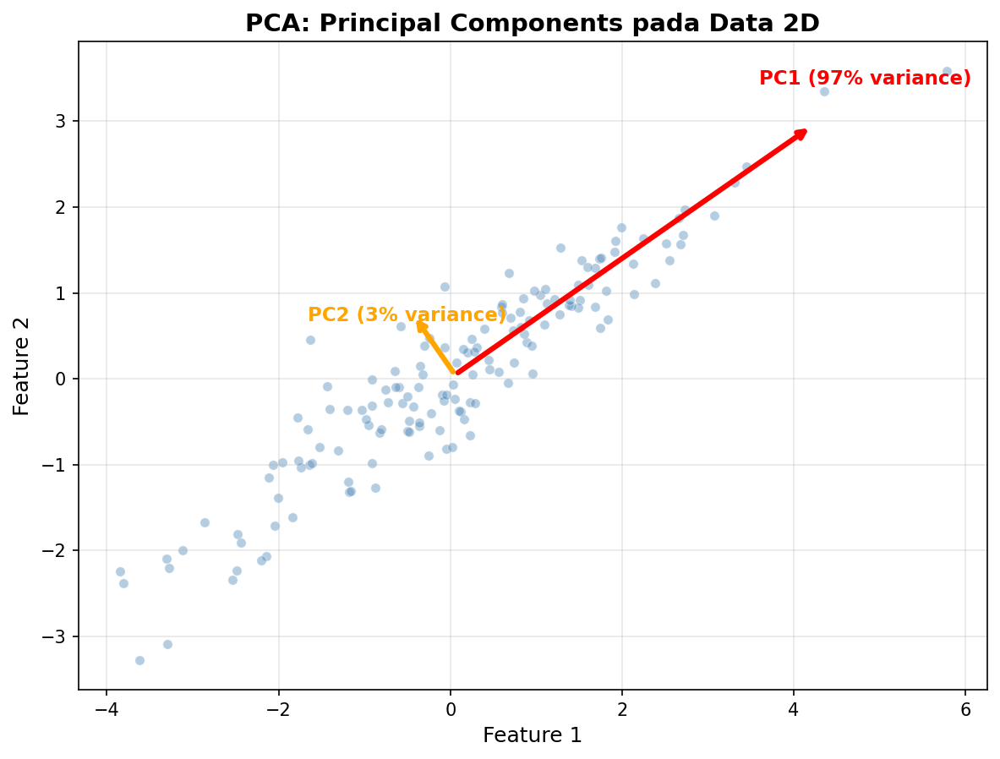
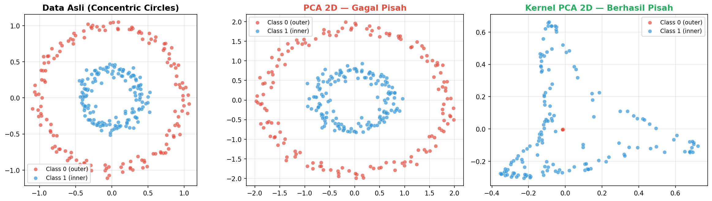
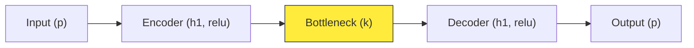
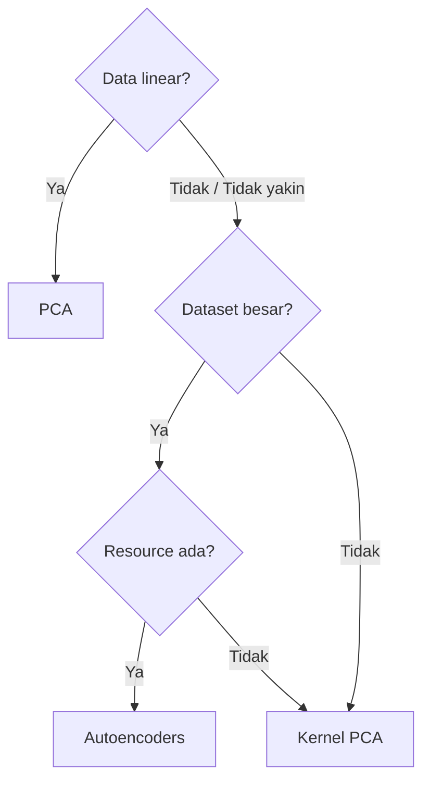

# Feature Extraction: PCA, Kernel PCA, dan Autoencoders

Materi **Feature Extraction** untuk dimensionality reduction — dari linear (PCA), non-linear (Kernel PCA), sampai deep learning (Autoencoders).

## Tujuan Pembelajaran

Setelah mempelajari materi ini, mahasiswa bisa:

- Bedain Feature Selection (Week 3) dan Feature Extraction
- Paham cara kerja PCA termasuk eigen decomposition
- Tau kenapa PCA gagal di data non-linear dan kapan pakai Kernel PCA
- Paham arsitektur Autoencoder (encoder-bottleneck-decoder)
- Pilih metode yang tepat berdasarkan karakteristik data

## Daftar Isi

1. [Feature Extraction vs Feature Selection](#1-feature-extraction-vs-feature-selection)
2. [PCA](#2-pca)
3. [Kernel PCA](#3-kernel-pca)
4. [Autoencoders](#4-autoencoders)
5. [Perbandingan Ketiga Metode](#5-perbandingan-ketiga-metode)
6. [Decision Framework](#6-decision-framework)
7. [Tugas dan Latihan](#7-tugas-dan-latihan)
8. [Referensi](#8-referensi)

---

## 1. Feature Extraction vs Feature Selection

Week 3 kita belajar **Feature Selection** — pilih subset fitur asli yang paling relevan. Sekarang kita belajar **Feature Extraction** — bikin fitur baru dari kombinasi fitur asli.

| Aspek | Feature Selection (Week 3) | Feature Extraction (Week 4) |
|-------|---------------------------|----------------------------|
| Proses | Pilih subset fitur **asli** | Bikin **fitur baru** dari kombinasi |
| Output | {Age, Fare} (nama asli) | {PC1, PC2} (transformasi) |
| Informasi | Fitur tidak terpilih = dibuang | Semua fitur dikombinasikan |
| Interpretasi | Mudah — nama fitur tetap jelas | Sulit — "PC1 itu apa?" |
| Contoh | SelectKBest, RFE, LASSO | PCA, Kernel PCA, Autoencoders |

Kapan extraction lebih cocok dari selection? Ketika fitur-fitur saling berkorelasi tinggi dan informasinya bisa "dipadatkan" ke dimensi lebih sedikit.

---

## 2. PCA

### Definisi

PCA itu teknik **unsupervised linear** dimensionality reduction yang:
- Cari arah (vektor) di mana data punya **maximum variance**
- Bikin komponen baru (PC) yang saling **ortogonal** (tidak berkorelasi)
- Reduce dimensi dengan **minimal information loss**

Bayangin data 2D berbentuk elips:
- **PC1** = sumbu terpanjang elips (arah varians terbesar)
- **PC2** = sumbu terpendek (tegak lurus PC1)

Kalau PC1 udah capture 95% varians, kita bisa buang PC2 dan reduce dari 2D ke 1D.



### Langkah-Langkah PCA

```
Data Mentah
    |
    v
[Preprocessing] - Handle missing, encoding, outlier
    |
    v
[Standardisasi] - z = (x - mu) / sigma  (WAJIB!)
    |
    v
[Covariance Matrix] - Sigma = (1/n-1) X^T X
    |
    v
[Eigen Decomposition] - Sigma v = lambda v
    |
    v
[Pilih k PC] - Berdasarkan cumulative explained variance
    |
    v
[Proyeksi] - Z = X . W
    |
    v
Data Tereduksi (n x k)
```

### Formula

<details>
<summary>Klik untuk lihat formula matematika PCA</summary>

**Standardisasi:**
$$z_i = \frac{x_i - \mu}{\sigma}$$

**Covariance Matrix:**
$$\Sigma = \frac{1}{n-1} \mathbf{X}^T \mathbf{X}$$

**Eigen Decomposition:**
$$\Sigma \mathbf{v} = \lambda \mathbf{v}$$

**Explained Variance Ratio:**
$$\text{EVR}_k = \frac{\lambda_k}{\sum_{i=1}^{p} \lambda_i}$$

**Proyeksi:**
$$\mathbf{Z} = \mathbf{X} \cdot \mathbf{W}$$

Di mana $\mathbf{W} = [\mathbf{v}_1, \mathbf{v}_2, \ldots, \mathbf{v}_k]$ (projection matrix dari k eigenvector teratas).

</details>

### Kenapa Standardisasi Wajib?

PCA sensitif sama **scale** fitur. Kalau fitur "Gaji" range 3-50 juta dan "Umur" range 20-65, tanpa standardisasi PCA bakal didominasi Gaji — padahal belum tentu lebih informatif.

### Menentukan Jumlah PC

Dua cara umum:
- **Cumulative Explained Variance** — pilih k PC pertama yang total variance-nya 80-95%
- **Scree Plot** — plot eigenvalue vs nomor PC, cari "elbow point"

### Kelebihan dan Kekurangan

| Kelebihan | Kekurangan |
|-----------|------------|
| Hilangin multikolinearitas | Cuma capture hubungan **linear** |
| Bantu visualisasi (2D/3D) | Komponen sulit diinterpretasikan |
| Kurangin overfitting | Lossy — ada informasi hilang |
| Cepat dan stabil | Sensitif sama outlier |

### Kapan Pakai PCA?

- Data berdimensi tinggi dengan hubungan **linear**
- Preprocessing sebelum clustering/klasifikasi
- Visualisasi data ke 2D/3D
- Hilangin multikolinearitas sebelum regresi

---

## 3. Kernel PCA

### Limitasi PCA

PCA cuma tangkap hubungan **linear**. Kalau data punya pola **non-linear** (misal: dua class bentuk bulan sabit), PCA gagal.



### Cara Kerja

Kernel PCA solve ini dengan:
1. Transform data ke dimensi lebih tinggi (feature space) di mana pola non-linear jadi linear
2. Lakukan PCA di feature space tersebut

Pakai **kernel trick** — hitung similarity di feature space tanpa beneran transformasi. Yang dihitung cuma kernel matrix $K_{ij} = K(x_i, x_j)$.

### Parameter `kernel` — Jenis Fungsi Similarity

Parameter `kernel` menentukan **cara ukur similarity** antar data point di high-dimensional space.

| Kernel | Apa yang dilakukan | Parameter |
|--------|-------------------|-----------|
| **RBF** (default) | Ukur similarity berdasarkan **jarak Euclidean** antar titik. Makin dekat = makin similar | `gamma` |
| **Polynomial** | Ukur similarity berdasarkan **interaksi polynomial** antar fitur (misal: $x_1 \cdot x_2$, $x_1^2$) | `degree`, `gamma` |
| **Sigmoid** | Mirip aktivasi neural network, ukur similarity pakai fungsi tanh | `gamma`, `coef0` |

<details>
<summary>Klik untuk lihat formula kernel</summary>

**RBF Kernel:**
$$K(x, y) = \exp(-\gamma \|x - y\|^2)$$

**Polynomial Kernel:**
$$K(x, y) = (\gamma \langle x, y \rangle + r)^d$$

**Sigmoid Kernel:**
$$K(x, y) = \tanh(\gamma \langle x, y \rangle + r)$$

</details>

### Parameter `gamma` — Radius Pengaruh

Gamma mengontrol **radius pengaruh** setiap data point:

- **Gamma kecil** (misal 0.01): Setiap titik "pengaruhi" titik-titik yang jauh → decision boundary smooth, general
- **Gamma besar** (misal 100): Setiap titik cuma pengaruhi tetangga sangat dekat → decision boundary detail, bisa overfit

Secara formula (RBF): $K(x, y) = \exp(-\gamma \|x - y\|^2)$
- Gamma kecil → eksponensial turun pelan → titik jauh masih punya nilai K tinggi
- Gamma besar → eksponensial turun cepat → cuma titik dekat yang punya nilai K tinggi

Intinya: **`kernel` = cara ukur similarity, `gamma` = seberapa lokal/global pengukurannya.**

Tips: mulai dari gamma kecil, naikkan bertahap. Perhatikan apakah cluster makin jelas atau justru makin "pecah".

### PCA vs Kernel PCA

| Aspek | PCA | Kernel PCA |
|-------|-----|------------|
| Hubungan | Linear | Non-linear |
| Parameter | `n_components` | `kernel`, `gamma`, `n_components` |
| Explained variance | Ada | Tidak ada (implicit space) |
| Speed | Cepat | Lebih lambat |

### Kapan Pakai?

- PCA gagal misahin cluster
- Data jelas punya pola non-linear
- Dataset tidak terlalu besar (Kernel PCA scale $O(n^2)$)

---

## 4. Autoencoders

### Definisi

Autoencoder itu neural network yang task-nya **reconstruct input sendiri**. Input dan target-nya **sama** — jadi network dipaksa belajar representasi yang paling efisien dari data di layer tengah (bottleneck). Yang kita ambil buat feature extraction adalah output dari **bottleneck layer** — representasi kompresi dari data asli.

### Arsitektur



| Komponen | Fungsi |
|----------|--------|
| **Encoder** | Compress data ke dimensi lebih kecil |
| **Bottleneck** | Fitur baru — representasi paling penting |
| **Decoder** | Reconstruct data dari bottleneck |
| **Loss** | Ukur reconstruction error (MSE / Binary Crossentropy) |

### Kenapa Autoencoder Berguna untuk Feature Extraction?

Bottleneck dipaksa merangkum semua dimensi input (misal 64) jadi cuma beberapa dimensi (misal 2). Informasi yang tidak penting akan hilang, yang tersisa di bottleneck adalah **representasi paling penting** dari data. Ini yang kita ambil sebagai fitur baru.

### Bedanya sama PCA

PCA compress secara **linear** (kombinasi linear fitur asli). Autoencoder compress secara **non-linear** karena pakai activation function (relu, sigmoid). Jadi autoencoder bisa tangkap pola yang lebih kompleks — tapi butuh training dan data yang cukup.

### Loss Function

Loss function ukur seberapa mirip output dengan input (biasanya MSE). Makin kecil loss = makin bagus bottleneck-nya merangkum informasi.

### Cara Belajar

1. Data masuk encoder, dikompresi ke bottleneck
2. Decoder coba reconstruct data asli
3. Loss ukur selisih input vs output
4. Weights di-update via backpropagation
5. Setelah training, bottleneck berisi representasi paling penting

### Autoencoder vs PCA

| Aspek | PCA | Autoencoders |
|-------|-----|--------------|
| Transformasi | Linear | Non-linear |
| Training | Tidak perlu | Perlu |
| Data | Bisa sedikit | Butuh cukup banyak (>1000) |
| Dependency | sklearn | TensorFlow/PyTorch |
| Interpretasi | Mudah | Sulit (black box) |

Fun fact: autoencoder dengan **linear activation** hasilnya sama dengan PCA. Non-linear activation (relu, sigmoid) yang bikin autoencoder lebih powerful.

### Kapan Pakai?

Pakai autoencoder kalau:
- Data kompleks (images, audio, text)
- Dataset cukup besar
- Resource (GPU/time) tersedia

Jangan pakai kalau:
- Dataset kecil — risk overfit
- Butuh interpretability
- PCA udah cukup bagus

---

## 5. Perbandingan Ketiga Metode

| Aspek | PCA | Kernel PCA | Autoencoders |
|-------|-----|------------|--------------|
| Hubungan | Linear | Non-linear | Non-linear |
| Training | Tidak | Tidak | Perlu |
| Parameter | `n_components` | `kernel`, `gamma` | Architecture, epochs |
| Speed | Cepat | Sedang | Lambat |
| Data kecil | Baik | Baik | Overfit risk |
| Interpretasi | Mudah | Sulit | Sulit |
| Best for | General purpose | Non-linear patterns | Complex data |

---

## 6. Decision Framework



Versi ringkas:

| Kondisi | Rekomendasi |
|---------|-------------|
| Data linear, butuh cepat | **PCA** |
| Data non-linear, dataset kecil-medium | **Kernel PCA** |
| Data kompleks (images), resource ada | **Autoencoders** |
| Tidak yakin | Coba **PCA** dulu, kalau gagal coba **Kernel PCA** |

---

## 7. Tugas

Semua tugas menggunakan **Digits dataset** (`sklearn.datasets.load_digits`) — 1797 gambar 8x8, 64 fitur, 10 class.

```python
from sklearn.datasets import load_digits
from sklearn.preprocessing import StandardScaler

digits = load_digits()
X = digits.data       # (1797, 64)
y = digits.target     # (1797,) — label 0-9

X_scaled = StandardScaler().fit_transform(X)
```

1. Apply **PCA**, **Kernel PCA** (RBF), dan **Autoencoder** pada Digits dataset, masing-masing dengan 2 komponen/bottleneck. Visualisasikan latent space ketiga metode.
2. Train **Logistic Regression** pakai extracted features dari masing-masing metode. Bandingkan accuracy-nya.
3. Ubah jumlah komponen/bottleneck jadi **10**. Apakah accuracy naik? Bandingkan ketiga metode lagi.
4. Untuk Kernel PCA, coba 5 nilai gamma: `[0.01, 0.05, 0.1, 0.5, 1.0]`. Mana yang kasih accuracy tertinggi?
5. **Kesimpulan:** Berdasarkan eksperimen, metode mana yang paling cocok untuk Digits dataset? Jelaskan alasanmu.

---

## 8. Referensi

1. Jolliffe, I.T. (2002). *Principal Component Analysis*. Springer.
2. Bishop, C.M. (2006). *Pattern Recognition and Machine Learning*. Springer.
3. Scholkopf, B., Smola, A., & Muller, K.R. (1998). Kernel Principal Component Analysis. *ICANN*.
4. Goodfellow, I., Bengio, Y., & Courville, A. (2016). *Deep Learning*. MIT Press.
5. Scikit-learn: [PCA](https://scikit-learn.org/stable/modules/decomposition.html#pca), [KernelPCA](https://scikit-learn.org/stable/modules/decomposition.html#kernel-pca)

---

*Praktikum Data Mining -- Week 4: Feature Extraction*
