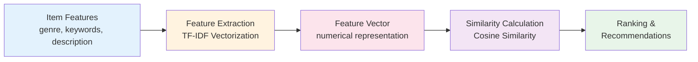
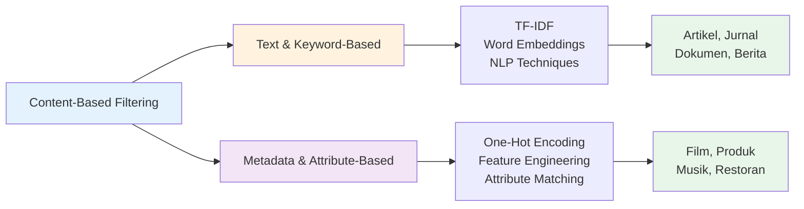
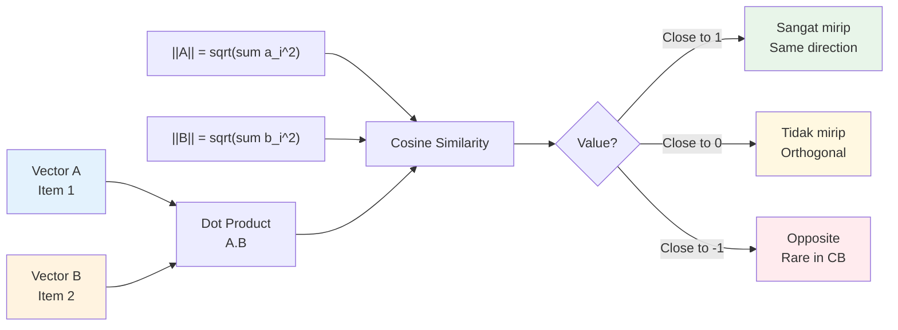
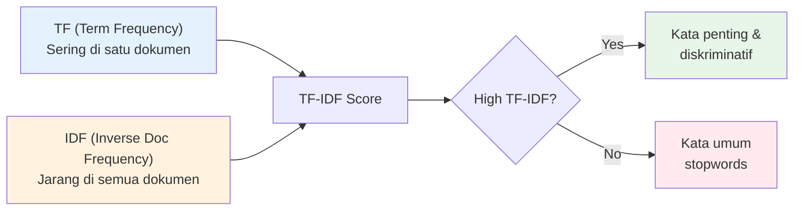
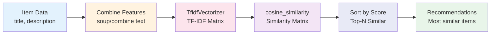
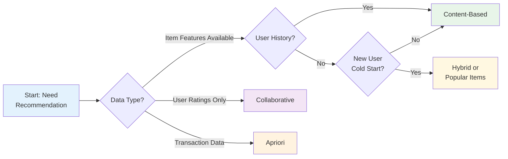

# Content-Based Filtering

## Tujuan Pembelajaran

Setelah mempelajari materi ini, mahasiswa mampu:
1. Menjelaskan konsep Content-Based Filtering dan terminologinya
2. Menghitung manual TF-IDF dan Cosine Similarity
3. Menjelaskan pipeline Content-Based Filtering step-by-step
4. Mengimplementasikan menggunakan sklearn (TfidfVectorizer, cosine_similarity)
5. Menghasilkan rekomendasi berdasarkan item similarity

## Daftar Isi
1. [Pendahuluan](#1-pendahuluan)
2. [Konsep Dasar](#2-konsep-dasar)
3. [Metrik Evaluasi](#3-metrik-evaluasi)
4. [TF-IDF Algorithm](#4-tf-idf-algorithm)
5. [Implementasi Python](#5-implementasi-python)
6. [Perbandingan dengan Metode Lain](#6-perbandingan-dengan-metode-lain)
7. [Keunggulan dan Kelemahan](#7-keunggulan-dan-kelemahan)
8. [Latihan](#8-latihan)

---

## 1. Pendahuluan

### Apa itu Content-Based Filtering?

**Content-Based Filtering** = Rekomendasi berdasarkan fitur/karakteristik item.

**Prinsip:** "Jika kamu suka item A, kamu kemungkinan juga suka item B yang mirip dengan A."

**Contoh penerapan:**
- Netflix: "Karena Anda tonton Inception (sci-fi, thriller), rekomendasi Interstellar"
- Spotify: "Karena Anda dengar lagu dengan tempo cepat, rekomendasi lagu serupa"
- News: "Karena Anda baca artikel tentang AI, rekomendasi artikel ML lainnya"

### Posisi Content-Based dalam Taxonomy

```
Recommendation System
├── Rule-Based Recommendation
│   ├── Data-Driven (Apriori/FP-Growth)
│   ├── Business Rules
│   └── Context-Aware Rules
├── Content-Based Filtering     ← FOKUS KITA
├── Collaborative Filtering
└── Hybrid Recommendation
```

**Content-Based** = Rekomendasi berdasarkan **fitur item** (genre, keywords, description, dll.)

---

## 2. Konsep Dasar

### Cara Kerja



---

### Jenis Content-Based Filtering

Content-Based Filtering dibagi menjadi dua jenis utama berdasarkan jenis fitur yang digunakan:

#### 1. Text and Keyword-Based Filtering

**Karakteristik:**
- Menggunakan **teks** sebagai fitur utama (judul, deskripsi, konten)
- Teknik utama: TF-IDF, Word Embeddings, NLP
- Cocok untuk: artikel berita, jurnal ilmiah, dokumen

**Contoh: Portal Berita**
- User membaca artikel tentang "XGBoost untuk prediksi customer churn"
- Sistem mengekstrak keywords: `xgboost`, `machine learning`, `customer churn`, `prediction`
- Rekomendasi: artikel ML lainnya dengan TF-IDF similarity tinggi

```
TF-IDF Similarity:
- "Random Forest vs XGBoost" → 0.72 ⭐
- "Feature Engineering untuk Churn" → 0.65
- "Neural Networks Basics" → 0.41
```

---

#### 2. Metadata/Attribute-Based Filtering

**Karakteristik:**
- Menggunakan **atribut terstruktur** sebagai fitur (genre, kategori, spesifikasi)
- Teknik utama: One-Hot Encoding, Feature Engineering
- Cocok untuk: film, produk e-commerce, musik

**Contoh: Streaming Video**
- User menonton: The Matrix (Keanu Reeves, Sci-Fi, Action) + Inception (Nolan, Sci-Fi, Thriller)
- Sistem membuat user profile dari fitur genre, director, actor
- Rekomendasi berdasarkan similarity:

| Movie | Genre Match | Actor Match | Director Match | Score |
|-------|-------------|-------------|----------------|-------|
| John Wick | Action ✅ | Keanu Reeves ✅ | - | **0.85** ⭐ |
| Interstellar | Sci-Fi ✅ | - | Nolan ✅ | **0.80** |
| Tenet | Sci-Fi ✅ | - | Nolan ✅ | 0.75 |

**Contoh: E-commerce Pakaian**
- User browsing: kemeja navy blue, slim fit, brand X
- Fitur: `color: navy`, `fit: slim`, `category: shirt`, `brand: X`
- Rekomendasi: kemeja serupa dengan attribute similarity > 0.7

---



---

### Terminologi

| Istilah | Definisi | Contoh |
|---------|----------|--------|
| **Item Features** | Karakteristik item | genre, keywords, description |
| **Feature Vector** | Representasi numerik item | [0.5, 0.3, 0.0, 0.8] |
| **TF-IDF** | Term Frequency-Inverse Document Frequency | Skor kepentingan kata |
| **Cosine Similarity** | Ukuran kemiripan dua vector | 0.0 - 1.0 |
| **User Profile** | Preferensi user dari history | Item yang disukai |
| **Item Profile** | Fitur/karakteristik item | Metadata item |

### Contoh Dataset

```
Movie 1: "The Dark Knight"
- Genre: Action, Thriller
- Keywords: batman, joker, gotham

Movie 2: "Inception"  
- Genre: Action, Sci-Fi, Thriller
- Keywords: dream, heist, subconscious

Movie 3: "La La Land"
- Genre: Romance, Musical
- Keywords: jazz, love, los angeles
```

---

## 3. Metrik Evaluasi

### 3.1 Cosine Similarity

**Cosine Similarity** = Ukuran kemiripan dua vector berdasarkan sudut antara mereka.



**Formula:**
```
cos(A, B) = (A · B) / (||A|| × ||B||)

dimana:
A · B = sum(a_i × b_i)  [dot product]
||A|| = sqrt(sum(a_i^2)) [magnitude]
```

| Nilai Cosine | Interpretasi |
|--------------|--------------|
| **1.0** | Identik (sama persis) |
| **0.8-0.99** | Sangat mirip |
| **0.5-0.79** | Cukup mirip |
| **0.0-0.49** | Tidak mirip |

---

### 3.2 Contoh Perhitungan Manual

**Dua movie dengan fitur genre:**

| Movie | Action | Sci-Fi | Romance | Comedy |
|-------|--------|--------|---------|--------|
| **The Dark Knight** | 1 | 0 | 0 | 0 |
| **Inception** | 1 | 1 | 0 | 0 |

**Hitung Cosine Similarity:**

```
A = [1, 0, 0, 0]  (The Dark Knight)
B = [1, 1, 0, 0]  (Inception)

Dot Product:
A · B = (1×1) + (0×1) + (0×0) + (0×0) = 1

Magnitude:
||A|| = sqrt(1² + 0² + 0² + 0²) = 1
||B|| = sqrt(1² + 1² + 0² + 0²) = sqrt(2) = 1.41

Cosine Similarity:
cos(A, B) = 1 / (1 × 1.41) = 0.71
```

**Interpretasi:** Cosine = 0.71 → Cukup mirip (berbagi genre Action)

---

## 4. TF-IDF Algorithm

### 4.1 Prinsip Dasar

**TF-IDF** = Ukuran kepentingan sebuah kata dalam dokumen relatif terhadap koleksi dokumen.

**Dua prinsip:**
1. Semakin sering kata muncul di satu dokumen → semakin penting untuk dokumen itu
2. Semakin banyak dokumen yang mengandung kata itu → semakin tidak diskriminatif



---

### 4.2 Formula TF-IDF

**Term Frequency (TF):**
```
TF(t, d) = (frequency of term t in document d) / (total terms in d)

atau dengan log normalization:
TF(t, d) = log(1 + freq(t, d))
```

**Inverse Document Frequency (IDF):**
```
IDF(t) = log(N / df_t)

dimana:
N = total number of documents
df_t = number of documents containing term t
```

**TF-IDF Score:**
```
TF-IDF(t, d) = TF(t, d) × IDF(t)
```

**Key insight:** 
- Jika kata muncul di semua dokumen → IDF = 0 → TF-IDF = 0
- Jika kata hanya muncul di satu dokumen → IDF tinggi → TF-IDF tinggi

---

### 4.3 Contoh Step-by-Step

**Dataset (3 dokumen):**

| Doc | Content |
|-----|---------|
| D1 | "action movie with batman" |
| D2 | "sci-fi action movie with aliens" |
| D3 | "romantic comedy movie" |

**Step 1: Count Vectorizer**

| Term | D1 | D2 | D3 |
|------|----|----|----|
| action | 1 | 1 | 0 |
| movie | 1 | 1 | 1 |
| with | 1 | 1 | 0 |
| batman | 1 | 0 | 0 |
| sci-fi | 0 | 1 | 0 |
| aliens | 0 | 1 | 0 |
| romantic | 0 | 0 | 1 |
| comedy | 0 | 0 | 1 |

**Step 2: Calculate IDF**

| Term | df | N/df | IDF = log(N/df) |
|------|----|----|-----------------|
| action | 2 | 3/2 = 1.5 | 0.176 |
| movie | 3 | 3/3 = 1 | 0.000 |
| with | 2 | 3/2 = 1.5 | 0.176 |
| batman | 1 | 3/1 = 3 | 0.477 |
| sci-fi | 1 | 3/1 = 3 | 0.477 |
| aliens | 1 | 3/1 = 3 | 0.477 |
| romantic | 1 | 3/1 = 3 | 0.477 |
| comedy | 1 | 3/1 = 3 | 0.477 |

**Step 3: Calculate TF-IDF for D1**

| Term | TF(D1) | IDF | TF-IDF |
|------|--------|-----|--------|
| action | 1/4 = 0.25 | 0.176 | 0.044 |
| movie | 1/4 = 0.25 | 0.000 | 0.000 |
| with | 1/4 = 0.25 | 0.176 | 0.044 |
| batman | 1/4 = 0.25 | 0.477 | 0.119 |

**Step 4: TF-IDF Matrix (simplified)**

| Doc | action | movie | batman | sci-fi | aliens | romantic | comedy |
|-----|--------|-------|--------|--------|--------|----------|--------|
| D1 | 0.044 | 0.000 | **0.119** | 0.000 | 0.000 | 0.000 | 0.000 |
| D2 | 0.033 | 0.000 | 0.000 | **0.158** | **0.158** | 0.000 | 0.000 |
| D3 | 0.000 | 0.000 | 0.000 | 0.000 | 0.000 | **0.238** | **0.238** |

**Insight:** 
- "movie" punya TF-IDF = 0 karena muncul di semua dokumen (common word)
- "batman", "sci-fi", "romantic" punya TF-IDF tinggi karena unique (discriminative)

---

### 4.4 Calculate Similarity

Dari TF-IDF matrix, hitung cosine similarity antar dokumen:

**D1 vs D2:**
- Shared terms: "action" (keduanya punya skor non-zero)
- Cosine similarity: moderate (berbagi tema action)

**D1 vs D3:**
- Shared terms: tidak ada yang signifikan
- Cosine similarity: low atau 0 (genre berbeda)

---

## 5. Implementasi Python

### 5.1 Library

```python
from sklearn.feature_extraction.text import TfidfVectorizer
from sklearn.metrics.pairwise import cosine_similarity
import pandas as pd
```

### 5.2 Pipeline



### 5.3 Contoh Minimal

```python
from sklearn.feature_extraction.text import TfidfVectorizer
from sklearn.metrics.pairwise import cosine_similarity
import pandas as pd

# Data
movies = [
    {"title": "The Dark Knight", "description": "batman action thriller gotham joker"},
    {"title": "Inception", "description": "sci-fi action dream heist subconscious"},
    {"title": "La La Land", "description": "romance musical jazz love"},
    {"title": "Interstellar", "description": "sci-fi space adventure time travel"},
]

df = pd.DataFrame(movies)

# TF-IDF
tfidf = TfidfVectorizer(stop_words="english")
tfidf_matrix = tfidf.fit_transform(df["description"])

# Cosine Similarity
cosine_sim = cosine_similarity(tfidf_matrix, tfidf_matrix)

print("Similarity Matrix:")
print(cosine_sim)
```

### 5.4 Output

```
Similarity Matrix:
[[1.0, 0.0, 0.0, 0.0],
 [0.0, 1.0, 0.0, 0.58],
 [0.0, 0.0, 1.0, 0.0],
 [0.0, 0.58, 0.0, 1.0]]
```

**Interpretasi:** Inception dan Interstellar similarity = 0.58 (berbagi tema sci-fi)

### 5.5 Rekomendasi

```python
# Fungsi rekomendasi
def get_recommendations(title, cosine_sim, df):
    idx = df[df["title"] == title].index[0]
    sim_scores = list(enumerate(cosine_sim[idx]))
    sim_scores = sorted(sim_scores, key=lambda x: x[1], reverse=True)
    sim_scores = sim_scores[1:4]  # Top 3 (exclude self)
    
    movie_indices = [i[0] for i in sim_scores]
    return df["title"].iloc[movie_indices]

# User suka "Inception"
print(get_recommendations("Inception", cosine_sim, df))
```

**Output:**
```
3    Interstellar
0    The Dark Knight
2      La La Land
```

---

## 6. Perbandingan dengan Metode Lain

### Tabel Perbandingan

| Aspek | Content-Based | Collaborative | Apriori |
|-------|---------------|---------------|---------|
| **Data yang dibutuhkan** | Fitur item | Rating user | Data transaksi |
| **Cold-Start Item** | ✅ Tidak ada | ❌ Ada | ✅ Tidak ada |
| **Cold-Start User** | ❌ Ada | ✅ Tidak ada | ✅ Tidak ada |
| **Serendipity** | ❌ Rendah | ✅ Tinggi | ❌ Rendah |
| **Explainability** | ✅ Tinggi | ❌ Rendah | ✅ Tinggi |
| **Personalization** | ✅ Sedang | ✅ Tinggi | ❌ Rendah |

### Kapan Pakai Content-Based?



**✅ Gunakan Content-Based:**
- Punya fitur item (genre, description, keywords)
- Item baru sering ditambahkan (cold-start item)
- Butuh explainability ("karena mirip dengan X")
- User ingin rekomendasi mirip dengan yang disukai

**❌ Jangan:**
- Hanya punya rating user tanpa fitur item
- Butuh serendipity (penemuan tak terduga)
- Fitur item tidak informatif

### Contoh Hasil

**User suka `{Inception, The Dark Knight}`:**

| Metode | Rekomendasi | Alasan |
|--------|-------------|--------|
| Content-Based | `{Interstellar, Batman Begins}` | Mirip genre/keywords |
| Collaborative | `{Pulp Fiction, Fight Club}` | User mirip suka |
| Apriori | `{Memento, Dunkirk}` | Sering dibeli bersama |

---

## 7. Keunggulan dan Kelemahan

### Keunggulan ✅

| Keunggulan | Penjelasan |
|------------|------------|
| **No Cold-Start Item** | Item baru bisa langsung direkomendasi asal ada fitur |
| **Explainability** | "Direkomendasi karena mirip dengan X" |
| **Personalized** | Rekomendasi sesuai preferensi individu |
| **Independence** | Tidak butuh data user lain |
| **Feature Control** | Bisa pilih fitur mana yang penting |

### Kelemahan ❌

| Kelemahan | Solusi |
|-----------|--------|
| Cold-Start User | Hybrid dengan Collaborative atau populer items |
| Over-specialization | Tambahkan serendipity mechanism |
| **Filter Bubble** | Kombinasi dengan Collaborative, inject diversity |
| Feature Engineering | Gunakan deep learning untuk otomatis |
| Limited Discovery | Kombinasi dengan Collaborative |
| Subjective Features | Standardisasi dengan expert |

**Filter Bubble** = Fenomena dimana user hanya melihat konten yang sesuai dengan preferensinya, menciptakan "gelembung" yang mengisolasi dari perspektif berbeda.

```
User interests: Sci-Fi, Action, Thriller

❌ Filter Bubble:
  Week 1: Inception → Matrix → Tenet → Interstellar → Dune → ...
  (Tidak pernah ekspos ke genre lain)

✅ Dengan Diversity Injection:
  Week 5: Inject "La La Land" (Romance) atau "Parasite" (Drama)
  User dapat menemukan genre baru yang mungkin disukai
```

**Dampak Filter Bubble:**
- User tidak menemukan hal baru (serendipity rendah)
- Eksposur terbatas pada satu sudut pandang
- Berbahaya untuk news recommendation (echo chamber, bias confirmation)

---

## 8. Latihan

### Latihan 1: Perhitungan Manual

**Dataset:**
```
D1: "data science python machine learning"
D2: "python programming data analysis"
D3: "web development javascript html"
```

**Soal:**
1. Hitung Count Vector untuk semua dokumen
2. Hitung IDF untuk term "python"
3. Hitung TF-IDF untuk term "data" di D1
4. Hitung Cosine Similarity D1 vs D2

---

### Latihan 2: Implementasi

1. Load dataset movies dari Kaggle
2. Buat "soup" (kombinasi genre + keywords + director)
3. Implementasi TF-IDF + Cosine Similarity
4. Rekomendasi untuk user suka `{The Avengers, Iron Man}`

---

### Latihan 3: Feature Engineering

1. Identifikasi fitur mana yang paling berpengaruh
2. Experimen dengan kombinasi fitur berbeda
3. Bandingkan hasil rekomendasi

---

### Latihan 4: Perbandingan

1. Implementasikan Apriori dengan dataset yang sama
2. Bandingkan hasil dengan Content-Based
3. Analisis perbedaan dan kesamaan

---

### Latihan 5: Hybrid

1. Buat hybrid: 50% Content-Based + 50% Collaborative
2. Evaluasi dengan precision@K
3. Bandingkan dengan masing-masing metode单独

---

## Referensi

### Papers
- Lops, P. et al. (2011). *Content-based Recommender Systems: State of the Art and Trends*
- Cantador, I. et al. (2011). *Personalisation in Recommender Systems*

### Books
- Ricci, Rokach & Shapira (2015). *Recommender Systems Handbook*
- Aggarwal, C.C. (2016). *Recommender Systems: The Textbook*

### Online
- sklearn TF-IDF: https://scikit-learn.org/stable/modules/feature_extraction.html#tfidf
- Kaggle Movies: https://www.kaggle.com/rounakbanik/the-movies-dataset

---

*Dibuat untuk Praktikum Recommendation System*
