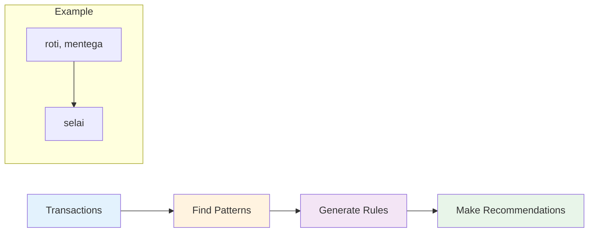
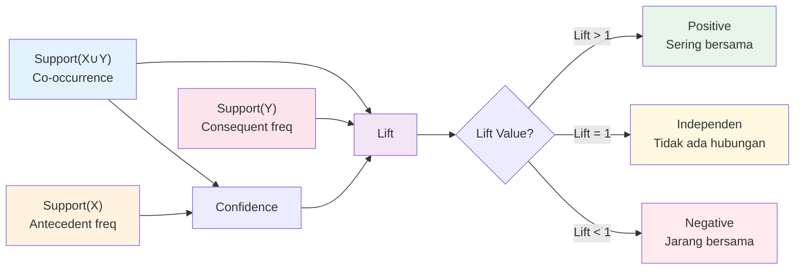
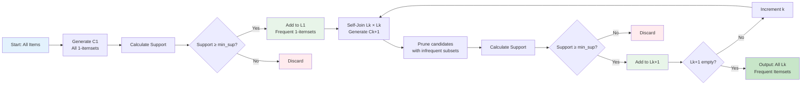
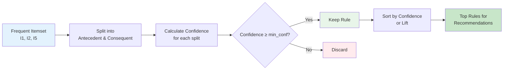
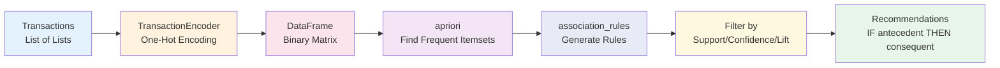
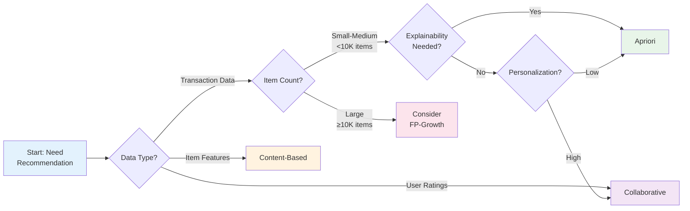

# Rule-Based Recommendation dengan Apriori Algorithm

## Tujuan Pembelajaran

Setelah mempelajari materi ini, mahasiswa mampu:
1. Menjelaskan konsep Association Rule Mining dan terminologinya
2. Menghitung manual Support, Confidence, dan Lift
3. Menjelaskan langkah Apriori Algorithm dengan contoh step-by-step
4. Mengimplementasikan Apriori menggunakan mlxtend
5. Menghasilkan rekomendasi berdasarkan association rules

## Daftar Isi
1. [Pendahuluan](#1-pendahuluan)
2. [Association Rule Mining](#2-association-rule-mining)
3. [Metrik Evaluasi](#3-metrik-evaluasi)
4. [Apriori Algorithm](#4-apriori-algorithm)
5. [Implementasi Python](#5-implementasi-python)
6. [Perbandingan dengan Metode Lain](#6-perbandingan-dengan-metode-lain)
7. [Keunggulan dan Kelemahan](#7-keunggulan-dan-kelemahan)
8. [Latihan](#8-latihan)

---

## 1. Pendahuluan

### Apa itu Recommendation System?

**Recommendation System** = Sistem yang memprediksi item yang mungkin disukai pengguna.

**Contoh penerapan:**
- E-commerce: "Orang yang beli A juga beli B"
- Streaming: "Karena Anda tonton X, rekomendasi Y"
- Sosial Media: "Orang yang Anda follow juga follow Z"

### Posisi Rule-Based dalam Taxonomy

```
Recommendation System
├── Rule-Based Recommendation      ← FOKUS KITA
│   ├── Data-Driven (Apriori/FP-Growth)
│   ├── Business/Domain-Expert Rules
│   └── Context-Aware Rules
├── Content-Based Filtering
├── Collaborative Filtering
└── Hybrid Recommendation
```

**Rule-Based** = Aturan logis `IF [Kondisi] THEN [Rekomendasi]`

---

## 2. Association Rule Mining

### Konsep Dasar

**Association Rule Mining** = Teknik menemukan hubungan antar item dalam data transaksional.



**Format Aturan:**
```
IF {antecedent} THEN {consequent}

Contoh:
IF {roti, mentega} THEN {selai}
IF {laptop} THEN {mouse}
```

### Terminologi

| Istilah | Definisi | Contoh |
|---------|----------|--------|
| **Itemset** | Kumpulan item | {roti, mentega, selai} |
| **Transaction** | Satu pembelian | T1: {roti, mentega} |
| **k-Itemset** | Itemset dengan k item | 2-itemset: {roti, mentega} |
| **Frequent Itemset** | Support ≥ threshold | {roti, mentega} support ≥ 0.1 |

### Format Dataset

```
T1: {roti, mentega, selai}
T2: {roti, susu}
T3: {mentega, telur}
T4: {roti, mentega, susu}
T5: {roti, selai}
```

---

## 3. Metrik Evaluasi

### 3.1 Support

**Support** = Frekuensi kemunculan itemset.

```
Support(X) = (Transaksi mengandung X) / (Total transaksi)
```

**Contoh:**
- Dataset: 10 transaksi
- {roti, mentega} muncul 3 kali
- **Support = 3/10 = 0.3 (30%)**

---

### 3.2 Confidence

**Confidence** = Seberapa sering rule terbukti benar.

```
Confidence(X → Y) = Support(X ∪ Y) / Support(X)
```

**Contoh:**
- Support({roti, mentega}) = 0.3
- Support({roti}) = 0.5
- **Confidence({roti} → {mentega}) = 0.3/0.5 = 0.6 (60%)**

**Interpretasi:** "60% pembeli roti juga beli mentega"

---

### 3.3 Lift

**Lift** = Kekuatan hubungan antar item.



```
Lift(X → Y) = Confidence(X → Y) / Support(Y)
```

| Nilai Lift | Interpretasi |
|------------|--------------|
| **Lift > 1** | Positif (sering bersama) |
| **Lift = 1** | Independen (tidak ada hubungan) |
| **Lift < 1** | Negatif (jarang bersama) |

**Contoh:**
- Confidence = 0.6, Support(Y) = 0.4
- **Lift = 0.6/0.4 = 1.5** → 1.5x lebih mungkin

---

### 3.4 Contoh Perhitungan Manual

**Dataset (5 transaksi):**
```
T1: {roti, mentega, selai}
T2: {roti, susu}
T3: {mentega, telur}
T4: {roti, mentega, susu}
T5: {roti, selai}
```

**Hitung untuk rule {roti} → {mentega}:**

| Metrik | Perhitungan | Hasil |
|--------|-------------|-------|
| Support({roti}) | 4/5 | **0.8** |
| Support({mentega}) | 3/5 | **0.6** |
| Support({roti, mentega}) | 2/5 | **0.4** |
| Confidence | 0.4/0.8 | **0.5 (50%)** |
| Lift | 0.5/0.6 | **0.83** |

**Kesimpulan:** Lift < 1 → hubungan negatif

---

## 4. Apriori Algorithm

### 4.1 Prinsip Dasar

**Apriori Principle:**

> "Jika itemset **frequent**, semua subset-nya juga frequent."
> 
> "Jika itemset **infrequent**, semua superset-nya juga infrequent."

**Ilustrasi:**
```
✅ {A, B, C} frequent → {A, B}, {A, C}, {B, C} juga frequent
❌ {A, B} infrequent → {A, B, C} juga infrequent (tidak perlu dicek!)
```

---

### 4.2 Langkah Algoritma



**Ringkasan Langkah:**
1. C1 = semua item unik
2. Hitung support setiap item
3. L1 = item dengan support ≥ min_sup
4. ULANGI sampai Lk kosong:
   a. Ck = gabungkan itemsets (self-join)
   b. PRUNE: hapus yang ada subset infrequent
   c. Hitung support
   d. Lk = candidate dengan support ≥ min_sup
5. OUTPUT: Semua frequent itemsets

---

### 4.3 Contoh Step-by-Step

**Dataset (9 transaksi):**
```
T1: {I1, I2, I5}     T4: {I1, I2, I4}     T7: {I1, I3}
T2: {I2, I4}         T5: {I1, I3}         T8: {I1, I2, I3, I5}
T3: {I2, I3}         T6: {I2, I3}         T9: {I1, I2, I3}
```

**Minimum Support = 2**

**Step 1: L1 (Frequent 1-itemsets)**
| Item | Count | Frequent? |
|------|-------|-----------|
| I1 | 6 | ✅ |
| I2 | 7 | ✅ |
| I3 | 6 | ✅ |
| I4 | 2 | ✅ |
| I5 | 2 | ✅ |

**Step 2: L2 (Frequent 2-itemsets)**
| Itemset | Count | Frequent? |
|---------|-------|-----------|
| {I1, I2} | 4 | ✅ |
| {I1, I3} | 4 | ✅ |
| {I1, I4} | 1 | ❌ |
| {I2, I3} | 4 | ✅ |

**Step 3: L3 (Frequent 3-itemsets)**
| Itemset | Count | Frequent? |
|---------|-------|-----------|
| {I1, I2, I3} | 2 | ✅ |
| {I1, I2, I5} | 2 | ✅ |

**Step 4: C4 → Pruned (tidak ada candidate)**

**ALGORITMA SELESAI**

---

### 4.4 Generate Rules



Dari **{I1, I2, I5}**, possible rules:

| Rule | Confidence |
|------|------------|
| {I1, I2} → {I5} | 50% |
| {I1, I5} → {I2} | **100%** ⭐ |
| {I2, I5} → {I1} | **100%** ⭐ |

**Best Rule:** `{I1, I5} → {I2}` - Confidence 100%

---

## 5. Implementasi Python

### 5.1 Library

```python
pip install mlxtend

from mlxtend.preprocessing import TransactionEncoder
from mlxtend.frequent_patterns import apriori, association_rules
```

### 5.2 Pipeline



**Contoh Transformasi Data:**

```
Transactions:
[['roti', 'mentega'], ['roti', 'susu'], ['mentega', 'telur']]

One-Hot Matrix:
   roti  mentega  susu  telur
0   1      1       0      0
1   1      0       1      0
2   0      1       0      1
```

### 5.3 Contoh Minimal

```python
from mlxtend.preprocessing import TransactionEncoder
from mlxtend.frequent_patterns import apriori, association_rules
import pandas as pd

# Data
transactions = [['roti', 'mentega'], ['roti', 'susu'], ['mentega', 'telur']]

# One-hot encode
te = TransactionEncoder()
df = pd.DataFrame(te.fit_transform(transactions), columns=te.columns_)

# Apriori
frequent = apriori(df, min_support=0.3, use_colnames=True)

# Rules
rules = association_rules(frequent, metric="confidence", min_threshold=0.5)

print(rules[['antecedents', 'consequents', 'support', 'confidence', 'lift']])
```

### 5.4 Output

| antecedents | consequents | support | confidence | lift |
|-------------|-------------|---------|------------|------|
| (roti) | (mentega) | 0.33 | 0.67 | 1.33 |

### 5.5 Rekomendasi

```python
# User beli roti → rekomendasi?
for _, rule in rules.iterrows():
    if 'roti' in rule['antecedents']:
        print(f"Rekomendasi: {rule['consequents']}, Confidence: {rule['confidence']:.0%}")
```

---

## 6. Perbandingan dengan Metode Lain

### Tabel Perbandingan

| Aspek | Apriori | Content-Based | Collaborative |
|-------|---------|---------------|---------------|
| **Data** | Transaksi | Fitur item | Rating user |
| **Cold-Start** | ❌ Tidak ada | ✅ Ada | ✅ Ada |
| **Serendipity** | ❌ Rendah | ❌ Rendah | ✅ Tinggi |
| **Explainability** | ✅ Tinggi | ✅ Tinggi | ❌ Rendah |
| **Personalization** | ❌ Rendah | ✅ Sedang | ✅ Tinggi |

### Kapan Pakai Apriori?



**✅ Gunakan Apriori:**
- Punya data transaksi
- Butuh explainability (audit, medis)
- Item tidak terlalu banyak

**❌ Jangan:**
- Butuh personalisasi tinggi
- Ingin serendipity
- Item sangat banyak

### Contoh Hasil

**User beli `{spaghetti, pasta sauce}`:**

| Metode | Rekomendasi | Alasan |
|--------|-------------|--------|
| Apriori | `{parmesan, olive oil}` | 80% pembeli sama |
| Content-Based | `{pasta, italian bread}` | Mirip kategori |
| Collaborative | `{red wine, garlic bread}` | User mirip suka |

---

## 7. Keunggulan dan Kelemahan

### Keunggulan ✅

| Keunggulan | Penjelasan |
|------------|------------|
| **Explainability** | "75% pembeli Y juga beli X" |
| **Tidak ada Cold-Start** | Rules berlaku universal |
| **Sederhana** | Implementasi mudah |
| **Real-time** | Lookup instan |
| **Domain independent** | Tidak perlu expertise |

### Kelemahan ❌

| Kelemahan | Solusi |
|-----------|--------|
| Tidak personal | Hybrid dengan Collaborative |
| Scalability | FP-Growth |
| Low serendipity | Kombinasi metode lain |
| Ignore rare items | Pertimbangkan lift > 1 |

---

## 8. Latihan

### Latihan 1: Perhitungan Manual

**Dataset:**
```
T1: {A, B, C}     T3: {B, C}     T5: {A, B, C, D}
T2: {A, B}        T4: {A, C}
```

**Soal:**
1. Hitung Support {A}, {B}, {C}, {D}
2. Dengan min_support = 0.4, tentukan frequent itemsets
3. Hitung Confidence {A} → {B}
4. Hitung Lift {A} → {C}

---

### Latihan 2: Implementasi

1. Load `groceries.csv`
2. Apriori dengan min_support = 0.02
3. Generate rules dengan min_confidence = 0.3
4. Rekomendasi untuk user beli `{yogurt, whole milk}`

---

### Latihan 3: Analisis Bisnis

1. Identifikasi 3 rules paling actionable
2. Jelaskan strategi promosi
3. Identifikasi item yang sering dibeli sendiri

---

### Latihan 4: Perbandingan

1. Implementasikan Content-Based
2. Bandingkan hasil dengan Apriori

---

### Latihan 5: Hybrid

1. Buat hybrid: 60% Apriori + 40% Collaborative
2. Evaluasi dengan train-test split

---

## Referensi

### Papers
- Agrawal & Srikant (1994). *Fast algorithms for mining association rules*
- Han, Pei & Yin (2000). *Mining frequent patterns without candidate generation*

### Books
- Tan, Steinbach & Kumar (2019). *Introduction to Data Mining*
- Ricci, Rokach & Shapira (2015). *Recommender Systems Handbook*

### Online
- mlxtend: https://rasbt.github.io/mlxtend/
- Kaggle Groceries: https://www.kaggle.com/heeraldedhia/groceries-dataset

---

*Dibuat untuk Praktikum Recommendation System*
