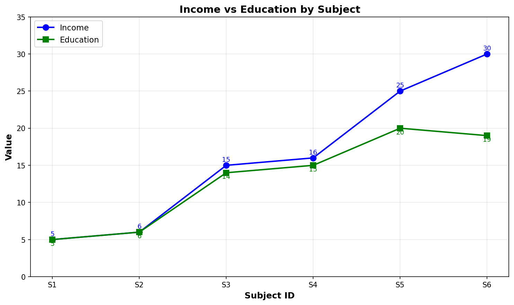

# Tugas K-Means Clustering

## Data

| Subject ID | Income | Education |
|------------|--------|-----------|
| S1         | 5      | 5         |
| S2         | 6      | 6         |
| S3         | 15     | 14        |
| S4         | 16     | 15        |
| S5         | 25     | 20        |
| S6         | 30     | 19        |

### Visualisasi Data



## Instruksi

Lakukan clustering dengan **K-Means (k=2)** menggunakan data di atas.

### Langkah Pengerjaan:

1. **Tentukan Cluster Awal**
   - Cluster 1 awal: S1, S3, S5
   - Cluster 2 awal: S2, S4, S6
   - Hitung **centroid awal** untuk masing-masing cluster:
     - C1 = rata-rata (Income, Education) dari S1, S3, S5
     - C2 = rata-rata (Income, Education) dari S2, S4, S6

2. **Iterasi 1**
   - Hitung jarak Euclidean setiap data point ke C1 dan C2
   - Assign setiap data point ke cluster terdekat
   - Hitung centroid baru

3. **Iterasi 2**
   - Ulangi langkah 2 dengan centroid baru dari Iterasi 1
   - Hitung jarak, assign cluster, hitung centroid baru
   - **Cukup sampai Iterasi 2 saja**

4. **Hasil Akhir**
   - Tuliskan anggota Cluster 1 dan Cluster 2
   - Tuliskan koordinat centroid akhir

5. **Interpretasi dan Elaborasi**
   - Jelaskan karakteristik masing-masing cluster
   - Analisis apakah hasil clustering masuk akal
   - Berikan insight dari hasil clustering

## Format Jawaban

```
Nama: [Nama Lengkap]
NIM: [NIM]

LANGKAH 1: INISIALISASI CLUSTER
- Cluster 1 awal: S1, S3, S5
- Cluster 2 awal: S2, S4, S6

Hitung Centroid Awal:
C1 = ...
C2 = ...

ITERASI 1:
Hitung jarak setiap data point ke C1 dan C2:
- S1: d(C1)=..., d(C2)=... → Cluster ...
- S2: d(C1)=..., d(C2)=... → Cluster ...
- S3: d(C1)=..., d(C2)=... → Cluster ...
- S4: d(C1)=..., d(C2)=... → Cluster ...
- S5: d(C1)=..., d(C2)=... → Cluster ...
- S6: d(C1)=..., d(C2)=... → Cluster ...

Assignment baru:
Cluster 1: [...]
Cluster 2: [...]

Centroid Baru:
C1 = ...
C2 = ...

ITERASI 2:
Hitung jarak setiap data point ke C1 baru dan C2 baru:
- S1: d(C1)=..., d(C2)=... → Cluster ...
- S2: d(C1)=..., d(C2)=... → Cluster ...
- S3: d(C1)=..., d(C2)=... → Cluster ...
- S4: d(C1)=..., d(C2)=... → Cluster ...
- S5: d(C1)=..., d(C2)=... → Cluster ...
- S6: d(C1)=..., d(C2)=... → Cluster ...

Assignment baru:
Cluster 1: [...]
Cluster 2: [...]

Centroid Baru:
C1 = ...
C2 = ...

HASIL AKHIR:
Cluster 1: [...]
Cluster 2: [...]
Centroid Akhir:
C1 = ...
C2 = ...

INTERPRETASI DAN ELABORASI:
1. Jelaskan karakteristik masing-masing cluster:
   - Cluster 1: [Jelaskan pola Income dan Education]
   - Cluster 2: [Jelaskan pola Income dan Education]

2. Apakah hasil clustering masuk akal? Mengapa?
   [Jawaban Anda]

3. Apa insight yang bisa diambil dari hasil clustering ini?
   [Jawaban Anda]
```

## Rumus Jarak Euclidean

```
d = √[(x₂ - x₁)² + (y₂ - y₁)²]
```

## Pengumpulan

**Link:** https://forms.gle/S5bzZqKZd7ZhhetAA

**Deadline:** [1 Mei 2026]

---

**Catatan:**
- Kerjakan secara manual (tulis tangan atau Excel)
- Tunjukkan semua perhitungan
- Upload hasil dalam format PDF/gambar/xlsx
