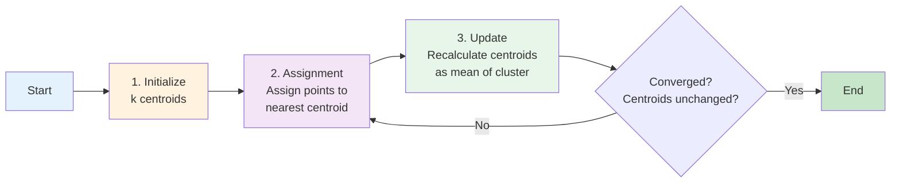
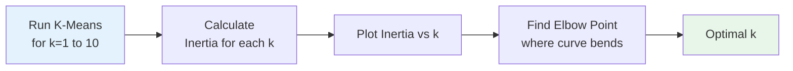
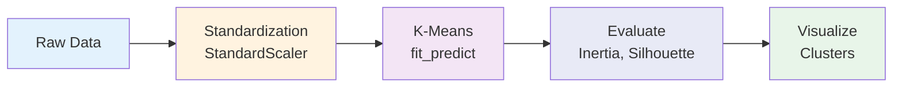
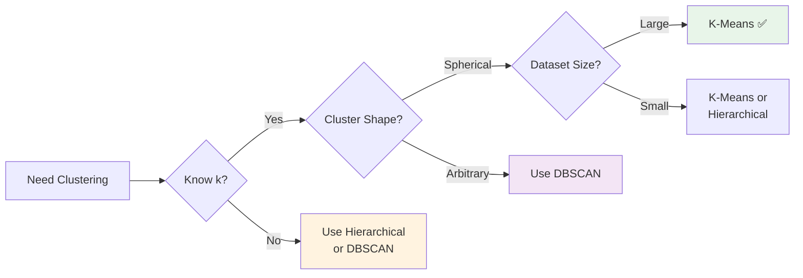

# K-Means Clustering

## Tujuan Pembelajaran

Setelah mempelajari materi ini, mahasiswa mampu:
1. Menjelaskan konsep K-Means Clustering dan terminologinya
2. Menghitung manual centroid dan assignment step
3. Menjelaskan algoritma K-Means step-by-step
4. Mengimplementasikan K-Means menggunakan sklearn
5. Menentukan jumlah cluster optimal dengan Elbow Method dan Silhouette Analysis
6. Membandingkan K-Means dengan Hierarchical Clustering

## Daftar Isi
1. [Pendahuluan](#1-pendahuluan)
2. [Konsep Dasar](#2-konsep-dasar)
3. [Algoritma K-Means](#3-algoritma-k-means)
4. [Metrik Evaluasi](#4-metrik-evaluasi)
5. [Menentukan Jumlah Cluster Optimal](#5-menentukan-jumlah-cluster-optimal)
6. [K-Means++ Initialization](#6-k-means-initialization)
7. [Implementasi Python](#7-implementasi-python)
8. [Perbandingan dengan Metode Lain](#8-perbandingan-dengan-metode-lain)
9. [Use Cases](#9-use-cases)
10. [Keunggulan dan Kelemahan](#10-keunggulan-dan-kelemahan)
11. [Latihan](#11-latihan)

---

## 1. Pendahuluan

### Apa itu K-Means Clustering?

**K-Means Clustering** = Algoritma clustering yang membagi data ke dalam **k kelompok (cluster)** berdasarkan kedekatan ke pusat cluster (centroid).

**Prinsip:** "Data dalam satu cluster dibuat saling dekat, sementara antar cluster dibuat sejauh mungkin."

**Contoh penerapan:**
- Customer Segmentation: "Kelompokkan pelanggan berdasarkan perilaku belanja"
- Image Compression: "Kurangi jumlah warna dalam gambar"
- Document Clustering: "Kelompokkan artikel berita berdasarkan topik"

### Posisi K-Means dalam Taxonomy

```
Clustering Algorithms
├── Partitioning Methods
│   ├── K-Means                    ← FOKUS KITA
│   ├── K-Medoids (PAM)
│   └── Fuzzy C-Means
├── Hierarchical Methods
│   ├── Agglomerative
│   └── Divisive
└── Density-Based Methods
    ├── DBSCAN
    └── OPTICS
```

**K-Means** = Partitioning method yang **hard clustering** (setiap point masuk tepat 1 cluster)

---

## 2. Konsep Dasar

### Terminologi

| Istilah | Definisi | Contoh |
|---------|----------|--------|
| **k** | Jumlah cluster yang diinginkan | k=3 (3 cluster) |
| **Centroid** | Titik pusat cluster (mean) | μ₁, μ₂, μ₃ |
| **Assignment** | Proses assign point ke cluster | Point A → Cluster 1 |
| **Inertia (WCSS)** | Within-Cluster Sum of Squares | Ukuran compactness |
| **Convergence** | Centroid tidak berubah lagi | Algoritma selesai |

### Objective Function

K-Means bertujuan **minimize Within-Cluster Sum of Squares (WCSS)**:

```
WCSS = Σᵢ₌₁ᵏ Σₓ∈Cᵢ ||x - μᵢ||²

dimana:
- k = jumlah cluster
- Cᵢ = cluster ke-i
- x = data point dalam cluster Cᵢ
- μᵢ = centroid cluster ke-i
- ||x - μᵢ||² = squared Euclidean distance
```

Artinya, kita menjumlahkan semua jarak kuadrat antara setiap data dengan centroid cluster-nya.
**Interpretasi:** Semakin kecil WCSS, semakin compact (rapat) cluster-nya.

---

### Euclidean Distance

K-Means menggunakan **Euclidean Distance** untuk mengukur jarak:

```
d(x, μ) = √(Σⱼ₌₁ᵈ (xⱼ - μⱼ)²)

Squared Euclidean Distance:
d²(x, μ) = Σⱼ₌₁ᵈ (xⱼ - μⱼ)²
```

**Contoh 2D:**
- Point x = (3, 5)
- Centroid μ = (1, 2)
- d²(x, μ) = (3-1)² + (5-2)² = 4 + 9 = 13

**Kenapa squared distance?**
1. Lebih cepat (tidak perlu √)
2. Penalize outliers lebih berat (Memberikan penalti lebih besar untuk jarak yang jauh)
3. Differentiable (untuk optimasi)

---

## 3. Algoritma K-Means

### Langkah Algoritma



**Ringkasan:**
1. **Initialize**: Pilih k centroid awal (random atau k-means++)
2. **Assignment**: Assign setiap point ke centroid terdekat
3. **Update**: Hitung ulang centroid sebagai mean dari points di cluster
4. **Repeat**: Ulangi step 2-3 sampai centroid tidak berubah atau sampai perubahan sangat kecil

---

### Contoh Step-by-Step

**Dataset (6 points 2D):**
```
A(1,1), B(1,2), C(2,1), D(8,8), E(8,9), F(9,8)
```

**Goal:** k=2 cluster

**Step 1: Initialize (random)**
- μ₁ = (1.5, 1.5)
- μ₂ = (8.5, 8.5)

**Step 2: Assignment (Iteration 1)**

| Point | d² to μ₁ | d² to μ₂ | Assigned |
|-------|----------|----------|----------|
| A(1,1) | 0.5 | 112.5 | Cluster 1 |
| B(1,2) | 0.5 | 84.5 | Cluster 1 |
| C(2,1) | 0.5 | 84.5 | Cluster 1 |
| D(8,8) | 84.5 | 0.5 | Cluster 2 |
| E(8,9) | 98.0 | 0.5 | Cluster 2 |
| F(9,8) | 98.0 | 0.5 | Cluster 2 |

**Step 3: Update**

Cluster 1: {A, B, C}
```
μ₁ = ((1+1+2)/3, (1+2+1)/3) = (1.33, 1.33)
```

Cluster 2: {D, E, F}
```
μ₂ = ((8+8+9)/3, (8+9+8)/3) = (8.33, 8.33)
```

**Step 4: Check Convergence**
- Centroids berubah → lanjut iterasi
- Setelah beberapa iterasi → converge

**Final Result:**
- Cluster 1: {A, B, C} dengan centroid ≈ (1.33, 1.33)
- Cluster 2: {D, E, F} dengan centroid ≈ (8.33, 8.33)

Terlihat bahwa data secara alami terpisah menjadi dua kelompok yang jelas, sehingga K-Means cepat konvergen.

---

### Pseudocode

```python
def kmeans(X, k, max_iter=100):
    # 1. Initialize centroids
    centroids = initialize_random(X, k)
    
    for iteration in range(max_iter):
        # 2. Assignment step
        clusters = assign_to_nearest(X, centroids)
        
        # 3. Update step
        new_centroids = compute_means(X, clusters)
        
        # 4. Check convergence
        if centroids == new_centroids:
            break
        
        centroids = new_centroids
    
    return clusters, centroids
```

---

## 4. Metrik Evaluasi

### 4.1 Inertia (WCSS)

**Within-Cluster Sum of Squares** = Total squared distance dari points ke centroid-nya.

```
Inertia = Σᵢ₌₁ᵏ Σₓ∈Cᵢ ||x - μᵢ||²
```

**Interpretasi:**
- **Lower is better** (cluster lebih compact)
- Selalu menurun saat k bertambah
- Tidak cukup digunakan sendiri karena nilainya selalu turun saat k bertambah.

**Contoh:**
```
k=2: Inertia = 150.5
k=3: Inertia = 89.2  ← lebih baik
k=4: Inertia = 45.1  ← lebih baik lagi
```

---

### 4.2 Silhouette Score

**Silhouette Coefficient** mengukur seberapa mirip suatu data dengan cluster-nya dibanding cluster lain.

```
s(i) = (b(i) - a(i)) / max{a(i), b(i)}

dimana:
- a(i) = average distance ke points dalam cluster yang sama
- b(i) = average distance ke points di cluster terdekat lainnya
```

**Range:** -1 to +1
- **s ≈ 1**: Point sangat cocok dengan cluster-nya
- **s ≈ 0**: Point di boundary antar cluster
- **s < 0**: Point mungkin salah cluster

**Average Silhouette Score:**
```
Silhouette Score = (1/n) Σᵢ₌₁ⁿ s(i)
```

**Interpretasi:**
- **> 0.7**: Strong structure
- **0.5 - 0.7**: Reasonable structure
- **0.25 - 0.5**: Weak structure
- **< 0.25**: No substantial structure

---

## 5. Menentukan Jumlah Cluster Optimal

### 5.1 Elbow Method

**Prinsip:** Plot Inertia vs k, cari "elbow" (titik dimana penurunan melambat).



**Contoh:**
```
k=1: Inertia = 600
k=2: Inertia = 325  ← steep drop
k=3: Inertia = 140  ← steep drop
k=4: Inertia = 90   ← elbow (optimal)
k=5: Inertia = 75   ← diminishing returns
k=6: Inertia = 65
```

**Keunggulan:**
- ✅ Simple & intuitive
- ✅ Visual & easy to interpret

**Kelemahan:**
- ❌ Subjective (elbow tidak selalu jelas)
- Kadang bentuk ‘elbow’ tidak terlihat jelas, sehingga interpretasinya bisa subjektif.
- ❌ Tidak bekerja baik untuk smooth curves

---

### 5.2 Silhouette Analysis

**Prinsip:** Pilih k dengan **highest average Silhouette Score**.

**Langkah:**
1. Run K-Means untuk k=2 to 10
2. Hitung Silhouette Score untuk setiap k
3. Pilih k dengan score tertinggi

**Contoh:**
```
k=2: Silhouette = 0.68
k=3: Silhouette = 0.72  ← highest
k=4: Silhouette = 0.65
k=5: Silhouette = 0.58
```

**Keunggulan:**
- ✅ Objective metric
- ✅ Considers cluster separation
- ✅ Less subjective than Elbow

**Kelemahan:**
- ❌ Computationally expensive
- ❌ May not align with domain knowledge

---

### 5.3 Kombinasi Metode

**Best Practice:** Gunakan **Elbow + Silhouette + Domain Knowledge**

```
Elbow Method → k=4
Silhouette   → k=3
Domain       → 3 customer segments

Decision: k=3 (align with business need)
```

---

## 6. K-Means++ Initialization

### Problem dengan Random Initialization

**Random initialization** bisa menyebabkan:
- ❌ Poor local minima
- ❌ Inconsistent results
- ❌ Slow convergence
- ❌ Centroids terlalu dekat

---

### K-Means++ Algorithm

**Prinsip:** Pilih centroid awal yang **well-spread** (tersebar baik).

**Langkah:**
1. Pilih centroid pertama **random** dari dataset
2. Untuk setiap point, hitung **squared distance** ke centroid terdekat
3. Pilih centroid berikutnya dengan **probability proportional to squared distance**
4. Ulangi sampai k centroids terpilih

**Formula Probability:**
```
P(x) = D²(x) / Σᵢ D²(xᵢ)

dimana:
D(x) = distance dari x ke centroid terdekat
```

**Intuisi:** Points yang **jauh** dari centroids existing punya **probability lebih tinggi** dipilih.
Atau bahasa simple nya: "Semakin jauh sebuah titik dari centroid yang sudah ada, semakin besar peluangnya dipilih".

---

### Perbandingan

| Aspek | Random Init | K-Means++ |
|-------|-------------|-----------|
| **Convergence** | Slow | Fast |
| **Consistency** | ❌ Varies | ✅ Stable |
| **Quality** | ⚠️ Hit-or-miss | ✅ Better |
| **Complexity** | O(kd) | O(nkd) |

**Recommendation:** **Always use K-Means++** (default di sklearn)

---

## 7. Implementasi Python

### 7.1 Library

```python
from sklearn.cluster import KMeans
from sklearn.preprocessing import StandardScaler
from sklearn.metrics import silhouette_score
import matplotlib.pyplot as plt
import numpy as np
```

### 7.2 Pipeline


Kenapa pakai StandardScaler?
Karena K-Means berbasis jarak, skala fitur yang berbeda bisa membuat hasil bias.

---

### 7.3 Contoh Minimal

```python
from sklearn.cluster import KMeans
from sklearn.preprocessing import StandardScaler
import numpy as np

# Data
X = np.array([[1,1], [1,2], [2,1], [8,8], [8,9], [9,8]])

# Standardize
scaler = StandardScaler()
X_scaled = scaler.fit_transform(X)

# K-Means
kmeans = KMeans(n_clusters=2, random_state=42, n_init=10)
labels = kmeans.fit_predict(X_scaled)

print("Labels:", labels)
print("Centroids:", kmeans.cluster_centers_)
print("Inertia:", kmeans.inertia_)
```

**Output:**
```
Labels: [0 0 0 1 1 1]
Centroids: [[-1.22 -1.22] [1.22 1.22]]
Inertia: 0.12
```

---

### 7.4 Parameter Penting

| Parameter | Deskripsi | Default | Recommendation |
|-----------|-----------|---------|----------------|
| `n_clusters` | Jumlah cluster k | - | Use Elbow/Silhouette |
| `init` | Initialization method | 'k-means++' | Keep default |
| `n_init` | Number of runs | 10 | ≥10 for stability |
| `max_iter` | Max iterations | 300 | Usually sufficient |
| `random_state` | Seed for reproducibility | None | Set for consistency |

---

## 8. Perbandingan dengan Metode Lain

### Tabel Perbandingan

| Aspek | K-Means | Hierarchical | DBSCAN |
|-------|---------|--------------|--------|
| **Specify k** | ✅ Required | ❌ Not required | ❌ Not required |
| **Cluster Shape** | Spherical | Depends on linkage | Arbitrary |
| **Noise Handling** | ❌ Poor | ❌ Poor | ✅ Excellent |
| **Scalability** | ✅ O(nkt) | ❌ O(n²logn) | ⚠️ O(n²) |
| **Deterministic** | ❌ No (random init) | ✅ Yes | ✅ Yes |
| **Interpretability** | ✅ High (centroids) | ✅ High (dendrogram) | ⚠️ Medium |

---

### Kapan Pakai K-Means?



**✅ Gunakan K-Means:**
- Clusters roughly spherical
- Similar cluster sizes
- Large dataset (need speed)
- Know approximate k
- Need interpretable centroids

**❌ Jangan K-Means:**
- Non-spherical clusters (elongated, irregular)
- Different cluster densities
- Many outliers
- Unknown k
- Need to detect noise

---

### Contoh Hasil

**Dataset: Mall Customers (Income vs Spending)**

| Metode | Clusters Found | Characteristics |
|--------|----------------|-----------------|
| **K-Means (k=5)** | 5 spherical groups | High/Low Income × High/Low Spending |
| **Hierarchical** | Dendrogram shows 4-6 | Similar to K-Means |
| **DBSCAN** | 3 dense regions + noise | Misses sparse groups |

**Kesimpulan:** K-Means optimal untuk customer segmentation dengan clear income/spending patterns.

---

## 9. Use Cases

### 9.1 Customer Segmentation

**Problem:** Kelompokkan pelanggan untuk targeted marketing.

**Features:**
- Age
- Annual Income
- Spending Score

**K-Means Result (k=5):**
1. **High Value**: High income, high spending
2. **Potential**: High income, low spending
3. **Budget Conscious**: Low income, high spending
4. **Careful**: Low income, low spending
5. **Average**: Medium income, medium spending

**Business Action:**
- Cluster 1 → Loyalty program
- Cluster 2 → Upselling campaign
- Cluster 3 → Discount offers

---

### 9.2 Image Compression

**Problem:** Reduce image file size dengan color quantization.

**Process:**
1. Treat each pixel as 3D point (R, G, B)
2. K-Means dengan k=16 (16 colors)
3. Replace each pixel dengan nearest centroid color

**Result:**
- Original: 16M colors (24-bit)
- Compressed: 16 colors (4-bit)
- File size: 85% reduction

---

### 9.3 Document Clustering

**Problem:** Kelompokkan artikel berita berdasarkan topik.

**Process:**
1. TF-IDF vectorization
2. K-Means clustering
3. Analyze cluster keywords

**Result:**
- Cluster 1: Sports (keywords: game, team, player)
- Cluster 2: Politics (keywords: government, election, policy)
- Cluster 3: Technology (keywords: AI, software, data)

---

## 10. Keunggulan dan Kelemahan

### Keunggulan ✅

| Keunggulan | Penjelasan |
|------------|------------|
| **Computationally Efficient** | O(nkt) - linear dengan n |
| **Scalable** | Works well untuk large datasets |
| **Simple & Interpretable** | Easy to understand & explain |
| **Guaranteed Convergence** | Always converges (to local optimum) |
| **Interpretable Centroids** | Centroids represent cluster characteristics |

---

### Kelemahan ❌

| Kelemahan | Solusi |
|-----------|--------|
| **Must specify k** | Use Elbow/Silhouette method |
| **Sensitive to initialization** | Use K-Means++ (default) |
| **Assumes spherical clusters** | Use DBSCAN for arbitrary shapes |
| **Sensitive to outliers** | Remove outliers or use K-Medoids |
| **Local optima** | Run multiple times (n_init > 1) |
| **Equal cluster sizes** | Use Gaussian Mixture Models |

---

### Best Practices

1. **Always standardize data** (StandardScaler)
2. **Use K-Means++ initialization** (default)
3. **Run multiple times** (n_init ≥ 10)
4. **Combine Elbow + Silhouette** untuk pilih k
5. **Validate with domain knowledge**
6. **Handle outliers** sebelum clustering
7. **Set random_state** untuk reproducibility

---

## 11. Latihan

### Latihan 1: Perhitungan Manual

**Dataset:**
```
A(2,2), B(2,3), C(3,2), D(8,7), E(8,8), F(9,7)
```

**Soal:**
1. Initialize μ₁=(2.5, 2.5), μ₂=(8.5, 7.5)
2. Hitung distance setiap point ke kedua centroid
3. Assign points ke cluster terdekat
4. Hitung centroid baru
5. Apakah sudah converge?

---

### Latihan 2: Implementasi

1. Load Mall Customers dataset
2. Pilih features: Annual Income, Spending Score
3. Standardize data
4. Gunakan Elbow Method untuk tentukan k optimal
5. Fit K-Means dengan k optimal
6. Visualize clusters dengan scatter plot
7. Interpretasi karakteristik setiap cluster

---

### Latihan 3: Perbandingan

1. Implementasi K-Means dengan k=3, 4, 5
2. Hitung Silhouette Score untuk masing-masing
3. Bandingkan hasil dengan Hierarchical Clustering
4. Analisis: Metode mana yang lebih baik? Kenapa?

---

### Latihan 4: Image Compression

1. Load image (RGB)
2. Reshape ke (n_pixels, 3)
3. K-Means dengan k=8, 16, 32, 64
4. Reconstruct image dengan centroid colors
5. Compare file size & visual quality

---

### Latihan 5: Real-World Case

**Dataset:** Iris dataset

1. Apply K-Means dengan k=3
2. Compare dengan true labels (species)
3. Calculate Adjusted Rand Index
4. Analyze misclassified points
5. Explain why some points are misclassified

---

## Referensi

### Papers
- MacQueen, J. (1967). *Some methods for classification and analysis of multivariate observations*
- Arthur, D. & Vassilvitskii, S. (2007). *k-means++: The advantages of careful seeding*

### Books
- Hastie, T., Tibshirani, R., & Friedman, J. (2009). *The Elements of Statistical Learning*
- Bishop, C. M. (2006). *Pattern Recognition and Machine Learning*

### Online
- sklearn K-Means: https://scikit-learn.org/stable/modules/clustering.html#k-means
- K-Means Visualization: https://www.naftaliharris.com/blog/visualizing-k-means-clustering/

---

*Dibuat untuk Praktikum Clustering - Week 08*
